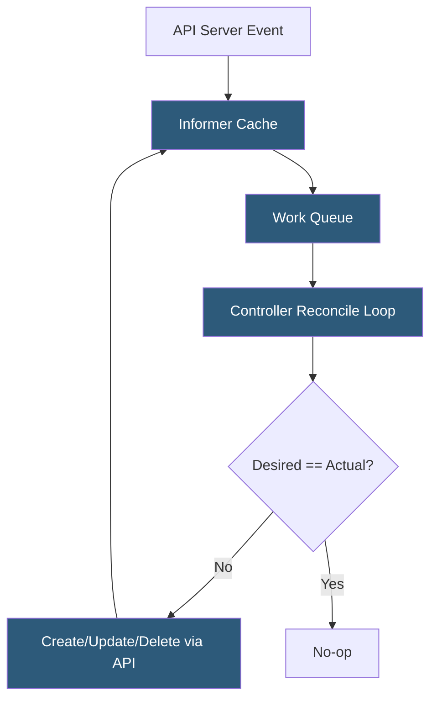

**Category:** Kubernetes Infrastructure
**Difficulty:** Intermediate
**Reading time:** 6 min read

---

The kube-controller-manager is a single binary that embeds dozens of independent reconciliation loops, each responsible for driving a specific Kubernetes resource type toward its desired state. It is the engine behind deployments, replica management, service accounts, and many other core abstractions.

- **Reconciliation loop** — a control loop that compares desired state (spec) to actual state (status) and takes corrective action
- **Informer** — a cached, event-driven watch mechanism that feeds controllers with resource change notifications
- **Work queue** — rate-limited queue that buffers events and prevents thundering-herd processing
- **ReplicaSet controller** — ensures the correct number of pod replicas are running at all times
- **Deployment controller** — manages rolling updates and rollbacks by manipulating ReplicaSets
- **ServiceAccount controller** — auto-provisions ServiceAccount tokens and default accounts per namespace
- **Leader election** — ensures only one controller-manager instance is active in an HA setup

Each controller within the controller-manager follows the same structural pattern: it registers an informer to watch one or more resource types, processes add/update/delete events by enqueuing keys, and a worker goroutine dequeues keys and runs the reconciliation function.

The reconciliation function reads the current state of the world from the informer cache (not live from etcd), computes the delta from desired state, and issues API calls to close the gap. If an API call fails — due to a conflict, network error, or admission webhook rejection — the key is re-enqueued with exponential back-off, providing natural retry logic without busy polling.

The **Deployment controller** is a representative example. It watches Deployment objects and manages child ReplicaSets. On a spec change (e.g., a new image tag), it creates a new ReplicaSet and scales it up while scaling down the old one according to the `maxSurge` and `maxUnavailable` parameters. Status conditions on the Deployment object surface progress and health to users.

In HA control planes, multiple controller-manager pods run simultaneously, but a Kubernetes leader-election mechanism using a Lease API object ensures that only the elected leader runs reconciliation loops. Others stay in standby, ready to assume leadership within seconds of a failure.

- Understanding why a Deployment rollout is stalled (inspect controller events)
- Building custom controllers following the same informer/work-queue pattern
- Diagnosing why pods are not being created after a replica count change
- Tuning controller sync periods to reduce API server load in large clusters

| Advantage | Disadvantage |
|-----------|--------------|
| Level-triggered reconciliation is self-healing after transient failures | Controller logic bugs can cause oscillation loops and excessive API churn |
| Informer caching dramatically reduces direct etcd reads | Cache staleness can cause controllers to act on outdated state briefly |
| Leader election ensures no split-brain reconciliation | Leadership failover adds seconds of delay before reconciliation resumes |
| Single binary simplifies deployment and lifecycle management | One slow controller can monopolize goroutines; requires profiling to isolate |

- [Kubernetes control plane components](kubernetes-control-plane-components.md)
- [Kubernetes scheduler algorithms](kubernetes-scheduler-algorithms.md)
- [RBAC (Role-Based Access Control)](rbac-role-based-access-control.md)

---
*Part of the [Kubernetes Infrastructure](index.md) category · [Back to Master Index](../../index.md)*
