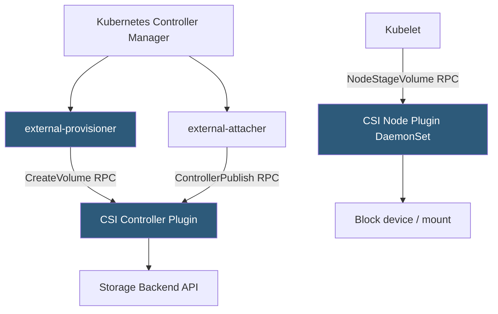

**Category:** Kubernetes Infrastructure
**Difficulty:** Intermediate
**Reading time:** 6 min read

---

The Container Storage Interface is a standardized gRPC API that Kubernetes uses to communicate with storage drivers, allowing any storage vendor to write a CSI driver that works with Kubernetes without modifying the core codebase.

- **CSI driver** — a plugin implementing the CSI spec that runs as pods in the cluster and handles storage operations
- **Controller plugin** — handles volume lifecycle operations (create, delete, attach, detach, snapshot) that require cloud/storage API calls
- **Node plugin** — runs as a DaemonSet and handles node-local operations (mount, unmount, format)
- **external-provisioner** — sidecar that watches PVCs and calls the CSI controller's `CreateVolume` RPC
- **external-attacher** — sidecar that calls `ControllerPublishVolume` to attach volumes to nodes
- **VolumeSnapshot** — Kubernetes CRD for creating point-in-time snapshots of PVs via CSI
- **CSI driver registry** — the mechanism by which node plugins register with the kubelet

CSI separates the storage lifecycle into two planes. The **controller plugin** handles cloud/SAN API calls that do not require a specific node: creating a volume (allocating storage), deleting it, attaching it to a node (cloud disk attachment), creating snapshots, and expanding capacity. These operations run in centralized controller pods and communicate with external storage APIs over the network.

The **node plugin** handles mount-point operations that must run on the node where the pod is scheduled: staging a volume to a node-global path (`NodeStageVolume`), publishing it to a specific pod path (`NodePublishVolume`), and the corresponding unmount operations. The node plugin runs as a DaemonSet so it is available on every node where pods might be scheduled.

Kubernetes provides a set of **sidecar containers** that bridge Kubernetes API events to CSI gRPC calls:
- `external-provisioner` watches PVC creation and calls `CreateVolume`
- `external-attacher` watches VolumeAttachment objects and calls `ControllerPublishVolume`
- `external-snapshotter` watches VolumeSnapshot objects and calls `CreateSnapshot`
- `node-driver-registrar` registers the node plugin with the kubelet's plugin socket

**VolumeSnapshot** and **VolumeSnapshotContent** are first-class Kubernetes resources enabling backup workflows. An application can create a VolumeSnapshot, triggering the external-snapshotter to call the CSI driver's `CreateSnapshot` RPC. The resulting snapshot can be used as a data source for a new PVC, enabling database clone or restore workflows.

- Integrating cloud-native storage (AWS EBS, GCE PD, Azure Disk) via vendor-provided CSI drivers
- Running stateful databases (MySQL, Cassandra, Kafka) on Kubernetes with persistent volumes
- Implementing automated backup pipelines using VolumeSnapshot and CronJob
- Using Rook/Ceph CSI for self-managed software-defined storage within the cluster

| Advantage | Disadvantage |
|-----------|--------------|
| Standard API eliminates in-tree driver code from Kubernetes; drivers ship independently | CSI driver version must be compatible with Kubernetes version; mismatches cause issues |
| VolumeSnapshot enables crash-consistent backups without application changes | CSI driver pods add cluster resource overhead (CPU, memory) per storage backend used |
| Controller/node split allows different RBAC and scheduling for each plane | Debugging CSI failures requires tracing across kubelet, external-provisioner, and driver logs |
| Driver quality varies; some cloud providers have excellent CSI drivers, others lag | PVC binding failure messages are often cryptic without familiarity with CSI error codes |

- [Kubernetes storage classes](kubernetes-storage-classes.md)
- [PersistentVolume provisioning](persistentvolume-provisioning.md)
- [StatefulSet management](statefulset-management.md)

---
*Part of the [Kubernetes Infrastructure](index.md) category · [Back to Master Index](../../index.md)*
