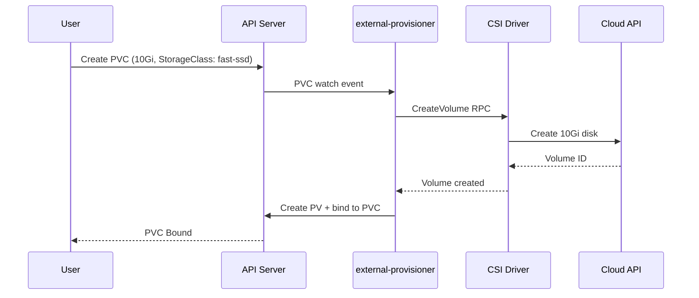

**Category:** Kubernetes Infrastructure
**Difficulty:** Intermediate
**Reading time:** 5 min read

---

Dynamic volume provisioning automates the creation of PersistentVolumes in response to PersistentVolumeClaims, eliminating the need for administrators to pre-provision storage. A StorageClass and its associated CSI provisioner handle volume creation on demand.

- **Dynamic provisioner** — the CSI driver component that creates PersistentVolumes when a matching PVC is created
- **StorageClass** — defines which provisioner to use and the parameters (disk type, IOPS, encryption) for new volumes
- **PVC binding trigger** — the creation of a PVC referencing a StorageClass initiates dynamic provisioning
- **external-provisioner sidecar** — a Kubernetes controller that watches PVCs and calls the CSI driver's CreateVolume RPC
- **Capacity-aware scheduling** — scheduler extension that checks available storage capacity before binding a PVC
- **Volume topology** — CSI driver communicates allowed topologies (zones) for the new volume to the provisioner
- **Capacity tracking** — CSIStorageCapacity API that publishes remaining storage capacity per topology segment

When a user creates a PVC with a `storageClassName`, the Kubernetes PV controller detects that no matching pre-existing PV is available and marks the PVC as pending with `WaitForFirstConsumer` or proceeds immediately depending on the StorageClass's `volumeBindingMode`.

The **external-provisioner** sidecar, bundled with the CSI driver deployment, watches for PVCs in the Pending state that reference its StorageClass. It calls the CSI driver's `CreateVolume` RPC with the requested capacity, access modes, and topology constraints. The CSI driver translates these into cloud API calls — for example, `aws ec2 create-volume` for EBS. The API returns a volume identifier that the CSI driver returns to the external-provisioner.

The external-provisioner then creates a PersistentVolume object in Kubernetes with the returned volume ID as its `volumeHandle`, sets the PVC's `volumeName` to bind them, and both objects enter the Bound state. The kubelet can then proceed with mounting the volume when a pod starts.

`WaitForFirstConsumer` mode delays the `CreateVolume` call until the pod is scheduled to a node. The scheduler takes the node's topology (availability zone) into account and informs the provisioner. This prevents the common failure mode of a volume being created in zone A while the pod gets scheduled to zone B.

The **CSIStorageCapacity** API (GA in Kubernetes 1.24) allows CSI drivers to publish their available capacity per topology segment. The scheduler reads this data and avoids scheduling pods to nodes where the StorageClass lacks sufficient capacity, preventing provisioning failures at mount time.

- Fully automated storage provisioning in cloud-native CI/CD pipelines
- Database-as-a-service platforms where each tenant gets their own PVC
- StatefulSet-based deployments where each replica automatically gets its own volume
- Dev/test environments where storage is created and deleted with each namespace lifecycle

| Advantage | Disadvantage |
|-----------|--------------|
| Zero-ops storage provisioning; developers need no knowledge of underlying infrastructure | Misconfigured StorageClass parameters silently create the wrong volume type |
| Integrates with cloud cost management; storage is created and deleted with PVCs | `Delete` reclaim policy can cause accidental data loss if PVC is deleted unintentionally |
| WaitForFirstConsumer prevents cross-zone attachment failures | Provisioning latency (5–30s for cloud APIs) can slow pod startup in stateful applications |
| CSIStorageCapacity avoids scheduling to zones with no available capacity | Capacity reporting is not implemented by all CSI drivers |

- [Kubernetes storage classes](kubernetes-storage-classes.md)
- [CSI (Container Storage Interface)](csi-container-storage-interface.md)
- [PersistentVolume provisioning](persistentvolume-provisioning.md)

---
*Part of the [Kubernetes Infrastructure](index.md) category · [Back to Master Index](../../index.md)*
