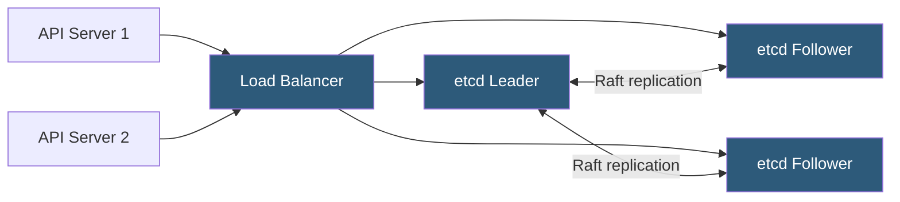

**Category:** Kubernetes Infrastructure
**Difficulty:** Advanced
**Reading time:** 7 min read

---

etcd is the distributed key-value store that backs all Kubernetes cluster state. Proper cluster design ensures high availability, strong consistency, and the low-latency I/O that Kubernetes relies on for rapid reconciliation.

- **Raft consensus** — the algorithm etcd uses to elect leaders and replicate log entries across members
- **Quorum** — majority of members required to commit writes; a 3-node cluster tolerates 1 failure
- **Leader** — the sole member that processes writes; followers forward client writes to the leader
- **WAL (Write-Ahead Log)** — durability mechanism etcd uses before applying state changes
- **Snapshot** — periodic compaction of the WAL into a point-in-time state file to limit disk growth
- **Defragmentation** — reclaims free space in the etcd database file (bbolt) after compaction
- **Peer URL** — the address etcd members use to communicate with each other for replication

etcd uses the Raft algorithm to maintain a replicated log across all cluster members. Every write request arrives at the leader, which appends the entry to its WAL and simultaneously sends it to followers. Once a quorum of members acknowledges the entry, the leader commits it and responds to the client. This model guarantees linearizability: every read reflects the most recent committed write.

Cluster sizing follows quorum mathematics. A 3-node cluster tolerates 1 failure; a 5-node cluster tolerates 2. Odd numbers are preferred because even-sized clusters offer no additional fault tolerance over the smaller odd cluster below them. Kubernetes production deployments standardize on 3 members for most environments and 5 for very large or critical clusters.

Storage I/O is the critical performance variable. etcd performs an fdatasync call for every Raft log entry before acknowledging a write, so disk latency directly affects API server throughput. NVMe SSDs with sub-millisecond fsync times are strongly recommended. etcd publishes a `wal_fsync_duration_seconds` metric to detect disk bottlenecks.

Backup is achieved by taking periodic snapshots using `etcdctl snapshot save`. These snapshots capture the full key-value state and can restore a cluster from complete data loss. Automated snapshot rotation and off-cluster storage (e.g., S3) are essential operational requirements. Defragmentation should be scheduled regularly to reclaim space after key deletions and compaction.

- Running production Kubernetes clusters with multi-node etcd for HA
- Storing custom application configuration data using the etcd API directly
- Disaster recovery restoration from etcd snapshots after complete cluster loss
- Performance benchmarking with etcd's built-in `etcd-benchmark` tool

| Advantage | Disadvantage |
|-----------|--------------|
| Strong consistency guarantees correctness for all cluster operations | Requires low-latency storage; cloud network-attached volumes may be too slow |
| Automatic leader election handles member failures transparently | Cluster must maintain quorum; simultaneous majority failure causes unavailability |
| Compaction and snapshots control database size growth | Defragmentation requires brief lock, can briefly impact API server latency |
| Well-defined backup and restore procedures | etcd database should not exceed ~8 GB; very large clusters need careful key-count management |

- [Kubernetes control plane components](kubernetes-control-plane-components.md)
- [API server scaling](api-server-scaling.md)
- [RBAC (Role-Based Access Control)](rbac-role-based-access-control.md)

---
*Part of the [Kubernetes Infrastructure](index.md) category · [Back to Master Index](../../index.md)*
