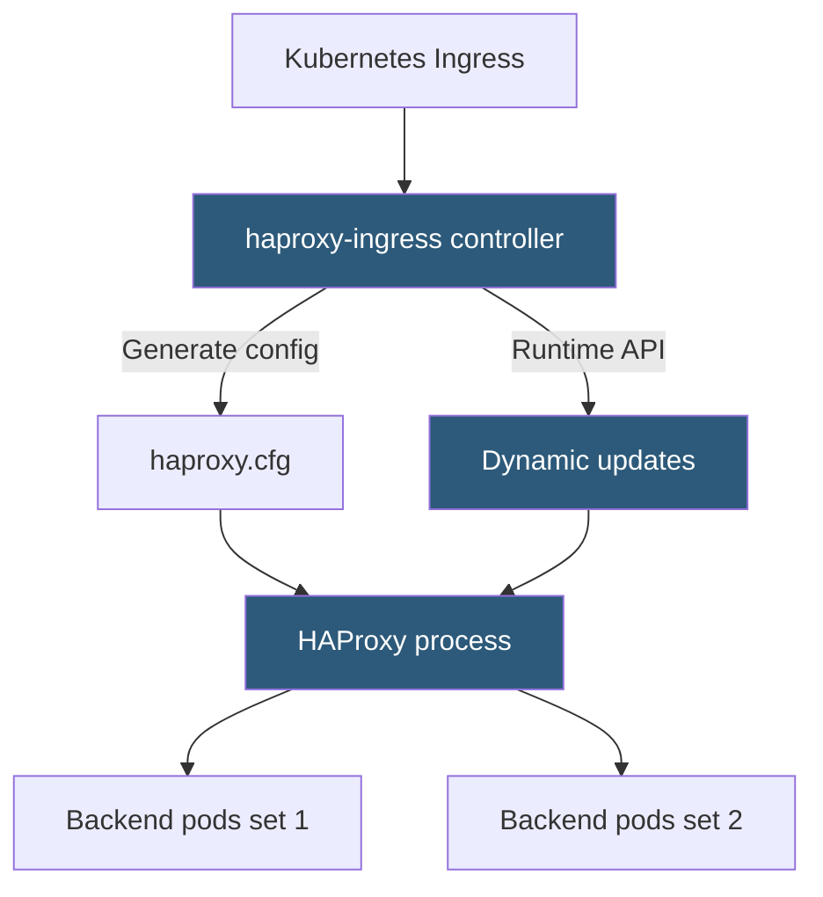

**Category:** Kubernetes Infrastructure
**Difficulty:** Intermediate
**Reading time:** 6 min read

---

HAProxy Ingress is a Kubernetes Ingress controller built on HAProxy, delivering high-throughput load balancing with fine-grained ACL-based routing, advanced health checking, and dynamic configuration updates without full process reloads.

- **HAProxy** — the high-performance TCP/HTTP load balancer underlying the controller
- **Dynamic API** — HAProxy's Runtime API that applies server weight changes and server additions without config reload
- **ConfigMap** — cluster-wide HAProxy settings (timeouts, max connections, TLS ciphers)
- **Global/defaults/frontend/backend** — the four HAProxy configuration sections the controller generates
- **ACL (Access Control List)** — HAProxy rule expressions for host, path, header, and source IP matching
- **Health check** — active HTTP or TCP probes HAProxy uses to remove unhealthy backends from rotation
- **Stick table** — in-memory session persistence store supporting IP, cookie, or header-based affinity

HAProxy Ingress watches Kubernetes Ingress, Service, and Endpoints objects and generates an `haproxy.cfg` file mapping each Ingress rule to HAProxy frontend ACLs and backend server entries. HAProxy's ACL engine evaluates request attributes (SNI for TLS, HTTP Host header, path prefix, source IP range) to select the correct backend.

A key HAProxy capability is its **Runtime API** (formerly the stats socket). When only backend servers change (pods scale up/down), the controller uses the Runtime API to add or remove server entries without reloading HAProxy at all. Full configuration changes (new Ingress rules, TLS changes) do require a reload, but HAProxy performs graceful reloads using the `hard-stop-after` mechanism, allowing in-flight requests to complete.

**Health checks** are more advanced than most other Ingress controllers. HAProxy can perform HTTP health checks with specific method/path/response-code expectations, TCP connect checks, or custom check scripts. Down servers are removed from rotation immediately, and recovery is detected on the next successful check interval.

**Session persistence** via stick tables stores session-to-server mappings in memory. Entries can be keyed by source IP, cookie value, or HTTP header. HAProxy's stick-table replication allows sharing state between multiple HAProxy instances, enabling consistent session persistence across a replicated controller deployment.

SSL offloading supports modern cipher suites and TLS 1.3. HAProxy can also perform SSL passthrough (SNI-based routing without decryption) for end-to-end TLS scenarios.

- High-throughput environments requiring HAProxy's proven performance and advanced ACL rules
- Financial or e-commerce applications needing reliable session persistence
- TCP-level load balancing for non-HTTP protocols (databases, message queues)
- Environments already using HAProxy for non-Kubernetes traffic wanting unified configuration

| Advantage | Disadvantage |
|-----------|--------------|
| Runtime API minimizes reload frequency; only full config changes require reload | Less ecosystem momentum than NGINX Ingress; smaller community contributor base |
| Advanced ACL language enables complex routing without external auth services | HAProxy configuration syntax is verbose and requires HAProxy expertise to debug |
| Stick tables provide in-memory session persistence without Redis dependency | Full reloads briefly drop in-flight connections on older kernel versions |
| Proven at extremely high concurrency in financial-grade applications | Annotations use HAProxy-specific directives; not portable across Ingress controllers |

- [Kubernetes Ingress controllers](kubernetes-ingress-controllers.md)
- [NGINX Ingress](nginx-ingress.md)
- [Traefik proxy](traefik-proxy.md)

---
*Part of the [Kubernetes Infrastructure](index.md) category · [Back to Master Index](../../index.md)*
