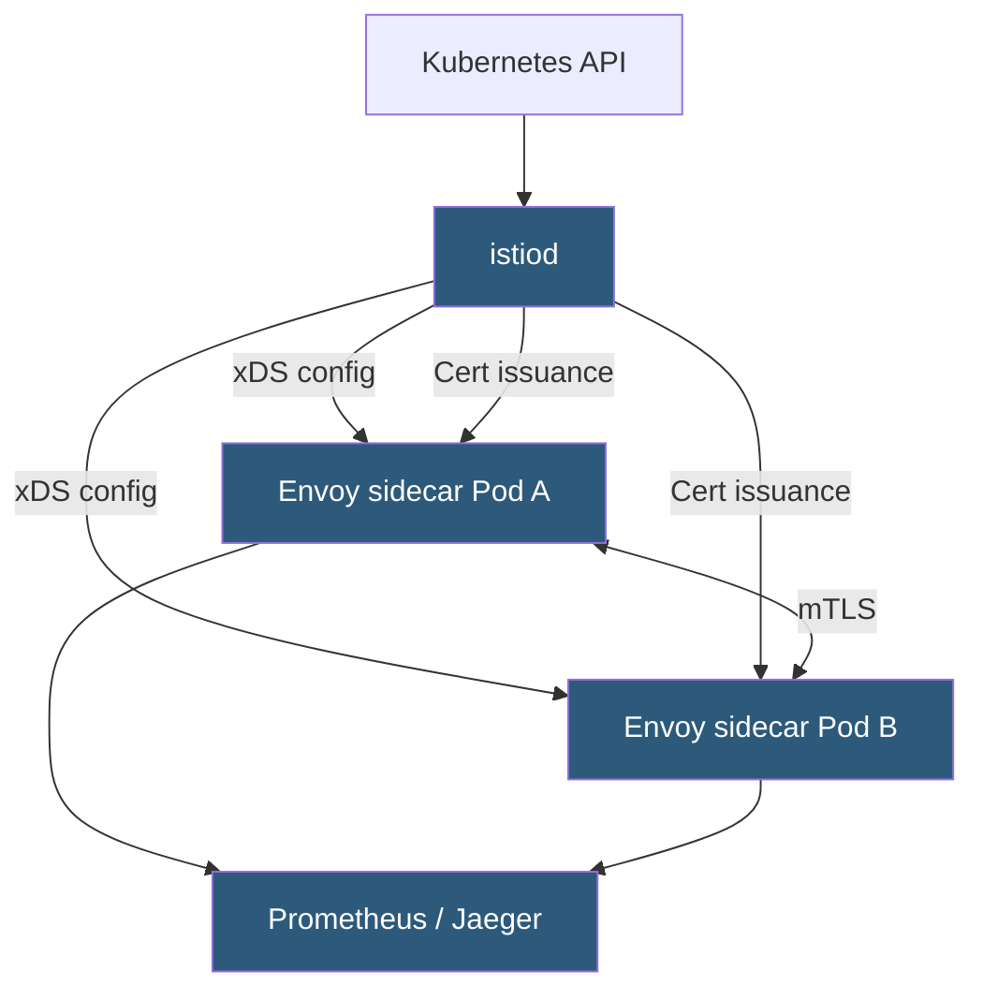

**Category:** Kubernetes Infrastructure
**Difficulty:** Advanced
**Reading time:** 7 min read

---

Istio is the most feature-rich open-source service mesh for Kubernetes, providing mutual TLS, advanced traffic management, policy enforcement, and deep telemetry via an Envoy-based sidecar data plane managed by its istiod control plane.

- **istiod** — unified control plane binary (merged from Pilot, Citadel, Galley) that handles config, certificates, and service discovery
- **Envoy sidecar** — the data-plane proxy injected into every pod via MutatingWebhookConfiguration
- **VirtualService** — Istio CRD that defines HTTP/TCP routing rules, retries, timeouts, and fault injection
- **DestinationRule** — Istio CRD that configures load balancing, connection pooling, and circuit breaking for a service
- **PeerAuthentication** — enforces mTLS policy; can be set per-namespace or cluster-wide
- **AuthorizationPolicy** — L7 access control based on service identity, HTTP attributes, or JWT claims
- **Ambient mesh** — Istio's sidecar-less architecture using node-level ztunnel and waypoint proxies

istiod serves as the single control-plane process. It reads Istio and Kubernetes custom resources, translates them into Envoy xDS configuration, and streams updates to all sidecars. When a service is deployed, istiod issues a short-lived SPIFFE X.509 certificate to the sidecar via the SDS (Secret Discovery Service) API. The sidecar presents this certificate for all outbound connections and validates peers' certificates against istiod's CA.

**Traffic management** is declarative. A VirtualService attached to a service host defines routing rules: split traffic 90/10 between two subsets, retry failed requests up to 3 times with a 25ms retry interval, abort 5% of requests with a 503 to test client resilience. A DestinationRule defines the subsets (by pod labels), sets connection pool limits, and configures outlier detection (circuit breaking) that ejects pods returning too many errors.

**Authorization policies** evaluate every request in the data plane without needing a central policy decision point. Each sidecar enforces allow/deny rules locally using metadata from the mTLS connection (source principal = SPIFFE ID) and HTTP request attributes (method, path, JWT claims). This is far more scalable than a centralized PEP.

The newer **ambient mesh** mode eliminates the per-pod sidecar. A node-level **ztunnel** proxy handles L4 mTLS for all pods on the node with minimal overhead. For pods needing L7 features, a per-namespace **waypoint proxy** is deployed. Ambient mode significantly reduces resource consumption and simplifies pod lifecycle management.

- Enterprise Kubernetes platforms requiring audit-grade mTLS and authorization logging
- Canary and A/B deployments with traffic percentage splitting
- Multi-cluster service mesh federation linking clusters across regions
- Regulatory environments needing cryptographic proof of service identity

| Advantage | Disadvantage |
|-----------|--------------|
| Richest feature set of any service mesh; covers nearly all traffic management scenarios | Steep learning curve; dozens of CRDs and complex interaction between them |
| istiod consolidation dramatically simplified prior multi-component architecture | Envoy sidecar per pod consumes ~50MB RAM and adds startup latency |
| Ambient mesh mode reduces overhead for latency-sensitive workloads | Ambient mesh is still maturing; some features not yet production-grade |
| Active CNCF project with broad vendor support and integrations | Upgrades can be disruptive; sidecar injection changes require rolling pod restarts |

- [Service mesh architecture](service-mesh-architecture.md)
- [Linkerd lightweight service mesh](linkerd-lightweight-service-mesh.md)
- [Cilium eBPF-based networking](cilium-ebpf-based-networking.md)

---
*Part of the [Kubernetes Infrastructure](index.md) category · [Back to Master Index](../../index.md)*
