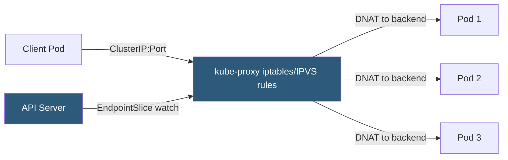

**Category:** Kubernetes Infrastructure
**Difficulty:** Intermediate
**Reading time:** 6 min read

---

Kube-proxy runs on every Kubernetes node and maintains network rules that allow pod-to-service communication. It translates virtual Service ClusterIP addresses into backend pod endpoints using kernel-level packet forwarding rules.

- **Service ClusterIP** — a stable virtual IP assigned to a Service that kube-proxy programs routes for
- **Endpoints / EndpointSlice** — the list of pod IP:port pairs backing a Service that kube-proxy watches
- **iptables mode** — default mode that programs NAT rules in the kernel's iptables chains for load balancing
- **IPVS mode** — high-performance mode using Linux IPVS (IP Virtual Server) in the kernel for large clusters
- **NodePort** — Service type that kube-proxy opens on a static port on every node's host interface
- **Session affinity** — optional configuration that pins a client IP to one backend pod
- **kube-proxy DaemonSet** — deployed as a DaemonSet to ensure exactly one instance per node

Kube-proxy watches the API server for Service and EndpointSlice objects. When a Service is created, kube-proxy programs rules in the node's kernel to intercept traffic destined for the Service's ClusterIP and randomly DNAT it to one of the available pod endpoints.

In **iptables mode** (the default), kube-proxy creates a chain of DNAT rules under the `KUBE-SERVICES` chain. Each Service gets a chain with one rule per backend pod. The rules use `statistic` matches for probabilistic load distribution. As endpoints change, kube-proxy rewrites the entire affected chain atomically. This approach has O(n) rule complexity — a cluster with 10,000 services and 100 endpoints each has 1,000,000 iptables rules, creating performance problems.

**IPVS mode** addresses large-cluster scaling. IPVS is a kernel load-balancing module that maintains a hash table of virtual servers and real servers. Rule lookup is O(1) regardless of the number of services. IPVS also supports richer scheduling algorithms: round-robin, least-connection, weighted round-robin, and shortest-expected-delay. IPVS mode requires the `ip_vs`, `ip_vs_rr`, and `nf_conntrack` kernel modules.

NodePort services cause kube-proxy to open a port on the node's host network interface and forward traffic to the ClusterIP, enabling external load balancers to reach services without knowing pod IP addresses.

- Enabling pod-to-service communication within a cluster
- Running high-service-count clusters with IPVS mode for performance
- Debugging connectivity failures by inspecting iptables rules with `iptables-save`
- Implementing session affinity for stateful application services

| Advantage | Disadvantage |
|-----------|--------------|
| Transparent to applications — pods use ClusterIP as a normal address | iptables mode degrades at scale (>1,000 services) due to rule count |
| IPVS mode provides O(1) lookup and advanced scheduling algorithms | IPVS requires specific kernel modules not present on all node images |
| DaemonSet deployment ensures consistent rules across all nodes | kube-proxy does not handle ingress or Layer 7 routing — requires an Ingress controller |
| NodePort opens service access at the infrastructure boundary | NodePort range is limited (default 30000–32767) and exposes ports on all nodes |

- [Kubelet architecture](kubelet-architecture.md)
- [Container Network Interface (CNI)](container-network-interface-cni.md)
- [Kubernetes Ingress controllers](kubernetes-ingress-controllers.md)

---
*Part of the [Kubernetes Infrastructure](index.md) category · [Back to Master Index](../../index.md)*
