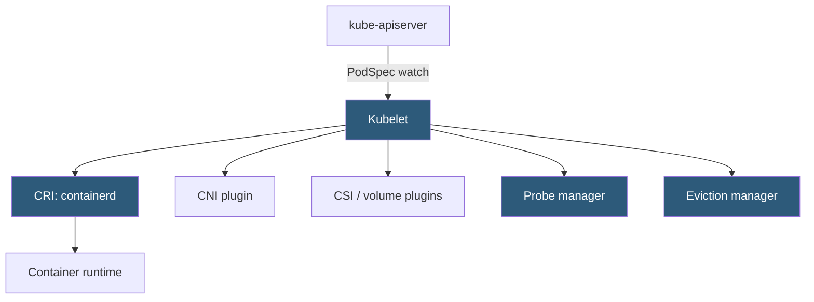

**Category:** Kubernetes Infrastructure
**Difficulty:** Intermediate
**Reading time:** 6 min read

---

The kubelet is the primary node agent in Kubernetes, responsible for ensuring that containers described in PodSpecs are running and healthy. It acts as the bridge between the Kubernetes control plane and the container runtime on each worker node.

- **PodSpec** — the declarative description of a pod that kubelet receives and tries to actualize
- **Container runtime interface (CRI)** — gRPC API the kubelet uses to talk to container runtimes (containerd, CRI-O)
- **Static pod** — pod manifest placed directly on the node filesystem; kubelet starts it without API server involvement
- **Liveness probe** — periodic health check; kubelet restarts containers that fail
- **Readiness probe** — determines whether a container is ready to receive traffic; removes pod from service endpoints if failing
- **Node status** — heartbeat data (capacity, conditions, addresses) the kubelet reports to the API server every 10 seconds
- **Eviction manager** — kubelet component that evicts pods when node resources (memory, disk) are critically low

The kubelet starts at node boot and registers the node with the API server, advertising its capacity (CPU, memory, ephemeral storage, extended resources like GPUs) and conditions. It then begins a watch on PodSpecs assigned to the node.

When a new pod arrives, the kubelet calls the CRI `RunPodSandbox` operation to create a network namespace (the pod sandbox), then `CreateContainer` and `StartContainer` for each container. It invokes the configured CNI plugin to wire networking to the sandbox and mounts volumes using CSI drivers or in-tree plugins.

After containers start, the kubelet launches probe goroutines for each configured liveness and readiness probe. Failed liveness probes trigger container restarts according to the pod's `restartPolicy`. Failed readiness probes update the pod's Ready condition, causing kube-proxy and endpoints controllers to remove the pod from service load balancing.

The **eviction manager** continuously monitors node-level resource pressure. When available memory falls below `evictionHard` thresholds, it selects pods for eviction using a priority ordering: BestEffort pods first (no requests/limits), then Burstable, then Guaranteed. This protects critical system pods during memory contention.

The kubelet also manages volume lifecycle — mounting PersistentVolumes before container start and unmounting on termination — and maintains garbage collection of unused container images to reclaim disk space.

- Diagnosing pod startup failures by inspecting kubelet logs and events
- Configuring eviction thresholds to protect node stability under memory pressure
- Using static pods to run critical per-node infrastructure (e.g., control plane components in kubeadm)
- Implementing custom node conditions via the kubelet's Node Problem Detector integration

| Advantage | Disadvantage |
|-----------|--------------|
| Decentralized per-node agent ensures local execution even if API server is temporarily unreachable | Misconfigured probes can cause unnecessary restarts or traffic to unhealthy pods |
| CRI abstraction allows swapping container runtimes without changing kubelet | CRI version mismatches between kubelet and runtime cause hard-to-diagnose failures |
| Eviction manager protects node stability automatically | Aggressive eviction thresholds can disrupt healthy workloads during transient spikes |
| Static pods enable bootstrapping control plane before cluster is fully up | Static pods are not visible through standard Kubernetes API queries |

- [Kubernetes control plane components](kubernetes-control-plane-components.md)
- [Kube-proxy networking](kube-proxy-networking.md)
- [Container Network Interface (CNI)](container-network-interface-cni.md)

---
*Part of the [Kubernetes Infrastructure](index.md) category · [Back to Master Index](../../index.md)*
