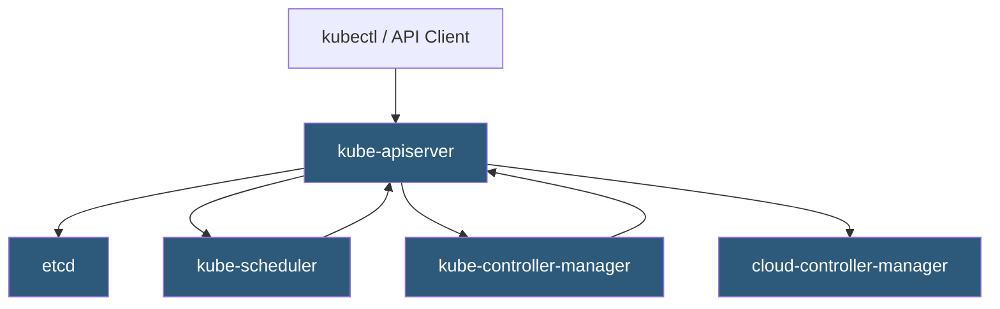

**Category:** Kubernetes Infrastructure
**Difficulty:** Intermediate
**Reading time:** 6 min read

---

The Kubernetes control plane is the set of components that manage the global state of a cluster, making scheduling decisions and responding to cluster events. It comprises the API server, etcd, scheduler, and controller manager, each fulfilling a distinct role in cluster orchestration.

- **API Server (kube-apiserver)** — the front-end REST gateway that validates and processes all cluster state changes
- **etcd** — distributed key-value store that holds all cluster state persistently
- **kube-scheduler** — assigns unscheduled pods to nodes based on resource requirements and policies
- **kube-controller-manager** — runs reconciliation loops that drive actual state toward desired state
- **cloud-controller-manager** — abstracts cloud-provider-specific control logic from core controllers
- **Control plane node** — dedicated host(s) running control-plane processes, typically kept separate from worker nodes
- **Leader election** — mechanism ensuring only one controller instance acts at a time in HA setups

The control plane operates as a continuous reconciliation engine. All mutations flow through the **kube-apiserver**, which authenticates requests, validates object schemas, applies admission webhooks, and persists changes to **etcd**. etcd uses the Raft consensus algorithm to guarantee consistency across replicas, making it the single source of truth for cluster state.

The **kube-scheduler** watches the API server for pods in the `Pending` state that have no node assignment. It runs a two-phase algorithm: filtering eliminates nodes that cannot satisfy pod constraints (CPU, memory, taints, affinity rules), and scoring ranks remaining nodes using priority functions. The highest-scoring node is bound to the pod via an API write.

The **kube-controller-manager** bundles dozens of controllers — ReplicaSet, Deployment, Job, ServiceAccount, and more — each watching relevant resource types and correcting drift. For example, the ReplicaSet controller continuously compares the actual number of running pods to the desired replica count and creates or deletes pods accordingly.

In production clusters, control-plane components are replicated across three or more nodes. The API server is stateless and horizontally scalable behind a load balancer. etcd nodes form a quorum cluster; the scheduler and controller-manager use leader election to ensure a single active instance at any time, with standby replicas ready to assume leadership on failure.

- Running highly available production Kubernetes clusters with zero single points of failure
- Auditing cluster changes by querying etcd snapshots
- Extending cluster behavior through custom controllers and admission webhooks registered with the API server
- Diagnosing scheduling failures by inspecting scheduler events and node conditions

| Advantage | Disadvantage |
|-----------|--------------|
| Declarative API enables GitOps and infrastructure-as-code workflows | etcd requires low-latency SSD storage; network latency degrades performance |
| HA control plane tolerates node failures without cluster downtime | Running 3+ control-plane nodes increases infrastructure cost |
| Pluggable scheduler supports custom scheduling logic | Debugging scheduler decisions requires deep familiarity with filtering and scoring |
| Controller framework simplifies building Kubernetes-native automation | Large clusters may need API server horizontal scaling and etcd tuning |

- [etcd cluster design](etcd-cluster-design.md)
- [API server scaling](api-server-scaling.md)
- [Kubernetes scheduler algorithms](kubernetes-scheduler-algorithms.md)

---
*Part of the [Kubernetes Infrastructure](index.md) category · [Back to Master Index](../../index.md)*
