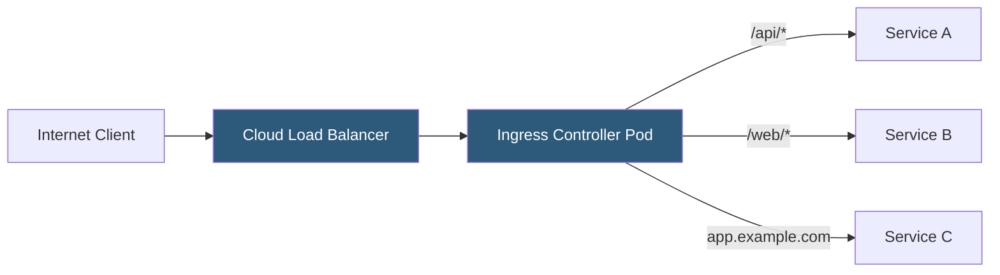

**Category:** Kubernetes Infrastructure
**Difficulty:** Intermediate
**Reading time:** 6 min read

---

Kubernetes Ingress controllers implement the Ingress API to provide HTTP and HTTPS routing from external traffic into cluster services. They watch Ingress resources and configure an underlying reverse proxy or load balancer to enforce the declared routing rules.

- **Ingress resource** — Kubernetes object declaring HTTP routing rules (host, path, backend service)
- **IngressClass** — references which controller implementation handles a given Ingress object
- **Ingress controller** — the pod(s) that watch Ingress resources and configure the actual proxy
- **TLS termination** — the controller decrypts HTTPS using certificates from Kubernetes Secrets
- **Annotations** — controller-specific configuration (timeouts, rate limits, auth) applied per Ingress
- **Path-based routing** — routes different URL paths on the same hostname to different backend services
- **Host-based routing** — routes different hostnames (virtual hosts) to different backend services

An Ingress controller is any pod that implements the Kubernetes Ingress spec by watching Ingress and Service objects via the API server and translating them into proxy configuration. The controller reconciles the current proxy config against the desired state declared in Ingress resources continuously.

When a new Ingress object is created, the controller reads its `rules` (host + path → backend service + port mappings) and `tls` section (hostname → Kubernetes Secret containing TLS certificate and key). It updates the underlying proxy — NGINX, HAProxy, Envoy, Traefik, or others — with the new virtual host configuration and reloads it gracefully.

**TLS termination** happens at the controller: HTTPS connections from clients are decrypted using the certificate from the referenced Kubernetes Secret. The connection to the backend service is typically plain HTTP on the cluster network, though passthrough mode (SNI-based routing without decryption) is supported for end-to-end encryption.

Controllers are distinguished by how they propagate configuration. NGINX-based controllers write nginx.conf and trigger a graceful reload. Envoy-based controllers (like Ambassador and Contour) use xDS APIs for zero-reload dynamic configuration. Traefik uses its own provider mechanism to update routing without process restarts.

Annotations remain the primary extension mechanism for per-Ingress configuration, but the Gateway API (a newer successor to Ingress) offers a structured, multi-resource approach that separates infrastructure concerns from application routing declarations.

- Routing external HTTP/HTTPS traffic to multiple services on a single IP/load balancer
- Automatic TLS certificate provisioning with cert-manager integration
- Path-based API gateway routing for microservices architectures
- Traffic-weighted routing for canary deployments via supported annotations

| Advantage | Disadvantage |
|-----------|--------------|
| Single external IP for many services reduces cloud load balancer cost | Annotation-based configuration is not standardized across controllers |
| TLS termination centralizes certificate management | NGINX config reload can cause brief connection drops under high request rates |
| Wide ecosystem choice (NGINX, Traefik, HAProxy, Envoy) | Multiple controllers in one cluster require careful IngressClass management |
| Supports cert-manager for automatic Let's Encrypt certificate rotation | Ingress API is limited; complex routing requires Gateway API or service mesh |

- [NGINX Ingress](nginx-ingress.md)
- [Traefik proxy](traefik-proxy.md)
- [Ambassador API Gateway](ambassador-api-gateway.md)

---
*Part of the [Kubernetes Infrastructure](index.md) category · [Back to Master Index](../../index.md)*
