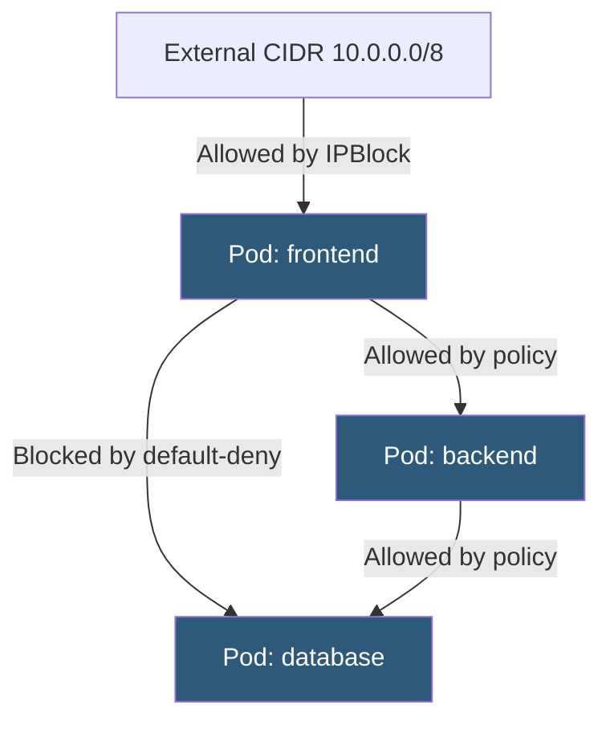

**Category:** Kubernetes Infrastructure
**Difficulty:** Intermediate
**Reading time:** 6 min read

---

Kubernetes NetworkPolicy resources define rules governing which pods can communicate with each other and with external endpoints. They implement a pod-level firewall that restricts traffic based on namespace, pod labels, IP blocks, and port numbers.

- **NetworkPolicy** — namespace-scoped Kubernetes resource that defines ingress and/or egress rules for selected pods
- **Pod selector** — label-based selector that defines which pods the policy applies to
- **Ingress rule** — controls which sources are allowed to send traffic to the selected pods
- **Egress rule** — controls which destinations the selected pods may send traffic to
- **Namespace selector** — allows traffic from pods in other namespaces matching specific labels
- **IPBlock** — allows traffic to/from specific CIDR ranges (useful for external services)
- **Default deny** — a NetworkPolicy with an empty `ingress: []` or `egress: []` blocks all traffic for the selected pods

NetworkPolicy is enforced by the CNI plugin, not by Kubernetes core. When a NetworkPolicy is created, the CNI plugin (Calico, Cilium, Weave, etc.) translates it into kernel-level firewall rules (iptables, eBPF, or IPset entries) on every node where affected pods run.

Policies are **additive and namespace-scoped**. If no NetworkPolicy selects a pod, that pod has unrestricted ingress and egress. Once any NetworkPolicy selects a pod, all traffic not explicitly permitted by at least one policy is blocked. Multiple policies for the same pod are unioned — any allow rule from any policy grants access.

**Ingress rules** specify allowed traffic sources. A source can be: a `podSelector` (pods within the same namespace matching labels), a `namespaceSelector` (all pods in namespaces matching labels), a combination of both (pods matching label X in namespace matching label Y), or an `ipBlock` (external CIDR). Each source entry in the array is ORed; each rule can also specify `ports` to restrict by port and protocol.

**Egress rules** follow the same structure but restrict outbound connections. A critical consideration is DNS: if you apply an egress policy, you must explicitly allow egress to the DNS service (kube-dns on port 53/UDP) or all name resolution will fail.

A **default-deny** posture is implemented by creating a NetworkPolicy that selects all pods in a namespace (`podSelector: {}`) with empty ingress/egress arrays. This denies all traffic to/from all pods in the namespace, and subsequent NetworkPolicy objects add back only the required flows.

- Implementing microsegmentation in multi-tenant clusters (namespace isolation)
- Preventing lateral movement in compromised pod scenarios (zero-trust default-deny)
- Restricting database access to only authorized application pods
- Controlling egress to external APIs by specific service pods

| Advantage | Disadvantage |
|-----------|--------------|
| Declarative policy alongside application manifests in GitOps workflows | NetworkPolicy is not enforced without a supporting CNI plugin; bare cluster has no enforcement |
| Namespace and pod label selectors align with Kubernetes-native abstractions | Does not support L7 rules (HTTP path, DNS hostname); only L3/L4 filtering |
| Default-deny + allow lists follow least-privilege security principles | Writing complete policies for complex topologies is error-prone and hard to audit |
| Policies are enforced in the data plane kernel, not a userspace proxy | Debugging blocked traffic requires knowing which CNI plugin and its specific logs/tools |

- [Calico networking](calico-networking.md)
- [Cilium eBPF-based networking](cilium-ebpf-based-networking.md)
- [Namespace isolation strategies](namespace-isolation-strategies.md)

---
*Part of the [Kubernetes Infrastructure](index.md) category · [Back to Master Index](../../index.md)*
