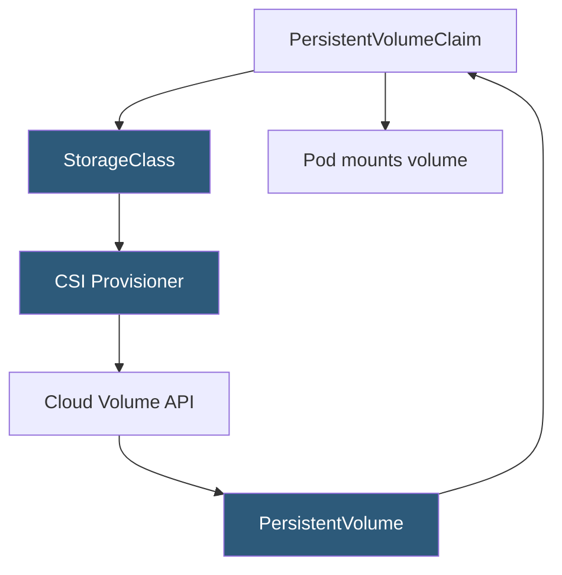

**Category:** Kubernetes Infrastructure
**Difficulty:** Intermediate
**Reading time:** 6 min read

---

StorageClasses define how Kubernetes dynamically provisions PersistentVolumes, abstracting the underlying storage technology from application developers. They specify the provisioner, parameters, reclaim policy, and volume binding mode for a class of storage.

- **StorageClass** — cluster-level resource defining a storage provisioner and its parameters
- **Provisioner** — the driver (CSI or in-tree) responsible for creating the physical volume
- **ReclaimPolicy** — what happens to the PV when its PVC is deleted: `Retain` or `Delete`
- **VolumeBindingMode** — `Immediate` (provision on PVC creation) or `WaitForFirstConsumer` (provision when pod is scheduled)
- **allowVolumeExpansion** — enables resizing an existing PersistentVolumeClaim without recreation
- **Parameters** — provisioner-specific settings (disk type, IOPS tier, encryption, replication factor)
- **Default StorageClass** — the StorageClass used when a PVC does not specify one; marked with annotation `storageclass.kubernetes.io/is-default-class: "true"`

When a user creates a PersistentVolumeClaim referencing a StorageClass, the storage provisioner (identified in the StorageClass's `provisioner` field) is invoked to create a matching PersistentVolume. The provisioner calls the underlying storage API — AWS EBS CreateVolume, GCE PD disk insert, or a Ceph RBD command — and registers the returned volume as a PV in the Kubernetes API.

**WaitForFirstConsumer** binding mode is critical for topology-aware provisioning. In Immediate mode, a volume might be created in one availability zone before the pod is scheduled, causing the pod to land in a different zone where the volume is inaccessible. WaitForFirstConsumer delays provisioning until the scheduler selects a node, then provisions the volume in the same topology zone.

**Parameters** are entirely provisioner-specific. For AWS EBS via the ebs.csi.aws.com provisioner, parameters include `type: gp3`, `iops: "3000"`, `throughput: "125"`, and `encrypted: "true"`. For GCE PD: `type: pd-ssd`, `replication-type: regional-pd`. For Ceph RBD: `pool`, `imageFormat`, `imageFeatures`. This flexibility allows operators to define tiered storage classes (fast-ssd, standard, archival) that application teams select by name.

`allowVolumeExpansion: true` enables online expansion. A user edits the PVC's `spec.resources.requests.storage` to a larger value; the CSI driver expands the underlying block device; and for filesystem volumes, kubelet runs the filesystem resize operation on the next pod attachment.

- Defining separate StorageClasses for different performance tiers (NVMe SSD vs HDD)
- Enforcing encryption-at-rest for sensitive workloads via provisioner parameters
- Topology-aware storage for multi-zone clusters to prevent cross-zone volume attachment
- Allowing developers to self-service storage without knowing underlying infrastructure details

| Advantage | Disadvantage |
|-----------|--------------|
| Abstracts storage infrastructure; application manifests are portable between clouds | StorageClass parameters are provisioner-specific; manifests are not truly cloud-portable |
| Dynamic provisioning eliminates pre-provisioning of PVs | Volume expansion may require pod restart for filesystem resize to take effect |
| Tiered classes (ssd, hdd, archive) let teams choose cost vs performance | Retain reclaim policy requires manual PV cleanup to avoid orphaned storage costs |
| WaitForFirstConsumer prevents cross-zone volume attachment errors | Default StorageClass misconfiguration causes silent provisioning to wrong tier |

- [CSI (Container Storage Interface)](csi-container-storage-interface.md)
- [PersistentVolume provisioning](persistentvolume-provisioning.md)
- [Dynamic volume provisioning](dynamic-volume-provisioning.md)

---
*Part of the [Kubernetes Infrastructure](index.md) category · [Back to Master Index](../../index.md)*
