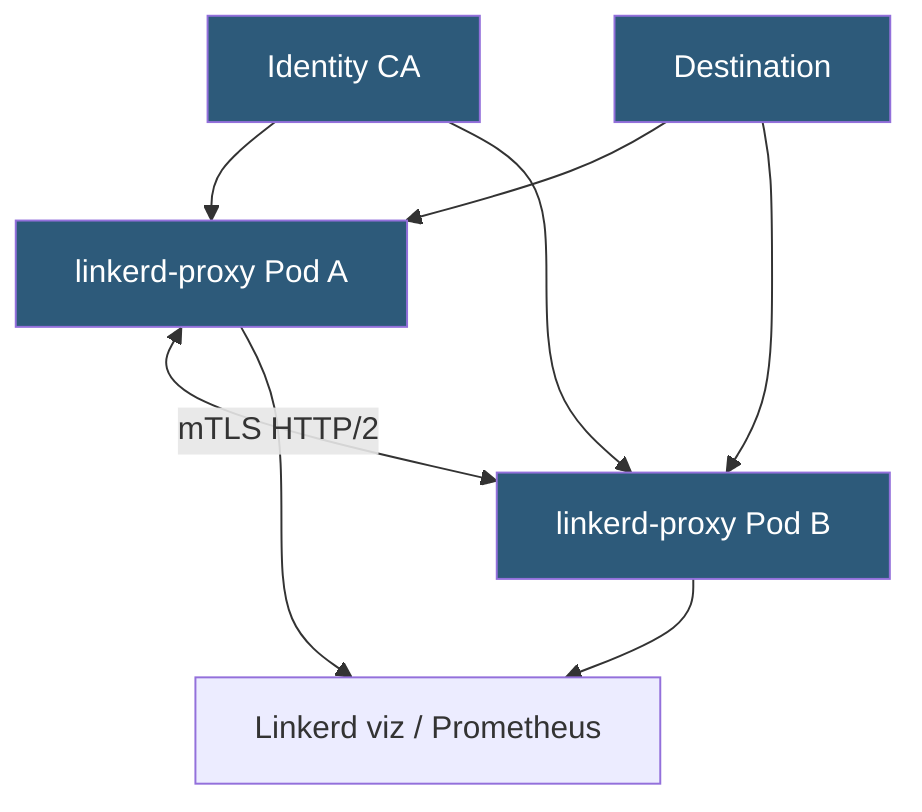

**Category:** Kubernetes Infrastructure
**Difficulty:** Intermediate
**Reading time:** 6 min read

---

Linkerd is a CNCF-graduated service mesh designed for simplicity and low resource overhead. It uses a purpose-built Rust micro-proxy instead of Envoy, delivering mTLS, observability, and traffic management with significantly less CPU and memory consumption than heavier alternatives.

- **linkerd-proxy** — the ultra-lightweight Rust sidecar proxy injected into pods
- **control plane** — three components: destination (service discovery), identity (mTLS CA), proxy-injector (sidecar injection webhook)
- **ServiceProfile** — Linkerd CRD that defines per-route metrics, retries, and timeouts for a service
- **Golden metrics** — success rate, request rate, and latency P50/P95/P99 automatically surfaced per service and route
- **mTLS identity** — derived from Kubernetes ServiceAccount; certificates rotated every 24 hours
- **Linkerd viz** — optional extension that adds Grafana dashboards, Prometheus scraping, and the Linkerd dashboard UI
- **Multi-cluster extension** — extends the mesh across Kubernetes clusters using a gateway-based topology

Linkerd's control plane has a deliberately small footprint: three Go services and an optional viz extension. The **destination** service resolves service endpoints and streams routing policy to proxies via gRPC. The **identity** service acts as a certificate authority, issuing short-lived TLS certificates to each proxy on behalf of the pod's ServiceAccount. The **proxy-injector** webhook automatically injects the linkerd-proxy sidecar container at pod creation time.

The **linkerd-proxy** is written in Rust for safety and performance. It intercepts traffic via iptables REDIRECT rules and speaks HTTP/1.1, HTTP/2, and gRPC. For every connection it transparently upgrades to mTLS using the identity certificate. The proxy is deliberately minimal — no Lua scripting, no Wasm — which makes it faster to start, smaller in RAM, and easier to reason about.

Per-route observability is a standout feature. When a ServiceProfile is defined for a service, Linkerd tracks success rate, latency, and request volume individually per route (HTTP method + path pattern). This granularity exposes which specific API endpoints are failing, not just aggregate service health.

Traffic management features are more limited than Istio by design. Linkerd supports retries, timeouts, and per-route rate limiting via ServiceProfile. For complex traffic splitting (canary deployments), Linkerd integrates with Flagger or SMI (Service Mesh Interface) TrafficSplit resources. The multi-cluster extension uses gateway services and mirrored service objects to route cross-cluster traffic without merging DNS or IP spaces.

- Teams prioritizing operational simplicity and low resource overhead over maximum features
- High-density clusters where sidecar memory per pod is a critical constraint
- Development teams that want mTLS and golden-signal observability without deep service mesh expertise
- Environments using SMI-compatible tooling for traffic management (Flagger, Argo Rollouts)

| Advantage | Disadvantage |
|-----------|--------------|
| linkerd-proxy uses ~10MB RAM versus ~50MB for Envoy sidecars | Fewer L7 features than Istio; no circuit breaker, no header-based routing |
| Extremely simple to install with `linkerd install | kubectl apply` | ServiceProfile-based retries require CRD per service; no global retry config |
| Automatic mTLS with zero-config certificate rotation | No WebAssembly (Wasm) extension point; customization options are limited |
| Golden metrics out-of-the-box without any application changes | Multi-cluster setup requires gateway infrastructure and careful DNS management |

- [Service mesh architecture](service-mesh-architecture.md)
- [Istio service mesh](istio-service-mesh.md)
- [Consul Connect](consul-connect.md)

---
*Part of the [Kubernetes Infrastructure](index.md) category · [Back to Master Index](../../index.md)*
