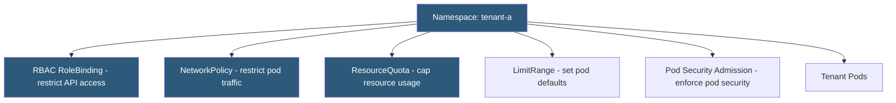

**Category:** Kubernetes Infrastructure
**Difficulty:** Intermediate
**Reading time:** 6 min read

---

Kubernetes namespaces provide a logical partitioning mechanism for cluster resources, but isolation requires combining RBAC, NetworkPolicy, resource quotas, and admission policies. Effective namespace isolation is the foundation of secure multi-tenancy in Kubernetes clusters.

- **Namespace** — a logical partition of a Kubernetes cluster providing a scope for names and resource policies
- **ResourceQuota** — limits total resource consumption (CPU, memory, object counts) within a namespace
- **LimitRange** — sets default and maximum resource requests/limits for pods in a namespace
- **NetworkPolicy** — restricts pod-to-pod and pod-to-external communication within and across namespaces
- **RBAC namespace scope** — Role and RoleBinding restrict user permissions to a specific namespace
- **Hierarchical namespaces** — extension (via HNC) that allows namespace trees with inherited policies
- **Virtual clusters** — isolated Kubernetes API surfaces (vcluster) built on top of a host namespace

Namespace isolation is not automatic — a pod in namespace A can, by default, send traffic to a pod in namespace B, and a user with cluster-admin can access any namespace. Building genuine isolation requires layering multiple mechanisms.

**RBAC isolation** ensures each team can only manage resources in their own namespace. A RoleBinding in namespace `tenant-a` binding the `edit` ClusterRole to `team-a` group allows team-a to create, update, and delete pods, services, and deployments in that namespace only. They cannot see resources in `tenant-b` or create cluster-scoped resources like ClusterRoles.

**NetworkPolicy isolation** blocks unauthorized cross-namespace traffic. A default-deny egress + ingress policy in each namespace, combined with explicit policies permitting only required flows, prevents compromised pods from probing other namespaces. The `namespaceSelector` in NetworkPolicy rules can restrict cross-namespace traffic to only trusted namespaces (e.g., monitoring namespace → all namespaces for metrics scraping).

**ResourceQuota** enforces fair resource consumption. Each namespace gets a quota object limiting total CPU, memory, and object counts. Without quotas, a single tenant can exhaust cluster capacity and starve others. Quotas also set `LimitRange` defaults so pods that omit resource requests get sensible defaults, enabling the scheduler to place them correctly.

**Hierarchical Namespace Controller (HNC)** enables namespace trees where child namespaces inherit RBAC and policy from parents. This simplifies management of many related namespaces (e.g., per-environment, per-team namespaces under a project root).

For the strongest isolation, **virtual clusters** (vcluster, Loft) provision a dedicated Kubernetes API server within a namespace. Tenants get a full Kubernetes API experience — including CRD management — while the host cluster remains unaffected by tenant operations.

- Multi-tenant SaaS platforms where each customer runs in their own namespace
- Development environment management where each developer gets an isolated namespace
- Compliance-driven workload separation between PCI and non-PCI environments
- Cost chargeback via ResourceQuota-based tracking of per-namespace consumption

| Advantage | Disadvantage |
|-----------|--------------|
| Lightweight compared to running separate clusters per tenant | True isolation requires multiple mechanisms; misconfiguring any layer creates gaps |
| Kubernetes-native; no additional controllers needed for basic isolation | Namespace-scoped isolation does not protect cluster-level resources (StorageClass, ClusterRole) |
| ResourceQuota prevents noisy-neighbor resource exhaustion | ResourceQuota management at scale requires automation to create and update quotas |
| Virtual clusters provide near-cluster-level isolation within a namespace | Virtual clusters add operational overhead; their Kubernetes API versions may lag the host |

- [RBAC (Role-Based Access Control)](rbac-role-based-access-control.md)
- [Pod security policies](pod-security-policies.md)
- [Kubernetes networking policies](kubernetes-networking-policies.md)

---
*Part of the [Kubernetes Infrastructure](index.md) category · [Back to Master Index](../../index.md)*
