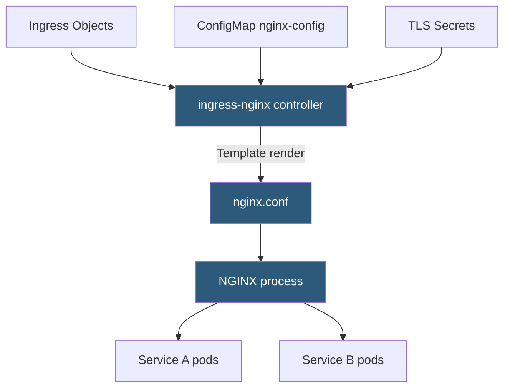

**Category:** Kubernetes Infrastructure
**Difficulty:** Intermediate
**Reading time:** 6 min read

---

The NGINX Ingress controller is the most widely deployed Kubernetes Ingress implementation, using NGINX as the underlying reverse proxy to handle HTTP/HTTPS routing, TLS termination, and traffic management for cluster services.

- **ingress-nginx** — the community-maintained NGINX Ingress controller (distinct from NGINX Inc.'s commercial controller)
- **nginx.conf template** — Go template that the controller uses to generate NGINX configuration from Ingress objects
- **ConfigMap** — cluster-wide NGINX settings (worker processes, keepalive, buffer sizes) exposed as a ConfigMap
- **Annotations** — per-Ingress tuning for timeouts, rate limits, auth, rewrite rules, CORS, and more
- **Rewrite rules** — annotation-driven URL path rewriting before proxying to backend services
- **Rate limiting** — NGINX `limit_req_zone` integration exposed via `nginx.ingress.kubernetes.io/limit-rps`
- **Snippet annotations** — allow raw NGINX config injection for advanced use cases

The ingress-nginx controller watches all Ingress resources in the cluster and generates an nginx.conf file using a Go template. Each Ingress rule translates into NGINX server and location blocks. When Ingress resources change, the controller re-renders the template and performs a graceful reload of the NGINX master process, which starts new worker processes with the new config and drains connections on old workers.

**Endpoint-level load balancing** is a notable optimization: ingress-nginx bypasses the Service ClusterIP and directly uses pod IPs from EndpointSlices. This avoids a double NAT (Ingress → Service → pod) and gives the controller more control over load balancing algorithms (round-robin, random, ewma).

TLS termination uses Kubernetes Secrets of type `kubernetes.io/tls`. The controller watches these secrets and updates the NGINX SSL configuration dynamically using the `ssl_certificate` and `ssl_certificate_key` directives. Certificates provided by cert-manager are automatically picked up without manual intervention.

**Annotations** provide extensive per-Ingress configuration. Common annotations include `nginx.ingress.kubernetes.io/proxy-body-size` (upload limit), `nginx.ingress.kubernetes.io/use-regex` (regex path matching), `nginx.ingress.kubernetes.io/auth-url` (external auth service), and `nginx.ingress.kubernetes.io/canary` with weight annotations for traffic splitting.

At large scale, the goroutine that watches endpoints and updates NGINX configuration adds CPU load. Tuning `--sync-period`, enabling `--enable-ssl-passthrough` only when needed, and using Global Rate Limiting (NGINX Plus feature) or ingress-nginx's built-in rate limits are key optimizations.

- Standard production Kubernetes clusters needing HTTP/HTTPS routing on a single IP
- Multi-tenant clusters with per-namespace Ingress resources managed independently
- Canary deployments using ingress-nginx's annotation-based traffic splitting
- External authentication for internal services using `auth-url` annotation with OAuth proxy

| Advantage | Disadvantage |
|-----------|--------------|
| Extremely widely used; extensive documentation and community support | Config reload on changes can cause brief connection disruption under load |
| Rich annotation set covers most production use cases without custom controllers | Annotation-based config is NGINX-specific; not portable to other controllers |
| Direct endpoint routing avoids double-NAT latency | Snippet annotations can introduce security risks if misused |
| Integrates natively with cert-manager for automatic TLS | High churn clusters (many pod changes per second) can cause excessive NGINX reloads |

- [Kubernetes Ingress controllers](kubernetes-ingress-controllers.md)
- [Traefik proxy](traefik-proxy.md)
- [HAProxy Ingress](haproxy-ingress.md)

---
*Part of the [Kubernetes Infrastructure](index.md) category · [Back to Master Index](../../index.md)*
