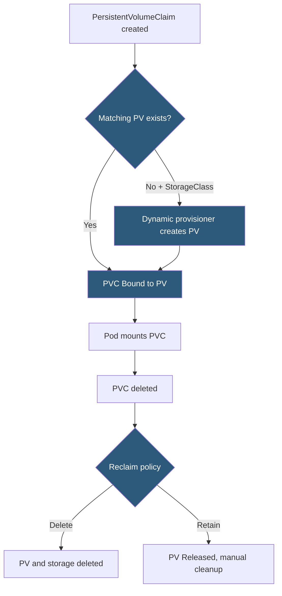

**Category:** Kubernetes Infrastructure
**Difficulty:** Intermediate
**Reading time:** 6 min read

---

PersistentVolumes (PVs) and PersistentVolumeClaims (PVCs) are Kubernetes abstractions that decouple pod storage from the pod lifecycle. PVs represent physical storage capacity; PVCs are requests for that storage from applications.

- **PersistentVolume (PV)** — a cluster-level resource representing a unit of storage provisioned manually or dynamically
- **PersistentVolumeClaim (PVC)** — a namespace-scoped storage request specifying size, access mode, and StorageClass
- **Access modes** — `ReadWriteOnce` (single node R/W), `ReadOnlyMany` (multi-node read), `ReadWriteMany` (multi-node R/W)
- **Binding** — the process that pairs a PVC with a matching PV based on capacity, access mode, and StorageClass
- **Reclaim policy** — `Retain` (manual cleanup), `Delete` (auto-delete PV and underlying storage), `Recycle` (deprecated)
- **Volume status** — PV lifecycle: Available → Bound → Released → Failed
- **Static provisioning** — administrator creates PVs manually before PVCs request them

In **static provisioning**, a cluster administrator creates PV objects that describe available storage — an NFS export, an iSCSI LUN, or a pre-provisioned cloud disk. Each PV specifies its capacity, access modes, and storage class name. When a user creates a PVC requesting 10Gi with `ReadWriteOnce` from the `fast-ssd` StorageClass, the control plane's PersistentVolume controller searches for an Available PV matching all constraints. If found, it binds them: the PV enters the Bound state and the PVC is also marked Bound.

In **dynamic provisioning**, no pre-provisioned PVs exist. The PVC references a StorageClass, and the associated CSI provisioner creates a new PV and the underlying storage resource on demand. Dynamic provisioning is the standard approach in cloud environments.

**Access modes** define the mount semantics the storage backend supports. Block volumes (EBS, GCE PD) only support `ReadWriteOnce` — one node at a time. Network filesystems (NFS, CephFS, Azure Files) support `ReadWriteMany`, enabling multiple pods across different nodes to share the same volume simultaneously.

The **volume status lifecycle** is important for debugging. A PV that was bound and then its PVC deleted enters the `Released` state. With a `Retain` policy, the PV is not immediately deleted. The administrator must manually inspect the data, clean the PV's `claimRef`, and set it back to `Available` before it can be rebound. With a `Delete` policy, the control plane automatically deletes the PV and triggers the CSI driver to delete the underlying storage.

- Pre-provisioning NFS shares for legacy workloads using static PVs
- Dynamic database storage provisioning where PVCs are created per tenant
- Multi-reader shared storage for content delivery pods using ReadWriteMany NFS volumes
- Data archival by retaining PVs after PVC deletion for audit or analysis

| Advantage | Disadvantage |
|-----------|--------------|
| Decouples application storage requests from infrastructure specifics | PVC/PV matching logic can be confusing; small mismatches cause unbound claims |
| Reclaim policies allow either automatic cleanup or data preservation | Retain policy requires manual PV lifecycle management, creating ops burden |
| Namespace-scoped PVCs enable per-tenant storage isolation | ReadWriteMany is only supported by shared filesystems, not standard block storage |
| Volume status progression is visible in the API for debugging | Cross-zone volume attachment failures are a common source of pod scheduling issues |

- [Kubernetes storage classes](kubernetes-storage-classes.md)
- [CSI (Container Storage Interface)](csi-container-storage-interface.md)
- [Dynamic volume provisioning](dynamic-volume-provisioning.md)

---
*Part of the [Kubernetes Infrastructure](index.md) category · [Back to Master Index](../../index.md)*
