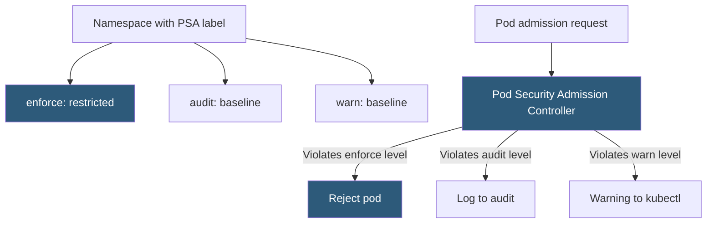

**Category:** Kubernetes Infrastructure
**Difficulty:** Advanced
**Reading time:** 6 min read

---

Pod Security Standards (PSS) and their enforcement via Pod Security Admission (PSA) replaced the deprecated PodSecurityPolicy in Kubernetes 1.25. They define security constraints on pods at the namespace level, preventing privilege escalation, host namespace access, and dangerous capabilities.

- **Pod Security Standards** — three predefined security profiles: Privileged, Baseline, and Restricted
- **Pod Security Admission (PSA)** — the built-in admission controller that enforces PSS at the namespace level
- **Privileged** — no restrictions; allows all pod capabilities (appropriate only for system components)
- **Baseline** — blocks the most dangerous defaults (privileged containers, host network/PID/IPC) while being compatible with common workloads
- **Restricted** — enforces pod hardening best practices (non-root, dropped capabilities, seccomp required)
- **Enforcement mode** — `enforce` (reject), `audit` (log), or `warn` (user warning) per namespace label
- **OPA/Gatekeeper** — policy engine alternative to PSA that supports arbitrary custom policies via Rego

Pod Security Admission is a built-in Kubernetes admission controller enabled by default since 1.23. It reads namespace labels to determine which policy level to apply in each enforcement mode. Namespace labels follow the format: `pod-security.kubernetes.io/<mode>: <level>`, where mode is `enforce`, `audit`, or `warn`, and level is `privileged`, `baseline`, or `restricted`.

The **Restricted** profile enforces: `runAsNonRoot: true`, `allowPrivilegeEscalation: false`, dropping all Linux capabilities (then adding back only those explicitly needed), requiring seccomp profile `RuntimeDefault` or `Localhost`, and disallowing `hostPath` volumes. Pods that violate any of these in a namespace with `enforce: restricted` are rejected at admission time with a descriptive error.

The **Baseline** profile only blocks clearly dangerous configurations: containers with `privileged: true`, `hostNetwork`, `hostPID`, `hostIPC`, host path mounts to sensitive directories, and certain dangerous Linux capabilities (NET_ADMIN, SYS_ADMIN, etc.). It is appropriate as a default for most application namespaces.

Using the **audit** and **warn** modes in parallel with a lower enforcement level allows organizations to see which workloads would be affected by tightening the enforce level — a prerequisite for incremental policy adoption without breaking running applications.

For more complex scenarios — custom resource policies, context-aware decisions, mutation — **OPA/Gatekeeper** or **Kyverno** provide Rego-based or YAML-based policy engines that can both validate and mutate pods at admission time.

- Enforcing that all application pods run as non-root in production namespaces
- Blocking privilege escalation and host namespace access cluster-wide as a default posture
- Auditing existing workloads for policy compliance before tightening enforcement
- Allowing system components (Prometheus node exporter, CNI DaemonSets) to bypass restrictions in the `kube-system` namespace

| Advantage | Disadvantage |
|-----------|--------------|
| Built-in admission controller requires no additional installation | PSS profiles are coarse-grained; no per-workload exceptions without namespace restructuring |
| Three standardized levels reduce policy design decision fatigue | Migrating from PodSecurityPolicy requires re-mapping each PSP to a namespace label |
| Audit/warn modes enable dry-run policy validation without disruption | Restricted level requires all workloads to be updated for seccomp and non-root compliance |
| OPA/Gatekeeper provides arbitrary custom policies when PSS is insufficient | OPA/Gatekeeper adds control-plane components and Rego learning curve |

- [RBAC (Role-Based Access Control)](rbac-role-based-access-control.md)
- [Namespace isolation strategies](namespace-isolation-strategies.md)
- [Kubernetes networking policies](kubernetes-networking-policies.md)

---
*Part of the [Kubernetes Infrastructure](index.md) category · [Back to Master Index](../../index.md)*
