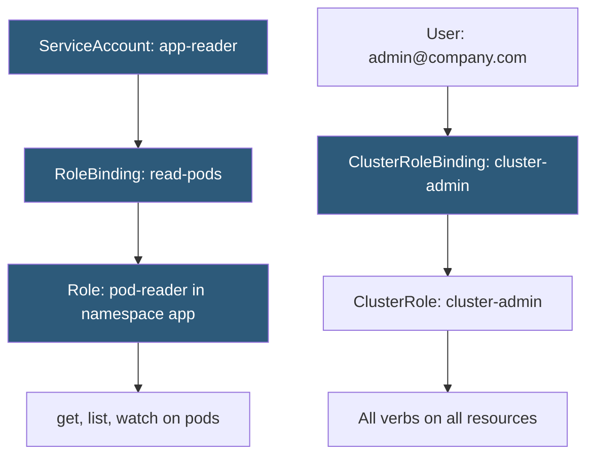

**Category:** Kubernetes Infrastructure
**Difficulty:** Intermediate
**Reading time:** 6 min read

---

Kubernetes RBAC controls what users, service accounts, and groups are permitted to do within a cluster by defining Roles and ClusterRoles with specific API permissions, then binding them to subjects via RoleBindings or ClusterRoleBindings.

- **Role** — namespace-scoped set of permissions on Kubernetes API resources (verbs on resources)
- **ClusterRole** — cluster-scoped role that can also be bound within individual namespaces
- **RoleBinding** — binds a Role or ClusterRole to subjects within a specific namespace
- **ClusterRoleBinding** — binds a ClusterRole to subjects cluster-wide
- **Subject** — the entity receiving permissions: User, Group, or ServiceAccount
- **Verb** — the allowed API operation: get, list, watch, create, update, patch, delete
- **Least privilege principle** — grant only the minimum permissions required for a workload or user

RBAC authorization is applied to every request that reaches the Kubernetes API server after authentication. The API server checks whether the authenticated principal (User, ServiceAccount, or Group) has a binding that includes a Role or ClusterRole permitting the requested verb on the requested resource in the appropriate namespace.

**Roles** are namespace-scoped and specify `rules`: an array of `apiGroups`, `resources`, and `verbs`. For example, a Role that allows reading pods is: `apiGroups: [""], resources: ["pods"], verbs: ["get", "list", "watch"]`. Core API group resources use `""` as the apiGroup; extension resources use their group name (e.g., `apps` for Deployments, `batch` for Jobs).

**RoleBindings** attach a Role (or ClusterRole used in namespace scope) to one or more subjects. Subjects can be individual user names (passed from the authentication layer), group names, or ServiceAccount objects. Pods automatically receive a ServiceAccount's RBAC permissions — this is how operators and controllers authenticate against the API server.

The **principle of least privilege** is critical. Application pods should have ServiceAccounts with the minimum permissions needed. A web frontend that only reads ConfigMaps should not have a ServiceAccount bound to `cluster-admin`. Attackers who compromise a pod can use its ServiceAccount token to call the Kubernetes API; overprivileged ServiceAccounts dramatically expand the blast radius.

**Aggregated ClusterRoles** allow composing permission sets. Multiple ClusterRoles with matching `aggregationRule` labels are automatically merged into a parent ClusterRole. This pattern is used for `view`, `edit`, and `admin` default cluster roles, where plugins can add permissions to these roles without replacing them.

- Granting CI/CD pipeline ServiceAccounts limited deploy permissions to specific namespaces
- Creating read-only cluster viewer roles for operations teams
- Auditing RBAC bindings to detect overprivileged service accounts
- Multi-tenant namespace isolation where namespace owners can manage their own resources

| Advantage | Disadvantage |
|-----------|--------------|
| Fine-grained API-level access control built into Kubernetes core | RBAC configurations are verbose; large clusters accumulate hundreds of roles and bindings |
| RoleBinding scoping limits ServiceAccount blast radius to one namespace | Wildcard resources/verbs in roles effectively grant broad access; easy to over-provision |
| Aggregated ClusterRoles allow plugin-friendly role extension | No time-based or context-based access (just-in-time access requires external tools) |
| `kubectl auth can-i` simplifies permission auditing | Auditing all effective permissions for a subject requires traversing multiple bindings |

- [Namespace isolation strategies](namespace-isolation-strategies.md)
- [Pod security policies](pod-security-policies.md)
- [Kubernetes control plane components](kubernetes-control-plane-components.md)

---
*Part of the [Kubernetes Infrastructure](index.md) category · [Back to Master Index](../../index.md)*
