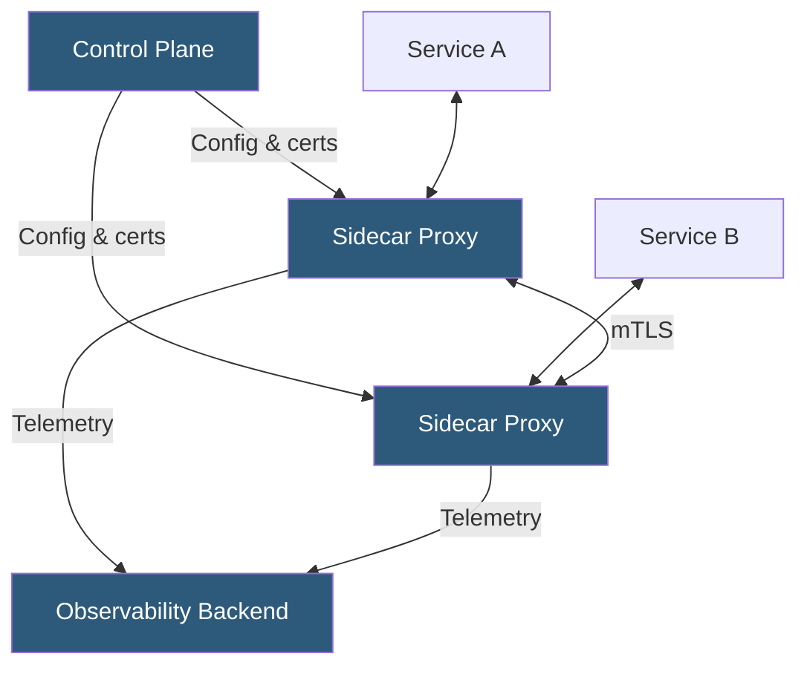

**Category:** Kubernetes Infrastructure
**Difficulty:** Intermediate
**Reading time:** 7 min read

---

A service mesh adds a dedicated infrastructure layer for handling service-to-service communication in Kubernetes, providing mutual TLS, traffic management, observability, and policy enforcement without modifying application code.

- **Sidecar proxy** — a container injected alongside each application container that intercepts all inbound and outbound traffic
- **Data plane** — the collection of sidecar proxies that actually process traffic
- **Control plane** — the management layer that distributes configuration, certificates, and policy to all proxies
- **mTLS (mutual TLS)** — bidirectional certificate-based authentication and encryption between all service pairs
- **Traffic shifting** — gradually routing a percentage of traffic to a new service version for canary deployments
- **Circuit breaker** — proxy-level pattern that stops sending traffic to unhealthy upstream instances
- **Envoy** — the open-source proxy most service mesh data planes are built on

A service mesh injects a sidecar proxy container into every pod at admission time, typically using a MutatingWebhookConfiguration. The sidecar — usually Envoy — intercepts all TCP traffic by redirecting it through iptables REDIRECT rules before the application process can accept or emit connections.

The **control plane** distributes configuration to each sidecar using xDS (Discovery Service) APIs. xDS is a set of gRPC streaming endpoints (LDS, RDS, CDS, EDS) that push Listener, Route, Cluster, and Endpoint definitions to proxies. Envoy subscribes and dynamically reconfigures its routing tables without restarts.

**Mutual TLS** is the core security primitive. The control plane operates a certificate authority that issues short-lived X.509 certificates to each workload, identified by their Kubernetes ServiceAccount (SPIFFE identity). Proxies automatically rotate certificates and enforce that all connections present a valid peer certificate. This creates an identity-based zero-trust network.

Traffic management features (retries, timeouts, circuit breaking, fault injection) are configured via custom resources (VirtualService, DestinationRule in Istio) or equivalent CRDs. These configs are translated into Envoy xDS configuration and pushed to the relevant proxies without any application changes.

Observability is a key byproduct: every proxy emits metrics (request rate, latency, error rate), access logs, and distributed traces for every service call. This creates golden-signal dashboards and service dependency maps automatically.

- Enforcing zero-trust mTLS between all services without changing application code
- Canary deployments with traffic-weight shifting and automated rollback
- Centralized policy enforcement (rate limits, AuthZ) across polyglot microservices
- End-to-end distributed tracing and service dependency mapping

| Advantage | Disadvantage |
|-----------|--------------|
| Application-agnostic — works for any language or protocol | Sidecar adds ~50–100ms cold-start latency and ~50MB RAM per pod |
| mTLS encrypts and authenticates all service communication by default | Control plane is complex; Istio requires significant expertise to operate |
| Rich traffic management without application code changes | Additional network hop through proxy adds microsecond latency per request |
| Automatic distributed tracing reduces observability instrumentation burden | Ambient mesh (sidecar-less) modes are still maturing |

- [Istio service mesh](istio-service-mesh.md)
- [Linkerd lightweight service mesh](linkerd-lightweight-service-mesh.md)
- [Consul Connect](consul-connect.md)

---
*Part of the [Kubernetes Infrastructure](index.md) category · [Back to Master Index](../../index.md)*
