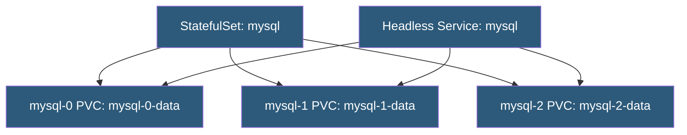

**Category:** Kubernetes Infrastructure
**Difficulty:** Intermediate
**Reading time:** 6 min read

---

StatefulSets manage the deployment and scaling of pods that require stable network identities, stable persistent storage, and ordered lifecycle guarantees. They are the correct workload type for distributed databases, message queues, and other stateful systems.

- **Stable network identity** — each pod gets a predictable DNS name: `<name>-<ordinal>.<service>.<namespace>.svc.cluster.local`
- **Headless Service** — a Service with `clusterIP: None` that enables DNS-based individual pod addressing
- **VolumeClaimTemplate** — a PVC template in the StatefulSet spec; each pod gets its own PVC created from it
- **Ordered creation** — pods are created 0, 1, 2... sequentially; each must be Running and Ready before the next starts
- **Ordered deletion** — pods are deleted in reverse order (N, N-1, ..., 0) during scale-down
- **Pod disruption budget (PDB)** — limits simultaneous unavailability during voluntary disruptions
- **Update strategy** — `RollingUpdate` (default) or `OnDelete` (manual pod deletion triggers update)

When a StatefulSet is created with N replicas, Kubernetes creates pods in strict ordinal order: `pod-0` first, then `pod-1` once `pod-0` is Ready, then `pod-2`, and so on. Each pod creation is accompanied by a PVC created from the VolumeClaimTemplate, named `<pvc-template-name>-<pod-name>`. This PVC is bound to the pod for its lifetime; deleting the pod does not delete the PVC, and when the pod is rescheduled, it reattaches to the same PVC.

The **stable DNS name** is the mechanism that distributed systems use to find their peers. A database primary can always be reached at `mysql-0.mysql.default.svc.cluster.local`; replicas can be reached at `mysql-1.mysql.default.svc.cluster.local`, etc. Applications hard-code these names in their configuration rather than using service discovery, which simplifies split-brain detection and replication setup.

**Rolling updates** update one pod at a time from the highest ordinal down. The `partition` parameter enables staged rollouts: only pods with ordinal ≥ partition are updated, allowing canary testing on a subset of replicas before completing the full rollout.

When a pod is terminated (rescheduled due to node failure or eviction), Kubernetes does not automatically delete its PVC. This is intentional — data is preserved. However, operators must ensure the PVC is released before the new pod starts, or the CSI driver allows multi-attach for the volume type. For ReadWriteOnce volumes (block devices), only one pod can mount at a time; Kubernetes waits for the old pod's volume detachment before the new pod can start.

- Running distributed databases (Cassandra, MongoDB, CockroachDB) on Kubernetes
- Deploying message brokers (Kafka, RabbitMQ) with stable broker IDs and persistent storage
- Elasticsearch/OpenSearch clusters where each node's data must survive pod rescheduling
- ZooKeeper ensembles where consistent node IDs are required for quorum

| Advantage | Disadvantage |
|-----------|--------------|
| Stable DNS names simplify peer discovery in distributed systems | Ordered startup/shutdown is slower than Deployment parallel scaling |
| PVC retention protects data across pod failures and rescheduling | Orphaned PVCs accumulate on scale-down and must be manually cleaned up |
| Partition-based rolling updates enable safe canary deployments of stateful systems | StatefulSet updates are complex; failed updates can leave a cluster in an inconsistent state |
| Headless Service enables client-side load balancing directly to individual pods | StatefulSets do not support pod template updates that change VolumeClaimTemplates |

- [CSI (Container Storage Interface)](csi-container-storage-interface.md)
- [PersistentVolume provisioning](persistentvolume-provisioning.md)
- [Kubernetes storage classes](kubernetes-storage-classes.md)

---
*Part of the [Kubernetes Infrastructure](index.md) category · [Back to Master Index](../../index.md)*
