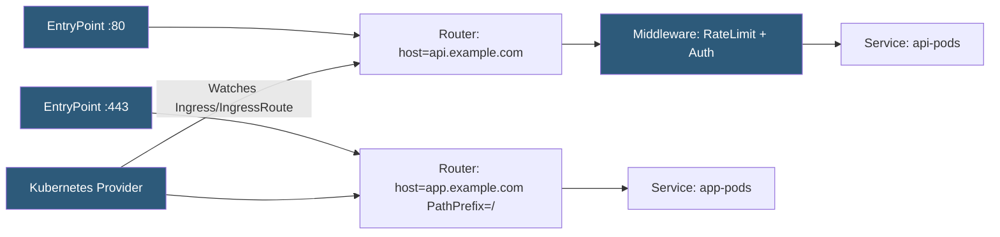

**Category:** Kubernetes Infrastructure
**Difficulty:** Intermediate
**Reading time:** 6 min read

---

Traefik is a modern reverse proxy and Kubernetes Ingress controller designed for dynamic cloud-native environments. It auto-discovers service configurations from Kubernetes, Docker, and other providers without requiring proxy restarts, and offers a rich middleware ecosystem for traffic management.

- **Provider** — a Traefik plugin that reads routing configuration from a source (Kubernetes Ingress, CRDs, Docker, Consul, etc.)
- **Router** — a Traefik rule that matches incoming requests and dispatches them to a service
- **Middleware** — chainable request/response transformers (auth, rate limiting, circuit breaker, compression)
- **IngressRoute** — Traefik's custom CRD that extends Kubernetes Ingress with richer routing expressions
- **EntryPoint** — named network port listeners (web on 80, websecure on 443, etc.)
- **Let's Encrypt ACME** — built-in certificate provisioner using HTTP-01 or DNS-01 ACME challenges
- **Traefik Hub** — SaaS dashboard for centralized management across multiple Traefik instances

Traefik uses a **provider** model to discover routing configuration. The Kubernetes provider watches Ingress resources and IngressRoute CRDs and immediately applies changes — there is no nginx.conf reload because Traefik's routing table is held in memory and updated atomically. New routes become live within milliseconds of Ingress creation.

**Routers** match incoming requests against rule expressions (Host, Path, PathPrefix, Header, Method) and pass matching traffic to a service. Routers can reference one or more **middlewares** that transform the request before it reaches the backend. Middleware chains are composable: a single middleware can be reused across many routers.

**Middlewares** cover a wide range of behaviors: `BasicAuth` and `ForwardAuth` for authentication; `RateLimit` for token-bucket rate limiting; `CircuitBreaker` to stop traffic to unhealthy backends; `Compress` for gzip/brotli responses; `Headers` for CORS, HSTS, and custom header injection; `StripPrefix` for path rewriting; and `Retry` for automatic request retries.

Traefik's built-in **ACME client** provisions and renews Let's Encrypt certificates automatically using HTTP-01 or DNS-01 challenges. Certificates are stored in a file or external KV store (Consul, etcd, Redis) for multi-instance consistency.

The **IngressRoute** CRD provides a more expressive alternative to standard Kubernetes Ingress annotations. It uses Traefik's rule language directly and can reference middlewares and services with explicit object references, making the intent clearer than opaque annotation strings.

- Dynamic microservices environments where services are created and destroyed frequently
- Teams wanting automatic TLS without external cert-manager deployment
- Multi-provider environments where routing rules come from both Kubernetes and Docker Compose
- API gateways requiring composable middleware chains (auth + rate limit + compression)

| Advantage | Disadvantage |
|-----------|--------------|
| Zero-restart dynamic configuration eliminates reload-related connection drops | IngressRoute CRDs are Traefik-specific; migrating away requires rewriting all routing config |
| Built-in ACME removes cert-manager dependency | Traefik's rule expression language has a learning curve |
| Rich middleware ecosystem in one binary | Under very high connection counts, single-process architecture may need careful tuning |
| Dashboard UI provides real-time visibility into routers, middlewares, and services | Dashboard exposes routing config; must be secured or disabled in production |

- [Kubernetes Ingress controllers](kubernetes-ingress-controllers.md)
- [NGINX Ingress](nginx-ingress.md)
- [Ambassador API Gateway](ambassador-api-gateway.md)

---
*Part of the [Kubernetes Infrastructure](index.md) category · [Back to Master Index](../../index.md)*
