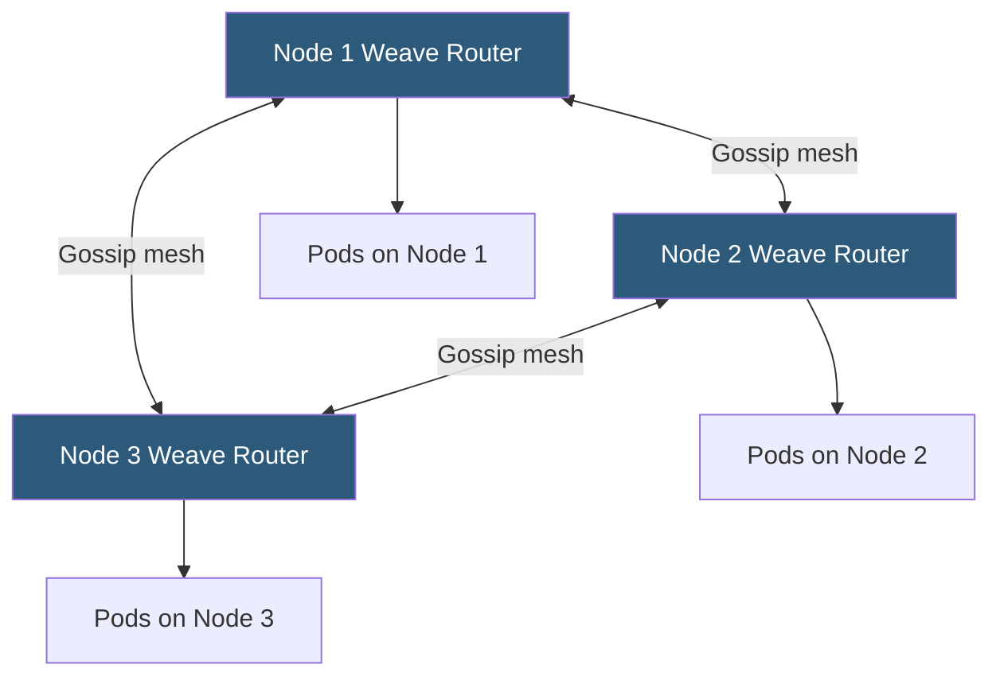

**Category:** Kubernetes Infrastructure
**Difficulty:** Beginner
**Reading time:** 5 min read

---

Weave Net is a Kubernetes CNI plugin that creates a virtual network overlay using VXLAN or a custom sleeve protocol, enabling pod-to-pod communication across nodes with built-in encryption and optional NetworkPolicy enforcement.

- **Weave router** — per-node daemon that manages the overlay network and routes pod traffic
- **Sleeve protocol** — Weave's fallback encapsulation using UDP when VXLAN is unavailable
- **Fast datapath** — VXLAN kernel offload mode used when nodes are on the same L3 segment
- **Weave DNS** — built-in DNS service discovery for pods using `.weave.local` domain
- **Weave NetworkPolicy** — Weave's enforcement of Kubernetes NetworkPolicy objects via iptables
- **Weave password encryption** — optional NaCl-encrypted VXLAN tunnels between nodes
- **Peer discovery** — Weave routers form a mesh using gossip protocol to find and track other nodes

Weave Net deploys a DaemonSet that runs a Weave router on every node. On startup, each router connects to a few seed peers and participates in a gossip-based mesh. Through gossip, every router learns the MAC addresses and IP prefixes of pods on every other node, building a distributed routing table.

For cross-node traffic, Weave uses **fast datapath** (VXLAN kernel offload) when the two nodes can reach each other directly over L3. The kernel's VXLAN driver encapsulates pod frames and delivers them at near-line-rate without userspace involvement. When VXLAN is blocked (e.g., by firewall rules), Weave falls back to its userspace **sleeve** encapsulation, routing packets through a UDP tunnel between the router processes.

Weave includes a built-in service discovery mechanism called Weave DNS. Each pod gets a DNS name based on its container name and network name, allowing services to be addressed without relying on Kubernetes DNS. This is particularly useful in multi-cluster or Docker Swarm contexts.

Optional traffic encryption uses NaCl authenticated encryption on all inter-node traffic. A pre-shared password is configured at install time; Weave rotates session keys automatically. This makes Weave attractive in environments where the underlying network is untrusted and certificate management overhead is to be avoided.

- Simple cluster setups where built-in encryption is needed without configuring additional PKI
- Hybrid environments mixing Kubernetes and Docker Swarm nodes on the same overlay
- Development clusters where ease of installation takes priority
- Environments where VXLAN may be blocked and a fallback protocol is needed

| Advantage | Disadvantage |
|-----------|--------------|
| Built-in optional encryption requires no external certificate infrastructure | Sleeve fallback mode incurs userspace context-switch overhead | 
| Gossip-based peer discovery simplifies multi-node setup | Gossip convergence can be slow in very large clusters (>1,000 nodes) |
| No central coordinator required; fully distributed | Performance lags behind Calico or Cilium for high-throughput workloads |
| NetworkPolicy enforcement included out of the box | Weave DNS conflicts with Kubernetes CoreDNS if not carefully configured |

- [Container Network Interface (CNI)](container-network-interface-cni.md)
- [Flannel overlay network](flannel-overlay-network.md)
- [Kubernetes networking policies](kubernetes-networking-policies.md)

---
*Part of the [Kubernetes Infrastructure](index.md) category · [Back to Master Index](../../index.md)*
