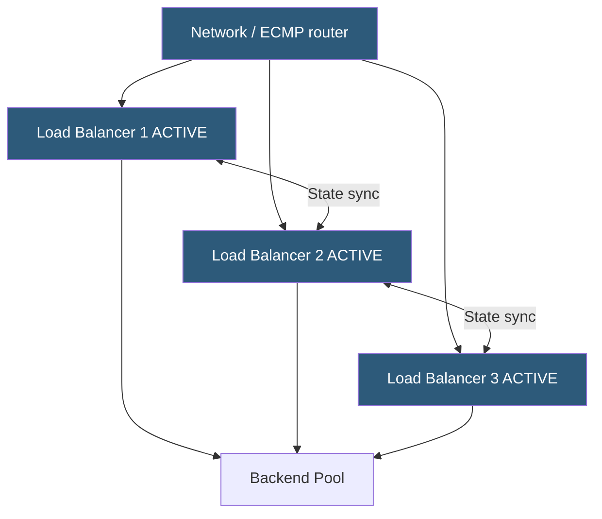

**Category:** Load Balancing
**Difficulty:** Advanced
**Reading time:** 6 min read

---

Active-active clustering runs two or more load balancer instances simultaneously, each processing traffic, eliminating the capacity waste of active-passive setups while providing redundancy. ECMP routing, anycast, or DNS round-robin distribute connections across all active nodes.

- **ECMP (Equal-Cost Multi-Path)** — network routing protocol configuration that splits traffic across multiple equal-cost paths (LB instances)
- **Anycast** — the same IP prefix announced from multiple PoPs; BGP naturally routes to the nearest/best-path PoP
- **Shared state** — session tables, rate limiters, and persistence mappings that must be synchronized across all active nodes
- **Stateless LB design** — using consistent hashing or IPVS to avoid shared state requirements
- **N+1 redundancy** — N instances handle production load; 1 can fail without impact
- **Failover detection** — ECMP withdraws a failed node's route within one BFD or routing convergence interval
- **Split-brain prevention** — active-active nodes must agree on shared state; split-brain causes duplicate processing or lost state

In **ECMP-based active-active**, the upstream router is configured with equal-cost routes to all LB instance IPs for the same destination VIP. The router hashes each flow (typically 5-tuple: source IP, source port, destination IP, destination port, protocol) to select which LB handles it. All packets of a given TCP flow go to the same LB instance. When an LB instance fails, the router detects it via BFD (Bidirectional Forwarding Detection) or OSPF/BGP withdrawal and removes it from the ECMP group. Remaining instances handle all traffic.

The key challenge is **session state consistency**. Each LB instance independently processes different flows, but shared state like stick table entries, SSL session IDs, and per-client rate limit counters may be needed across instances. Approaches:

1. **Stateless consistent hashing**: Each LB uses the same hash function to map client IPs to backends. Without shared tables, any instance routes the same client to the same backend. Adding or removing backends requires rehashing, but consistent hashing minimizes redistribution.

2. **State synchronization**: Instances replicate state via a shared Redis cluster or direct peer-to-peer sync (HAProxy peers). This maintains full state accuracy but adds latency and complexity.

3. **Sticky-at-router layer**: ECMP's 5-tuple hash ensures a given flow always hits the same LB instance, so each instance only needs its own sessions' state. Failover redistribution loses state only for flows on the failed instance.

**Anycast** is the most scalable approach, used by Cloudflare, AWS, and major CDNs. Each PoP announces the same IP prefix via BGP. Client packets are routed to the topologically nearest PoP. Within each PoP, an ECMP cluster handles local capacity.

- High-throughput public internet load balancers where single-instance capacity is insufficient
- CDN edge nodes using anycast to route users to the nearest PoP
- Multi-data-center active-active deployments with GSLB for geographic load distribution
- Kubernetes clusters using multiple Ingress controller replicas behind a cloud LB

| Advantage | Disadvantage |
|-----------|--------------|
| Full utilization of all LB capacity; no idle standby waste | State synchronization across active instances adds complexity and potential inconsistency |
| Scales horizontally by adding more LB instances to the ECMP group | ECMP flow hashing can create uneven distribution with small numbers of large flows |
| ECMP failover is as fast as BFD detection (sub-second) | Session persistence across all instances requires shared state store (Redis, etc.) |
| Anycast provides near-zero failover and geographic proximity routing | Anycast requires BGP control of IP address space; not available without provider assistance |

- [Active-passive clustering](active-passive-clustering.md)
- [Load balancer high availability](load-balancer-high-availability.md)
- [Global server load balancing (GSLB)](global-server-load-balancing-gslb.md)

---
*Part of the [Load Balancing](index.md) category · [Back to Master Index](../../index.md)*
