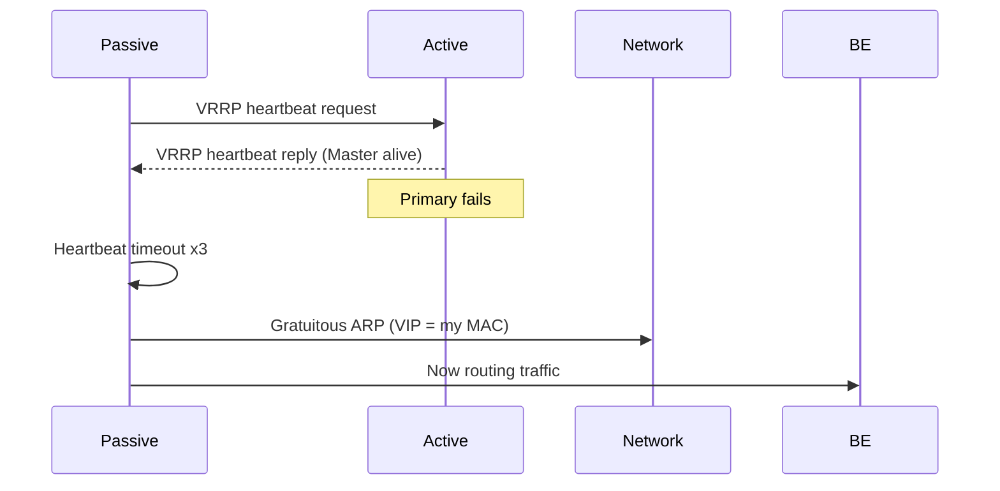

**Category:** Load Balancing
**Difficulty:** Intermediate
**Reading time:** 5 min read

---

Active-passive clustering runs one load balancer instance as the active node handling all traffic, with a second instance in passive standby ready to take over immediately on failure. It provides high availability with simple state management at the cost of unused standby capacity.

- **Active node** — the primary instance that processes all traffic and holds the VIP (Virtual IP)
- **Passive node** — the standby instance that monitors the active node and waits for failover signal
- **Failover trigger** — detection of active node failure via heartbeat timeout, health check failure, or manual preemption
- **VIP reassignment** — the passive node claims the virtual IP via gratuitous ARP or cloud API call
- **Preemption** — the original primary reclaims the VIP when it recovers, returning to active status
- **No preemption** — passive node retains active role after failover to prevent oscillation
- **Split-brain** — dangerous scenario where both nodes believe they are active and both claim the VIP

The active node sends VRRP advertisement packets (or custom heartbeat messages) to the passive node on a regular interval (typically 1 second). These packets carry the active node's priority and VIP ownership claim. The passive node monitors these advertisements. If it fails to receive a configurable number of consecutive advertisements (e.g., 3), it declares the active node failed and initiates takeover.

Takeover proceeds in milliseconds: the passive node updates its own network interface to assume the VIP, sends a gratuitous ARP broadcast (announcing that the VIP's MAC address is now its own MAC), and starts accepting new connections on the VIP. All network devices in the layer-2 domain update their ARP caches from the broadcast, and new client connections begin reaching the former passive node.

**Connection state** is the key operational question. Established TCP connections held by the active node are lost unless connection state synchronization is in place. HAProxy's `peers` section replicates stick table entries. `conntrackd` synchronizes the Linux kernel's connection tracking tables. With synchronization, most established connections survive failover; without it, clients must reconnect.

**Split-brain prevention** requires a fencing mechanism. If both nodes believe they are primary, both respond to ARP for the VIP, causing packet delivery to alternate unpredictably. Network isolation detection, STONITH (Shoot The Other Node In The Head), or quorum-based arbitration (a third node or disk-based witness) prevents split-brain. In cloud environments, only one instance can hold an Elastic IP or Floating IP at a time, providing natural exclusion.

**No-preemption mode** is often preferred in production. When the original primary recovers, it does not automatically reclaim the VIP. This prevents a brief dual-active window during failback and keeps the now-proven passive node in the active role. Manual failback is performed during a maintenance window.

- On-premises web infrastructure using Keepalived for HAProxy HA
- Database proxy pairs where a passive pgBouncer takes over on primary failure
- Edge routers with a hot standby using VRRP for gateway HA
- Cloud LB instances using Floating IP or Elastic IP as the VIP mechanism

| Advantage | Disadvantage |
|-----------|--------------|
| Simpler state management than active-active; no real-time sync under normal operations | 50% of hardware/VM capacity is idle in standby; costly for high-spec nodes |
| Clear ownership of the VIP at any time prevents routing ambiguity | Manual failback required in no-preemption mode; operational process needed |
| VRRP failover completes in 3–5 seconds without manual intervention | Loss of established connections if state synchronization is not configured |
| Simple to reason about and debug; one active node at any time | Standby node is not exercised under load; latent issues may surface only during failover |

- [Active-active clustering](active-active-clustering.md)
- [Load balancer high availability](load-balancer-high-availability.md)
- [Load balancer logging and metrics](load-balancer-logging-and-metrics.md)

---
*Part of the [Load Balancing](index.md) category · [Back to Master Index](../../index.md)*
