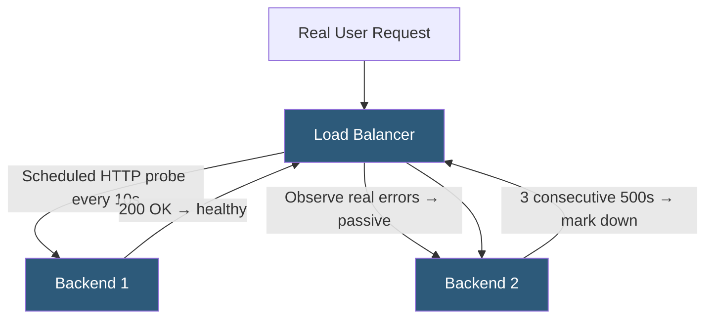

**Category:** Load Balancing
**Difficulty:** Intermediate
**Reading time:** 5 min read

---

Active health checks proactively probe backends on a schedule to detect failures before real users are affected, while passive health checks monitor real traffic to detect failure patterns from actual user requests. Most production setups combine both.

- **Active check** — scheduled probe from the load balancer to each backend; independent of real user traffic
- **Passive check** — observes real request outcomes (connection failures, HTTP 5xx, response timeouts) to infer health
- **Outlier detection** — Envoy's term for passive health checking; ejects backends exhibiting error rates above a threshold
- **Circuit breaker** — broader pattern combining passive checks with open/half-open/closed states
- **Fail-fast** — passive detection allows removing a failing backend after the first few real failures
- **Probe overhead** — active checks consume backend resources; must be lightweight
- **Jitter** — randomizing check intervals prevents synchronized probe storms to all backends simultaneously

**Active health checks** operate on a timer completely independent of real traffic. Every N seconds (configurable), the load balancer opens a TCP connection or sends an HTTP request to each backend's health endpoint. The check passes if the response comes within the timeout and matches expected criteria (status code, body content). Failures increment a counter; once the fall threshold is reached, the backend is removed.

The health check endpoint is typically a lightweight route that verifies internal dependencies: database connectivity, message queue reachability, disk space. A response of 200 signals readiness; 503 signals a self-reported unhealthy state (useful for graceful shutdown). The endpoint must be fast — a health check that triggers the same code paths as real requests can overload an already-stressed server.

**Passive health checks** observe real request streams. HAProxy's `observe layer7` monitors the HTTP response codes and connection state for every real request. After a configurable number of failures (5xx responses, connection refused, timeout) within a time window, the backend is marked down. Envoy's outlier detection tracks error percentages per backend and ejects those exceeding the `outlierDetection.consecutiveGatewayErrors` threshold.

The advantage of passive checks is **zero probe overhead** — no extra requests are sent. The disadvantage is that real users experience the failures that trigger detection. Active checks prevent some user-facing errors by detecting backend failure before any user request is sent there.

**Combined approach**: active checks for rapid scheduled detection (typically 10s intervals), passive checks as a secondary mechanism to catch failure modes the active probe misses (e.g., a backend that accepts health check connections but times out on real requests due to thread pool exhaustion).

- Active-only: Small backend pools where probe overhead is acceptable and fast detection is critical
- Passive-only: Very large backend pools where sending active probes to thousands of servers creates significant load
- Combined: Production APIs where both probe-based detection and real-traffic error monitoring are needed
- Graceful shutdown: Active health check endpoint returns 503 to drain a server before maintenance

| Advantage | Disadvantage |
|-----------|--------------|
| Active checks detect failure before users are affected | Active probes add load to backends and network; must be lightweight |
| Passive checks catch application-level errors that probe endpoints might hide | Passive checks mean some real user requests fail before backend is removed |
| Combined approach gives both proactive and reactive coverage | Tuning thresholds requires understanding traffic patterns to avoid false positives |
| Passive circuit-breaker prevents cascade failures to unhealthy backends | Overly aggressive passive thresholds remove healthy backends during transient error spikes |

- [Health check mechanisms](health-check-mechanisms.md)
- [Load balancer high availability](load-balancer-high-availability.md)
- [Connection rate limiting](connection-rate-limiting.md)

---
*Part of the [Load Balancing](index.md) category · [Back to Master Index](../../index.md)*
