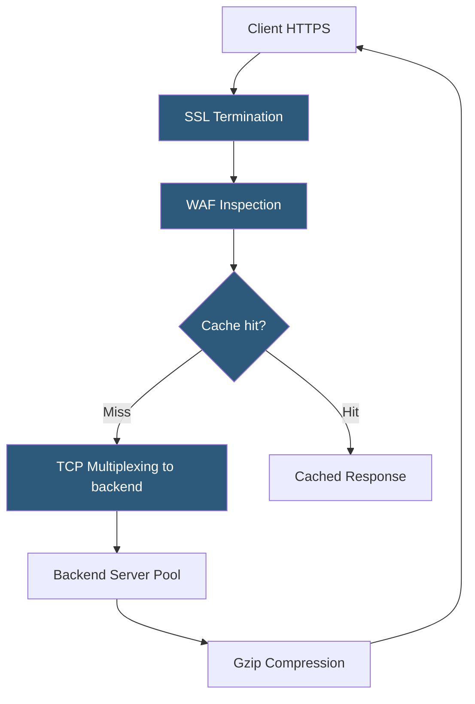

**Category:** Load Balancing
**Difficulty:** Intermediate
**Reading time:** 6 min read

---

Application Delivery Controllers are advanced load balancers that combine traffic management with application-layer services including SSL offload, WAF, caching, compression, application acceleration, and application health monitoring into a single platform.

- **Full proxy** — ADC terminates both client and server TCP connections, enabling deep traffic inspection and transformation
- **SSL offloading** — ADC handles TLS termination, freeing application servers from cryptographic overhead
- **WAF (Web Application Firewall)** — inspects HTTP traffic for OWASP Top 10 attacks (SQLi, XSS, CSRF)
- **HTTP compression** — ADC compresses responses on behalf of servers, reducing bandwidth consumption
- **TCP multiplexing** — ADC maintains a small persistent connection pool to backends, reusing connections for multiple clients
- **Content caching** — ADC caches static and dynamic content to reduce backend load
- **iRules / policies** — vendor-specific scripting languages for custom traffic manipulation logic

An ADC sits between clients and application servers as a full reverse proxy. Every client request is terminated at the ADC, inspected, potentially modified, and then forwarded to a backend server pool using a persistent connection pool. Responses flow back through the ADC, where they can be compressed, cached, and served to the client.

**TCP multiplexing** is a key performance feature. Establishing a new TCP connection involves a three-way handshake and, for TLS, certificate exchange and key negotiation — a round-trip cost that adds 100–300ms of latency. ADCs maintain a pool of persistent HTTP keep-alive or HTTP/2 connections to backend servers. New client requests are forwarded over existing backend connections, eliminating per-request connection overhead and reducing load on backend servers.

**WAF integration** applies OWASP rule sets against the decrypted HTTP stream. Requests matching known attack signatures are blocked with a 403 response before ever reaching the application. Commercial ADCs (F5, Citrix) integrate signature databases with regular updates and machine-learning anomaly detection.

**Application health checks** are more sophisticated than TCP-level checks. An ADC can send HTTP GET requests with specific headers, validate the response status code, check response body content for keywords, and measure response time. Backends that fail health criteria are automatically removed from the pool; they are re-added once they pass a configurable number of consecutive checks.

**Scripting extensions** (F5 iRules, Citrix policies) allow arbitrary traffic manipulation: rewrite URIs, insert or strip headers, route based on payload content, implement custom authentication, or call external services for policy decisions.

- Enterprise applications requiring integrated SSL, WAF, compression, and caching on one device
- Applications with high TLS connection overhead benefiting from TCP multiplexing
- PCI DSS compliance environments requiring WAF in front of payment applications
- Organizations needing centralized SSL certificate management across many applications

| Advantage | Disadvantage |
|-----------|--------------|
| Single platform consolidates SSL, WAF, caching, and LB functions | Significant cost; commercial ADC licenses are expensive on top of hardware |
| TCP multiplexing reduces connection overhead on backend servers | ADC becomes a critical single point; extensive HA configuration required |
| Integrated WAF provides centralized application security | WAF false positives require ongoing tuning; too aggressive blocks legitimate traffic |
| Scripting enables complex custom traffic logic without code changes | Vendor-specific scripting languages create lock-in and require specialized expertise |

- [Hardware load balancer appliances](hardware-load-balancer-appliances.md)
- [SSL/TLS offloading](ssl-tls-offloading.md)
- [Layer 4 vs Layer 7 load balancing](layer-4-vs-layer-7-load-balancing.md)

---
*Part of the [Load Balancing](index.md) category · [Back to Master Index](../../index.md)*
