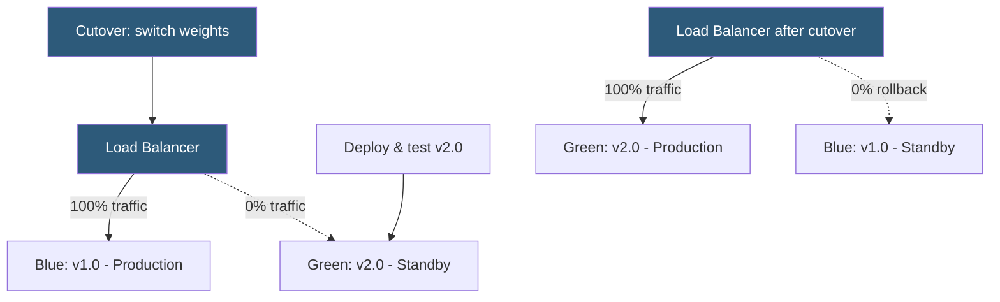

**Category:** Load Balancing
**Difficulty:** Intermediate
**Reading time:** 6 min read

---

Blue-green deployment uses two identical production environments — blue (current) and green (new) — and the load balancer to perform instant traffic cutover from one to the other, enabling zero-downtime releases with instant rollback capability.

- **Blue environment** — the currently active production version receiving all live traffic
- **Green environment** — the new version deployed and tested but receiving no live traffic
- **Cutover** — the moment the load balancer switches traffic from blue to green (or reverses for rollback)
- **Traffic split** — optionally routing a percentage of traffic to green before full cutover (canary phase)
- **Drain period** — time allowed for in-flight requests on blue to complete before terminating blue servers
- **Rollback** — redirecting traffic back to blue if green exhibits problems after cutover
- **Environment parity** — blue and green must be identical in infrastructure configuration to avoid environment-specific bugs

Both environments are provisioned identically and connected to the same load balancer configuration. Initially, blue is the active backend pool with weight 100 (or it is the only active pool), and green is configured as a backend with weight 0 or marked as disabled.

The green environment is deployed with the new version and undergoes smoke testing, integration testing, and pre-production validation while receiving no live traffic. Once green passes all validation gates, the cutover step executes: the load balancer's backend weights are adjusted — blue to 0, green to 100 (or blue pool is disabled and green is enabled). This change takes effect for new connections immediately, while in-flight requests on blue complete normally.

**Drain configuration** allows in-flight requests to blue to complete gracefully. HAProxy's `state drain` marks a server to accept no new connections while existing connections continue. AWS ALB deregisters targets gracefully over a configurable `deregistration_delay`. Once all active connections drain, the blue servers can be stopped or updated for the next release cycle.

**Rollback** is the primary advantage over rolling deployments. Because blue is still running in standby, reversing the cutover takes seconds: update the LB weights back to blue 100, green 0. The entire rollback is a configuration change, not a redeployment. This is critical for release risk management.

**Database schema changes** are the most complex challenge. Blue-green works cleanly when the application is stateless. When schema changes are required, the migration must be backward-compatible — the new schema must work with both v1.0 (blue) and v2.0 (green) code during the transition window. Expand-contract patterns (add new columns first, remove old columns after cutover) are the standard approach.

- Major version releases requiring instant rollback capability
- Compliance-mandated change approval where tested state must exactly match deployed state
- Database migration releases where blue must remain running as a rollback target
- CI/CD pipelines with automated cutover triggered by integration test pass

| Advantage | Disadvantage |
|-----------|--------------|
| Instant rollback by reversing weight change; no redeployment needed | Requires double infrastructure (two full environments running simultaneously) |
| Zero downtime; cutover affects only new connections | Database schema changes must be backward-compatible between blue and green |
| Tested environment is identical to what gets production traffic | Blue must stay running and warmed up post-cutover for rollback to be fast |
| Clear separation between old and new version at all times | Traffic split state (session affinity) may route some users inconsistently during partial traffic shift |

- [Weighted load balancing](weighted-load-balancing.md)
- [Load balancer automation](load-balancer-automation.md)
- [Session persistence (sticky sessions)](session-persistence-sticky-sessions.md)

---
*Part of the [Load Balancing](index.md) category · [Back to Master Index](../../index.md)*
