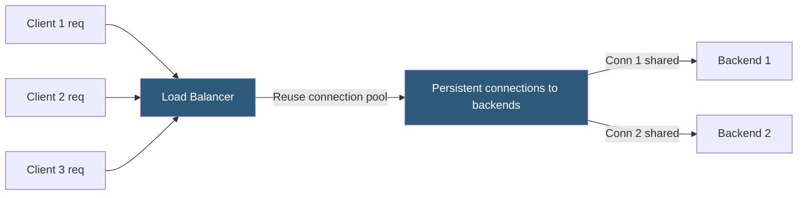

**Category:** Load Balancing
**Difficulty:** Intermediate
**Reading time:** 6 min read

---

Connection multiplexing at the load balancer reuses a small pool of persistent backend connections to service multiple client requests, eliminating per-request TCP and TLS handshake overhead and dramatically reducing the connection load on backend servers.

- **Connection pool** — a set of pre-established, persistent TCP connections to each backend server
- **Keep-alive** — HTTP/1.1 mechanism that reuses a TCP connection for multiple sequential requests
- **HTTP/2 multiplexing** — multiple concurrent HTTP/2 streams over a single TCP connection; true simultaneous multiplexing
- **Connection reuse factor** — the average number of client requests served per backend connection; higher = more efficient
- **TCP handshake cost** — a new TCP connection costs 1 RTT; TLS adds 1–2 more RTTs; totaling 100–400ms on WAN
- **Backend connection pressure** — each TCP connection consumes file descriptors and memory on the backend server
- **Queue depth** — when all pooled connections are in use, new requests queue; queue depth configuration prevents overload

When a client request arrives, the load balancer selects a backend server and finds an available idle connection from its connection pool for that backend. The request is sent over the existing connection without a new TCP or TLS handshake. When the response is received, the connection is returned to the pool, ready for the next request.

The connection pool size per backend is configurable. HAProxy's `option http-server-close` enables HTTP/1.1 keep-alive on the backend side. NGINX's `keepalive N` directive in an upstream block sets the number of idle keep-alive connections to maintain per worker process. Envoy's `http2UpstreamRequests` and `maxRequestsPerConnection` settings control HTTP/2 stream multiplexing.

**HTTP/2 to the backend** is the most efficient form: a single TCP+TLS connection carries dozens of concurrent request streams. Envoy and modern ADCs use HTTP/2 upstream connections by default when backends support it. A single persistent HTTP/2 connection can replace 50+ individual HTTP/1.1 connections, dramatically reducing backend file descriptor usage.

The elimination of TLS handshake overhead is particularly valuable. A TLS 1.2 handshake over a WAN link (50ms RTT) costs 150ms of pure negotiation time. With connection multiplexing and TLS 1.3 session resumption, subsequent requests on the same connection have zero setup latency.

**Queue management**: when all connections in a backend's pool are saturated, new requests must wait. Configuring a sensible maximum queue depth and queue timeout allows the load balancer to return 503 errors quickly to clients when backends are overloaded, rather than queuing indefinitely and allowing latency to explode.

- High-volume REST APIs where short-lived requests would otherwise create thousands of new connections per second
- Microservices with many inter-service calls where connection setup latency accumulates
- Reducing backend server open-files limits by multiplexing many clients over few connections
- Mobile API backends where TLS handshakes are expensive due to higher-latency cellular links

| Advantage | Disadvantage |
|-----------|--------------|
| Eliminates per-request TCP+TLS setup latency for backend connections | Requires backends to support HTTP/1.1 keep-alive or HTTP/2; old servers may not |
| Reduces backend server file descriptor and memory usage dramatically | Head-of-line blocking in HTTP/1.1 means a slow response on a connection delays subsequent requests |
| HTTP/2 multiplexing completely eliminates HOL blocking within a connection | Connection pool misconfiguration (too small) causes request queuing under load |
| Enables faster scaling; new LB instances take connections from the pool | Debugging is harder; multiple clients share the same backend connection trace |

- [HTTP/2 and HTTP/3 support](http2-and-http3-support.md)
- [Application delivery controllers (ADC)](application-delivery-controllers-adc.md)
- [SSL/TLS offloading](ssl-tls-offloading.md)

---
*Part of the [Load Balancing](index.md) category · [Back to Master Index](../../index.md)*
