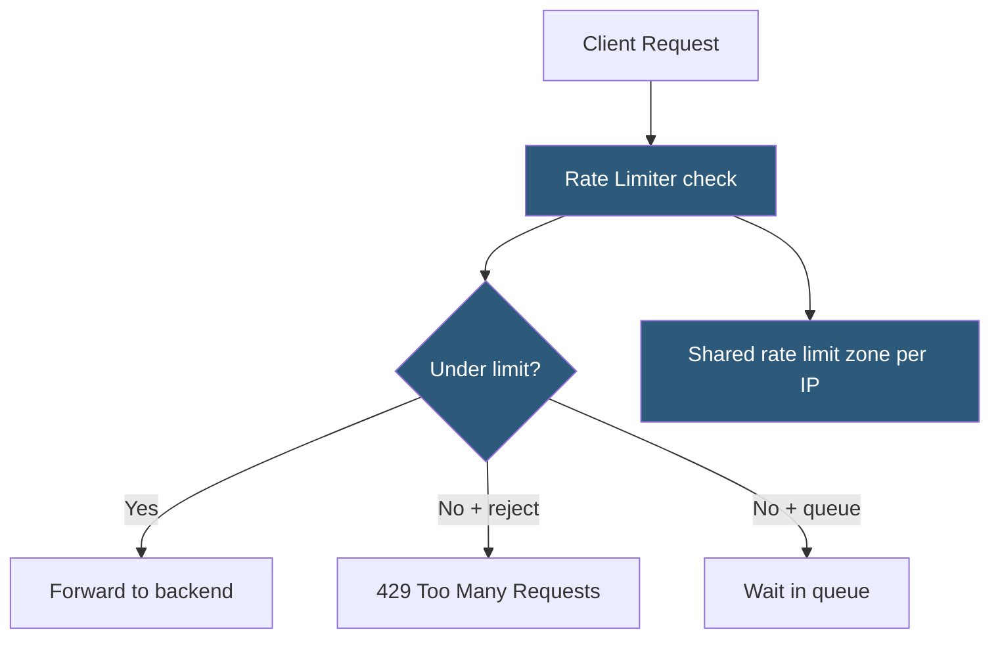

**Category:** Load Balancing
**Difficulty:** Intermediate
**Reading time:** 6 min read

---

Connection rate limiting at the load balancer restricts how quickly clients can establish new connections or send requests, protecting backend servers from traffic floods, preventing abuse, and enforcing fair resource usage across many clients.

- **Rate limit** — a threshold on the number of requests or connections allowed per time window
- **Token bucket** — algorithm that allows short bursts up to the bucket capacity, then enforces the steady-state rate
- **Leaky bucket** — processes requests at a fixed rate regardless of burst; excess requests are queued or dropped
- **Per-source IP limit** — restricts the rate of connections from any single client IP
- **Rate limit zone** — a shared memory zone (in NGINX) or stick table (in HAProxy) tracking per-key counters
- **429 Too Many Requests** — the HTTP status code returned to rate-limited clients
- **Backpressure** — queuing excess requests rather than dropping them immediately; introduces latency under overload

NGINX rate limiting uses the `limit_req_zone` and `limit_req` directives. A zone defines the key (e.g., `$binary_remote_addr` for per-IP) and the rate (e.g., `10r/s` — 10 requests per second). The `limit_req zone=my_limit burst=20 nodelay` directive allows bursts of up to 20 requests beyond the rate without queuing, after which excess requests receive 503 responses. Without `nodelay`, bursts are queued and serviced at the zone's rate, adding latency.

HAProxy's **stick tables** with `track-sc0` provide request rate tracking. A stick table entry stores the request count per key (source IP or cookie). An ACL checks whether the count exceeds the threshold and denies the request or redirects to an error page. Stick tables support byte rates, connection rates, and request rates as tracked metrics, enabling multi-dimensional policies.

**Connection rate limiting** is distinct from request rate limiting. Connection rate limits cap how many new TCP connections a source IP can establish per second, blocking connection floods before HTTP is even parsed. `iptables -m hashlimit` or HAProxy's frontend `tcp-request connection reject` with a stick table threshold implements this at the TCP layer.

**Distributed rate limiting** is needed in active-active deployments where each LB instance has its own local counters. Without a shared backend, a client making 100 req/s across 3 LB instances appears as 33 req/s to each. Solutions include:
- Approximate rate limiting accepting some overcount (most practical)
- Redis-backed centralized counters (Lua scripts or external modules)
- Rate limiting at a single choke point (GSLB layer) before traffic disperses

**Graceful degradation**: instead of returning 429 immediately, the load balancer can queue excess requests with a configurable timeout. If a backend slot opens within the timeout, the queued request is served; otherwise, it receives 429. This smooths bursty traffic without dropping requests.

- API gateway protecting backend microservices from client misbehavior or DDoS
- Login endpoint rate limiting to prevent credential stuffing attacks
- Per-tenant rate limiting for multi-tenant SaaS APIs
- CDN origin protection to prevent cache stampede on cache miss storms

| Advantage | Disadvantage |
|-----------|--------------|
| Protects backends from traffic spikes and abusive clients | Strict limits can affect legitimate users during burst traffic events |
| Per-IP limiting is simple and stateless (NGINX/HAProxy built-in) | Distributed rate limiting across multiple LB instances requires shared state |
| Burst allowance accommodates legitimate bursty usage patterns | Very granular rate limits (per user, per API key) require authentication before rate limit lookup |
| 429 response with `Retry-After` header allows polite retry | IP-based limits are ineffective when clients share a NAT IP or use VPNs |

- [DDoS mitigation at load balancer](ddos-mitigation-at-load-balancer.md)
- [Load balancer performance tuning](load-balancer-performance-tuning.md)
- [Load balancer logging and metrics](load-balancer-logging-and-metrics.md)

---
*Part of the [Load Balancing](index.md) category · [Back to Master Index](../../index.md)*
