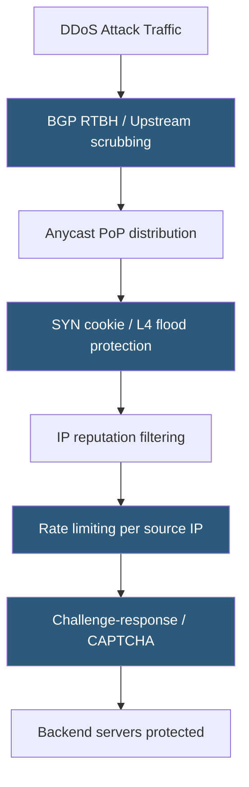

**Category:** Load Balancing
**Difficulty:** Advanced
**Reading time:** 7 min read

---

Load balancers are often the first line of defense against distributed denial-of-service attacks, using connection rate limiting, SYN cookies, IP reputation filtering, and challenge-response mechanisms to absorb or block attack traffic before it reaches backend servers.

- **SYN flood** — attacker sends large volumes of TCP SYN packets without completing handshakes; exhausts the server's SYN backlog
- **SYN cookies** — stateless TCP mechanism that embeds connection state in the sequence number, eliminating backlog exhaustion
- **IP reputation lists** — databases of known malicious IPs used to block attack sources at the LB
- **Anycast absorption** — distributing attack traffic across many PoPs so no single location is overwhelmed
- **Challenge-response** — redirecting suspect clients to a CAPTCHA or JS challenge before allowing backend access
- **Layer 7 DDoS** — HTTP-layer attacks using legitimate requests at high rate; harder to distinguish from real traffic
- **BGP blackholing (RTBH)** — advertising a victim prefix with a null route to upstream providers to drop attack traffic before it reaches the LB

**SYN cookies** address TCP SYN flood attacks. Normally, the server allocates a connection entry in the SYN backlog for each received SYN. Under SYN flood, this queue fills and legitimate connections are rejected. With SYN cookies enabled (`net.ipv4.tcp_syncookies = 1`), the server encodes the connection parameters into the initial sequence number using a cryptographic hash. No backlog entry is allocated. When the client's ACK arrives, the server decodes the ISN to reconstruct the connection, accepting only clients that complete the three-way handshake.

**IP reputation filtering** uses threat intelligence feeds to block traffic from known-malicious IP ranges. Services like MaxMind, AbuseIPDB, Cloudflare's threat feeds, and firewall vendor lists provide updated blocklists. Load balancers with scripting capabilities (iRules, NGINX Lua) can dynamically fetch and apply these lists. Cloud-based WAFs integrate reputation databases automatically.

**L7 DDoS** (HTTP floods, slowloris attacks) is harder to mitigate because each request is syntactically valid. Slowloris sends partial HTTP requests that never complete, exhausting the LB's per-connection timeout slots. Solutions include: short `client_body_timeout` and `client_header_timeout` values in NGINX that close slow connections quickly; minimum request rate limits; and behavioral anomaly detection that identifies unusually high request rates per IP or User-Agent.

**Anycast** is the most scalable mitigation for volumetric attacks. By announcing the same IP from dozens of PoPs via BGP, a 1 Tbps attack is distributed across all PoPs, each absorbing only ~50 Gbps. Cloudflare's anycast network regularly absorbs attacks exceeding 2 Tbps without impacting service.

**BGP RTBH (Remotely Triggered Black Hole)** is an emergency measure: the victim networks announces its attacked prefix with a next-hop of a null route. Upstream ISPs propagate this black hole, dropping all traffic to the attacked IP — blocking the attack but also blocking legitimate traffic. It is a last resort.

- Web application servers behind NGINX or HAProxy needing volumetric attack protection
- Financial services requiring multi-layer DDoS defense (network + L7)
- CDN edge nodes that are inherently DDoS targets due to their public IP exposure
- API gateways protecting critical backend services from application-layer floods

| Advantage | Disadvantage |
|-----------|--------------|
| SYN cookies eliminate backlog exhaustion with near-zero performance impact | Challenge-response mechanisms (CAPTCHA) degrade user experience for legitimate users |
| Anycast distributes attack volume across PoPs, preventing saturation | BGP RTBH blocks attackers and legitimate users simultaneously |
| Rate limiting per IP handles bot-based HTTP floods effectively | Sophisticated attackers use botnets with millions of unique IPs to evade per-IP limits |
| IP reputation filtering blocks known bad actors at line rate | Reputation lists have false positives; legitimate users on shared IPs may be blocked |

- [Connection rate limiting](connection-rate-limiting.md)
- [Global server load balancing (GSLB)](global-server-load-balancing-gslb.md)
- [Load balancer performance tuning](load-balancer-performance-tuning.md)

---
*Part of the [Load Balancing](index.md) category · [Back to Master Index](../../index.md)*
