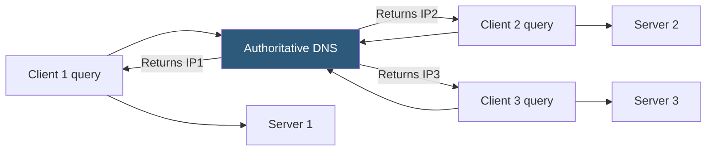

**Category:** Load Balancing
**Difficulty:** Beginner
**Reading time:** 5 min read

---

DNS-based load balancing distributes traffic by returning different IP addresses in response to DNS queries, either using round-robin rotation, geographic routing, or health-aware selection. It is the simplest form of load distribution requiring no dedicated proxy infrastructure.

- **DNS round-robin** — the DNS server returns multiple A/AAAA records in rotating order
- **TTL (Time to Live)** — controls how long clients cache DNS responses; short TTL enables faster failover
- **Weighted DNS** — returns specific IP addresses proportionally based on configured weights
- **GeoDNS** — returns IP addresses based on the geographic location of the querying resolver
- **Health-checked DNS** — authoritative DNS removes unhealthy IPs from responses automatically
- **Negative caching** — clients cache NXDOMAIN responses; impacts failover behavior
- **Resolver caching** — public DNS resolvers (8.8.8.8) may cache records beyond the stated TTL

The simplest form, **DNS round-robin**, stores multiple A records for the same hostname. When clients query the hostname, the authoritative DNS server returns all records but rotates their order with each response. A client that uses the first IP in the response will connect to Server 1; the next client gets a response with Server 2 first, and so on.

While simple to implement, round-robin has significant limitations. DNS clients and resolvers cache responses for the TTL duration. All requests from a cached IP go to the same server until the cache expires, meaning load distribution is uneven for clients with long-lived connections. Additionally, if a server fails, DNS continues returning its IP until TTL expires and the record is removed — during which time clients attempting to connect to the failed server experience timeouts.

**Health-checked DNS** (offered by Route 53, NS1, Cloudflare, and others) addresses the failure scenario. The DNS provider continuously probes each IP via HTTP or TCP checks. When an IP fails health checks, it is removed from DNS responses immediately. Clients that already cached the failing IP will experience failures until TTL expires and they re-resolve, but new connections are directed to healthy servers.

**Weighted routing** (a Route 53 policy type) assigns relative weights to each record set. Sending 90% of traffic to the primary server and 10% to a canary is accomplished by setting weights of 90 and 10. This is a simple mechanism for blue-green or canary deployments without a proxy layer.

GeoDNS extends this by selecting which record to return based on the source region of the DNS query, effectively routing users to the nearest server. Services like NS1, Constellix, and Route 53 Latency-Based Routing implement this as a standard feature.

- Simple multi-server redundancy for small-scale applications
- Geographic routing for globally distributed web properties
- Canary releases using weighted DNS to gradually shift traffic
- Disaster recovery switching traffic from primary to backup region

| Advantage | Disadvantage |
|-----------|--------------|
| No proxy infrastructure required; works with any server type | DNS caching means failover is slow; clients hold stale IPs for the TTL duration |
| Native integration with cloud provider routing policies (Route 53, GCP Cloud DNS) | Load is not truly balanced; client resolver caching creates uneven distribution |
| Supports geographic routing and latency-based routing out of the box | No session affinity; clients may connect to different servers across requests |
| Health-checked DNS removes failed IPs within one poll interval | Cannot inspect or manipulate traffic; no SSL offload, WAF, or header rewriting |

- [Global server load balancing (GSLB)](global-server-load-balancing-gslb.md)
- [Round-robin algorithm](round-robin-algorithm.md)
- [Health check mechanisms](health-check-mechanisms.md)

---
*Part of the [Load Balancing](index.md) category · [Back to Master Index](../../index.md)*
