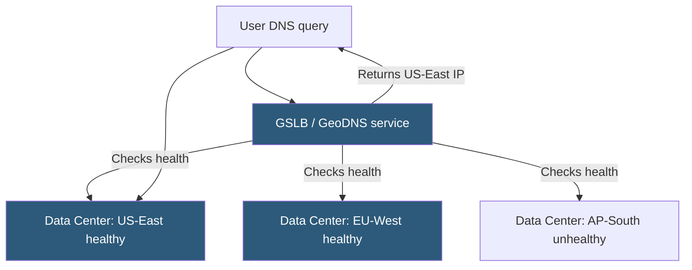

**Category:** Load Balancing
**Difficulty:** Advanced
**Reading time:** 7 min read

---

Global Server Load Balancing distributes traffic across data centers and cloud regions, routing end users to the optimal site based on health, geographic proximity, latency, or capacity. It is the foundation of multi-region high availability and disaster recovery.

- **Authoritative DNS** — GSLB is typically implemented by controlling DNS responses; returning different IPs based on query source
- **GeoDNS** — returns server IPs closest to the resolver's geographic location
- **Health monitoring** — GSLB continuously probes data center health and removes unhealthy sites from DNS rotation
- **TTL (Time to Live)** — short DNS TTL (30–60s) allows rapid failover by ensuring clients re-resolve frequently
- **Anycast** — routing technique where the same IP is announced from multiple PoPs; BGP routes traffic to the nearest PoP
- **Site affinity** — mechanism to route the same client consistently to the same data center (for session state)
- **RTT-based routing** — GSLB measures round-trip time to resolve the best data center per client resolver

GSLB operates primarily through DNS. When a client resolves a hostname (e.g., `api.example.com`), its DNS query reaches the GSLB's authoritative name server. The GSLB evaluates multiple signals — the source IP of the DNS resolver (for geo-mapping), real-time health of each data center, current load metrics, and configured routing policies — and returns the IP address of the most appropriate data center.

**Health monitoring** is continuous. The GSLB probes each data center's endpoints via HTTP(S) health checks (checking response codes and body content), TCP checks, or ICMP. When a data center fails health checks, its IP is removed from DNS responses within one TTL interval. Short TTLs (30–60 seconds) limit the window during which clients hold a stale IP pointing to a failed site.

**Geographic routing** maps DNS resolver subnets to geographic regions using MaxMind or similar databases. Clients in Europe are directed to EU-region data centers; Asian clients to APAC data centers. This reduces latency by minimizing physical distance between client and server.

**RTT-based routing** goes a step further by actively measuring network round-trip times from GSLB probe agents to the client's resolver. The data center with the lowest measured latency wins the routing decision. Vendors like F5 DNS and NS1 implement this as part of their GSLB offerings.

Anycast is an alternative to DNS-based GSLB: the same IP prefix is announced via BGP from multiple PoPs. BGP's routing protocol naturally routes client packets to the nearest PoP, achieving geographic load distribution at the network layer without DNS manipulation. Cloudflare and major CDNs use anycast extensively.

- Active-active multi-region deployments with automatic failover between regions
- Disaster recovery where a secondary site takes over DNS for a failed primary site
- Global API distribution routing users to the nearest region for lowest latency
- CDN origin selection routing cache misses to the geographically closest origin

| Advantage | Disadvantage |
|-----------|--------------|
| Automatic geographic routing improves user experience globally | DNS caching by resolvers can extend failover time beyond configured TTL |
| Health-based failover removes entire data centers from rotation automatically | Short TTLs increase DNS query volume and may conflict with CDN caching behavior |
| Anycast achieves routing at network layer without DNS changes | Anycast requires BGP control of IP address space; not available to most enterprises |
| Integrates with capacity management to prevent overloading single region | GSLB complexity increases with number of regions and routing policy combinations |

- [DNS-based load balancing](dns-based-load-balancing.md)
- [Active-active clustering](active-active-clustering.md)
- [Load balancer high availability](load-balancer-high-availability.md)

---
*Part of the [Load Balancing](index.md) category · [Back to Master Index](../../index.md)*
