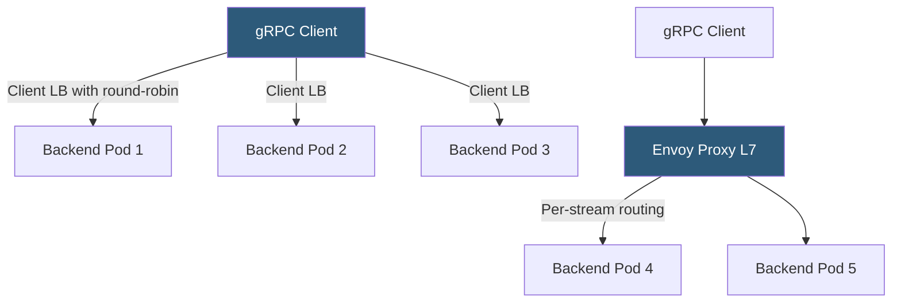

**Category:** Load Balancing
**Difficulty:** Advanced
**Reading time:** 6 min read

---

gRPC uses HTTP/2 as its transport, which means all calls within a session are multiplexed over a single long-lived TCP connection. This conflicts with standard connection-level load balancing, requiring proxy-level or client-side load balancing strategies that understand HTTP/2 stream framing.

- **HTTP/2 multiplexing** — all gRPC calls from a client share one TCP connection, making connection-level LB ineffective
- **Client-side load balancing** — the gRPC client library maintains connections to multiple backends and distributes calls
- **Proxy-side load balancing** — an L7 proxy (Envoy, NGINX, Traefik) understands HTTP/2 streams and routes per-call
- **gRPC header-based routing** — routing based on gRPC service name, method, or metadata headers
- **Server streaming** — gRPC server streams send multiple responses over one call; LB must not close mid-stream
- **gRPC health protocol** — standardized `grpc.health.v1.Health` service for health checks
- **Headless service** — Kubernetes service without ClusterIP; returns pod IPs for client-side gRPC LB

Standard TCP/L4 load balancing fails for gRPC because the load balancer sees only one TCP connection per client-backend pair. All gRPC calls from that client are multiplexed as HTTP/2 streams within that one connection, so L4 load balancing routes all calls to the same backend without distribution.

**Client-side load balancing** is the gRPC-native solution. The gRPC client library (available in all official gRPC language SDKs) supports pluggable load balancing policies. The `round_robin` policy maintains connections to all resolved backend endpoints and cycles calls across them. The `grpclb` policy delegates to an external load balancer service that provides a server list. With a Kubernetes headless service (ClusterIP: None), the gRPC client DNS-resolves the service name and receives all pod IPs, then distributes calls round-robin across all pods.

**Proxy-side load balancing** using Envoy is the alternative when client code cannot be modified or when cross-language services need centralized routing policy. Envoy understands HTTP/2 framing and can route individual gRPC streams (single request-response calls) to different backends. It also supports gRPC service-aware routing — different backends for `UserService/GetUser` versus `OrderService/CreateOrder`.

**gRPC health checks** use the standardized `grpc.health.v1.Health` protobuf service. A client or LB calls the `Check` RPC; the server returns SERVING, NOT_SERVING, or UNKNOWN. Kubernetes 1.23+ supports gRPC readiness probes natively using this protocol. Envoy supports gRPC health checking out of the box with the `grpc_health_check` configuration.

Server and client streaming calls complicate load balancing because they span many frames over a long duration. The load balancer must route all frames of a given stream to the same backend and must not timeout mid-stream based on HTTP idle connection timeouts.

- Kubernetes microservices where gRPC is the inter-service protocol and headless services enable client-side LB
- gRPC-based APIs exposed externally via Envoy or Traefik with per-method routing rules
- High-call-rate internal RPC frameworks where client-side LB minimizes proxy latency
- Service meshes (Istio, Linkerd) that provide transparent gRPC load balancing via sidecar proxies

| Advantage | Disadvantage |
|-----------|--------------|
| Client-side LB achieves per-call routing with zero proxy overhead | Requires gRPC client library support; language ecosystem coverage varies |
| Envoy proxy provides centralized routing policy without client changes | Proxy adds a network hop and latency to every gRPC call |
| gRPC health protocol provides standardized readiness reporting | Headless service + DNS resolution requires adequate DNS caching tuning |
| Service mesh sidecars provide automatic gRPC LB without code changes | Service mesh sidecars add memory overhead and startup latency per pod |

- [WebSocket load balancing](websocket-load-balancing.md)
- [HTTP/2 and HTTP/3 support](http2-and-http3-support.md)
- [Connection multiplexing](connection-multiplexing.md)

---
*Part of the [Load Balancing](index.md) category · [Back to Master Index](../../index.md)*
