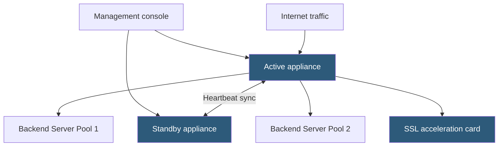

**Category:** Load Balancing
**Difficulty:** Intermediate
**Reading time:** 6 min read

---

Hardware load balancer appliances are purpose-built network devices that distribute traffic using dedicated ASICs, FPGAs, or optimized network processors. They offer deterministic ultra-high throughput and low latency that software solutions running on commodity hardware cannot match.

- **ASIC (Application-Specific Integrated Circuit)** — custom silicon designed exclusively for packet forwarding at line rate
- **FPGA (Field-Programmable Gate Array)** — reconfigurable hardware used for flexible high-speed packet processing
- **Throughput rating** — the total bits per second the appliance can process (e.g., 640 Gbps on an F5 BIG-IP i15800)
- **CPS (Connections per second)** — how many new TCP connections the appliance can establish per second
- **Concurrent connections** — the maximum number of simultaneously open connections held in hardware connection tables
- **Appliance HA pair** — two appliances in active-passive or active-active failover for physical redundancy
- **Full proxy** — architecture where the appliance terminates both client and server connections independently

Hardware appliances use purpose-built silicon to process packets in hardware without involving a general-purpose CPU for the fast path. ASICs perform operations like DNAT, connection table lookups, and SSL record processing at line rate — the speed of the physical network interface — with sub-microsecond latency per packet.

The control plane (configuration, health checks, protocol parsing) runs on embedded general-purpose processors within the appliance. The data plane is offloaded to dedicated hardware engines. F5 BIG-IP, Citrix ADC (formerly NetScaler), and A10 Networks are the leading vendors. These appliances support millions of concurrent SSL sessions using dedicated SSL acceleration hardware with on-chip key storage.

**HA pairing** is a core deployment pattern. Two appliances are configured as a failover pair. State synchronization keeps connection tables, SSL session IDs, and persistence tables mirrored between active and standby. On failure, the standby assumes the active role within 1–2 seconds, typically without dropping established connections.

Management interfaces are rich: graphical dashboards, REST and iControl/NITRO APIs for automation, scripting languages (iRules on F5, policies on Citrix) for custom traffic manipulation, and SNMP for monitoring integration. Configuration is typically backed up to external TFTP/SCP servers for disaster recovery.

Despite high upfront hardware cost, total cost of ownership may favor hardware appliances for organizations managing millions of TLS connections where the CPU cost on software solutions would require many servers.

- Financial institutions requiring deterministic sub-millisecond latency for trading platforms
- Carriers and ISPs handling 100G+ aggregated traffic volumes
- Organizations with strict compliance requirements for dedicated hardware boundaries
- Legacy data center environments standardized on F5 or Citrix appliances

| Advantage | Disadvantage |
|-----------|--------------|
| Deterministic line-rate performance independent of OS scheduling | High capital expenditure; appliances cost $50K–$500K+ |
| Dedicated SSL hardware offloads CPU from application servers | Physical appliances lack elasticity; capacity scaling requires hardware procurement |
| Proven reliability with enterprise SLAs and vendor support | Long procurement and provisioning cycles versus cloud-based alternatives |
| Rich scripting (iRules) enables arbitrary traffic manipulation at wire speed | Vendor lock-in; configuration syntax and feature sets are not portable across vendors |

- [Software load balancers](software-load-balancers.md)
- [Application delivery controllers (ADC)](application-delivery-controllers-adc.md)
- [SSL/TLS offloading](ssl-tls-offloading.md)

---
*Part of the [Load Balancing](index.md) category · [Back to Master Index](../../index.md)*
