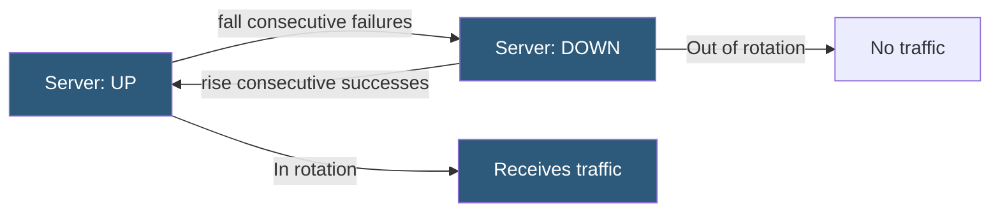

**Category:** Load Balancing
**Difficulty:** Beginner
**Reading time:** 5 min read

---

Health checks are the mechanism by which load balancers detect whether backend servers are able to serve traffic. They continuously probe backends and remove unhealthy instances from rotation, ensuring only healthy servers receive requests.

- **Active health check** — the load balancer proactively sends test requests to backends on a configured interval
- **Passive health check** — the load balancer monitors real request failures and marks backends down after a threshold
- **Interval** — how frequently health checks run (typically 5–30 seconds)
- **Timeout** — how long the load balancer waits for a health check response before considering it failed
- **Rise threshold** — number of consecutive successful checks before a downed server is returned to rotation
- **Fall threshold** — number of consecutive failures before a server is marked down
- **HTTP health check** — sends an HTTP GET to a dedicated `/healthz` endpoint and validates the status code and optionally the body

**Active health checks** run on a configurable timer. The load balancer sends a probe — TCP connect, HTTP GET, or custom script — to each backend. If the probe succeeds (TCP connect established, HTTP returns 200, custom script exits 0) within the timeout, the check is considered healthy. If it fails, a failure counter increments. Once consecutive failures reach the `fall` threshold (e.g., 3), the server is marked DOWN and removed from rotation.

Recovery follows the same pattern. Once the server is DOWN, the load balancer continues probing. When consecutive successes reach the `rise` threshold (e.g., 2), the server is marked UP and returned to rotation. The rise threshold prevents flapping — a server that alternates between working and failing would oscillate in and out of rotation. Requiring multiple consecutive successes confirms the server is genuinely recovered.

**HTTP health check** endpoints (`/health`, `/healthz`, `/ready`) should check application-level readiness, not just TCP connectivity. A web server might accept TCP connections but return 503 because its database connection pool is exhausted. A proper health endpoint checks all critical dependencies before returning 200. Kubernetes liveness and readiness probes implement the same concept at the container level.

**Passive health checks** (circuit-breaker style) monitor real traffic for errors. HAProxy's `observe layer7 error-limit 10 on-error mark-down` marks a server DOWN after 10 Layer 7 errors on real requests. This catches failure modes that active probes might miss, such as a server that responds to health checks but returns 500s on all real requests.

**Slow start** prevents overloading a server that just came back up. The load balancer gradually ramps up traffic to a recovering server over a configured duration (e.g., 30 seconds), rather than sending its full weighted share immediately.

- Automatic failover when an application server crashes or becomes unresponsive
- Rolling deployment health gating: new pods receive traffic only after health checks pass
- Database connection pool exhaustion detection via application-level health endpoint
- Identifying degraded servers through passive failure rate monitoring

| Advantage | Disadvantage |
|-----------|--------------|
| Automatic failure detection removes human reaction time from the failure path | Health check endpoints must accurately reflect application readiness, not just TCP connectivity |
| Rise/fall thresholds prevent flapping on transient failures | Short intervals increase load on backends; long intervals increase failover detection time |
| Passive checks catch error patterns that active probes miss | Passive checks only trigger after real users experience failures |
| Slow start prevents thundering-herd on server recovery | Complex dependency checks in health endpoints may timeout under load themselves |

- [Active vs passive health checks](active-vs-passive-health-checks.md)
- [Load balancer high availability](load-balancer-high-availability.md)
- [Software load balancers](software-load-balancers.md)

---
*Part of the [Load Balancing](index.md) category · [Back to Master Index](../../index.md)*
