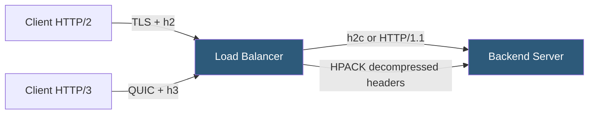

**Category:** Load Balancing
**Difficulty:** Intermediate
**Reading time:** 6 min read

---

Load balancers must support HTTP/2 and HTTP/3 on the client-facing side to deliver modern web performance, and optionally on the backend side to reduce connection overhead. HTTP/3's QUIC transport changes how load balancers handle connections at the network level.

- **HTTP/2** — binary framing protocol over TCP with stream multiplexing, header compression (HPACK), and server push
- **HTTP/3** — HTTP over QUIC (UDP-based transport); eliminates TCP HOL blocking and improves mobile performance
- **QUIC** — UDP-based transport protocol with built-in TLS 1.3, connection migration, and 0-RTT resumption
- **Stream multiplexing** — HTTP/2 sends multiple request/response pairs concurrently over one TCP connection
- **HPACK / QPACK** — header compression algorithms that reduce overhead of repeated headers (e.g., Cookie, Authorization)
- **Server push** — HTTP/2 feature allowing the server to proactively send resources (largely deprecated in practice)
- **h2c** — HTTP/2 over cleartext (no TLS); used for backend connections on trusted internal networks

A load balancer with HTTP/2 support negotiates the protocol with clients using ALPN (Application-Layer Protocol Negotiation) — a TLS extension where client and server advertise supported protocols during the handshake. Clients that support HTTP/2 advertise `h2`; the load balancer responds with `h2`, and the connection uses HTTP/2 framing.

With HTTP/2, the client can send multiple concurrent requests over one connection as independent streams. Each stream has a stream ID, and frames from different streams are interleaved. The load balancer must understand stream framing to route requests correctly or to translate them for backends.

Most load balancers **terminate HTTP/2 at the LB and forward HTTP/1.1 to backends**. This is simpler because most legacy backend servers support HTTP/1.1 but not HTTP/2. The LB demultiplexes the HTTP/2 streams into individual HTTP/1.1 requests and forwards them over its backend connection pool. This hybrid approach gives clients the benefits of HTTP/2 (multiplexing, HPACK) while keeping backend compatibility.

**HTTP/3 (QUIC)** introduces the most significant change to load balancer architecture. QUIC runs over UDP, not TCP. A load balancer that performs connection-level load balancing (L4) must understand that QUIC connections are identified by a Connection ID embedded in packets, not by the 4-tuple. When a mobile client changes IP addresses (connection migration), the QUIC Connection ID remains stable, but the UDP source IP/port changes — breaking L4 hash-based routing unless the LB understands QUIC CIDs.

Modern proxies (NGINX 1.25+, Caddy, HAProxy 2.6+, Envoy) support HTTP/3 on the frontend. Backend HTTP/3 support is less common because internal network latency is typically low enough that QUIC's advantages are minimal.

- Improving web application performance by enabling HTTP/2 multiplexing for browser clients
- Mobile APIs where QUIC's 0-RTT and connection migration reduce session establishment latency
- High-header-volume APIs (many Cookie and Authorization headers) benefiting from HPACK compression
- CDN edge nodes accepting HTTP/3 from browsers while communicating with origins over HTTP/2

| Advantage | Disadvantage |
|-----------|--------------|
| HTTP/2 multiplexing eliminates multiple TCP connections per browser page load | HTTP/2 streams share one TCP connection; TCP packet loss causes HOL blocking for all streams |
| QUIC eliminates TCP HOL blocking; independent stream delivery over UDP | QUIC is UDP-based; many corporate firewalls block UDP 443, forcing fallback to TCP |
| 0-RTT resumption (QUIC) eliminates handshake latency for returning clients | 0-RTT is vulnerable to replay attacks; requires careful server-side handling |
| HPACK/QPACK header compression reduces per-request overhead | HTTP/3 load balancing requires understanding QUIC Connection IDs for correct routing |

- [Connection multiplexing](connection-multiplexing.md)
- [SSL/TLS offloading](ssl-tls-offloading.md)
- [WebSocket load balancing](websocket-load-balancing.md)

---
*Part of the [Load Balancing](index.md) category · [Back to Master Index](../../index.md)*
