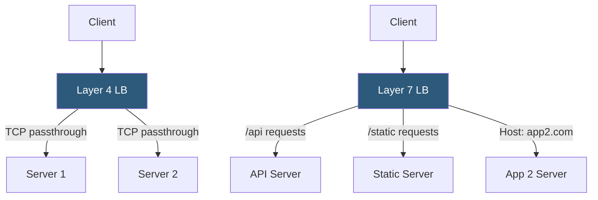

**Category:** Load Balancing
**Difficulty:** Beginner
**Reading time:** 5 min read

---

Layer 4 load balancers operate at the transport layer and forward TCP/UDP connections based on IP addresses and ports, while Layer 7 load balancers inspect application-layer content (HTTP headers, URLs, cookies) to make intelligent routing decisions.

- **Layer 4 (transport layer)** — routes based on source/destination IP and TCP/UDP port without inspecting payload
- **Layer 7 (application layer)** — routes based on HTTP headers, URL paths, cookies, query parameters, or request body
- **NAT-based L4** — rewrites destination IP/port at the load balancer; client IP may be obscured
- **DSR (Direct Server Return)** — L4 mode where responses bypass the load balancer, reducing its bandwidth requirements
- **Content-based routing** — L7 feature that directs requests to different backends based on URL or header content
- **SSL termination** — L7 feature that decrypts HTTPS and forwards plain HTTP to backends
- **Connection multiplexing** — L7 feature that reuses backend connections for multiple client requests

A **Layer 4 load balancer** operates at the TCP/UDP level. It receives a connection from a client, selects a backend server using a load balancing algorithm (round-robin, least connections), and either forwards the packets directly (transparent proxy) or performs NAT to rewrite destination addresses. Because it does not inspect the payload, it cannot understand HTTP concepts like cookies or URLs. The primary advantage is speed: minimal processing overhead means L4 balancers handle millions of concurrent connections efficiently.

A **Layer 7 load balancer** terminates the client TCP connection, parses the application protocol (usually HTTP/1.1, HTTP/2, or gRPC), and makes routing decisions based on application-level attributes. It can route `/api/users` to user-service pods and `/api/orders` to order-service pods, based entirely on the URL path. It can insert `X-Real-IP` headers so backends know the original client address, strip sensitive headers, or rewrite URLs before forwarding.

The tradeoff is latency and complexity. L7 load balancers spend CPU cycles parsing HTTP and maintaining their own connections to both clients and backends. For very high connection rates (millions per second), L4 is often used in front of L7 to distribute TCP connections across multiple L7 instances.

Modern architectures often stack both layers: a hardware or cloud L4 load balancer handles anycast and TCP termination at the network edge, while NGINX or Envoy L7 proxies handle HTTP routing, SSL, and authentication behind it.

- L4: TCP-level load balancing for non-HTTP protocols (databases, SMTP, game servers)
- L7: Path-based microservices routing where different URL prefixes map to different services
- L7: A/B testing and canary deployments based on HTTP headers or cookies
- L4+L7 stack: Cloud L4 NLB feeding NGINX L7 proxies for maximum throughput with smart routing

| Advantage | Disadvantage |
|-----------|--------------|
| L4 is extremely fast; minimal CPU per connection | L4 cannot route based on HTTP content; one backend set per port |
| L7 enables intelligent content-based routing | L7 adds latency; terminates and re-establishes connections |
| L7 SSL termination centralizes certificate management | L7 must handle full HTTP parser; adds attack surface |
| L4 DSR allows responses to bypass the LB, reducing bottleneck | L4 DSR requires infrastructure configuration support |

- [SSL/TLS offloading](ssl-tls-offloading.md)
- [Application delivery controllers (ADC)](application-delivery-controllers-adc.md)
- [Health check mechanisms](health-check-mechanisms.md)

---
*Part of the [Load Balancing](index.md) category · [Back to Master Index](../../index.md)*
