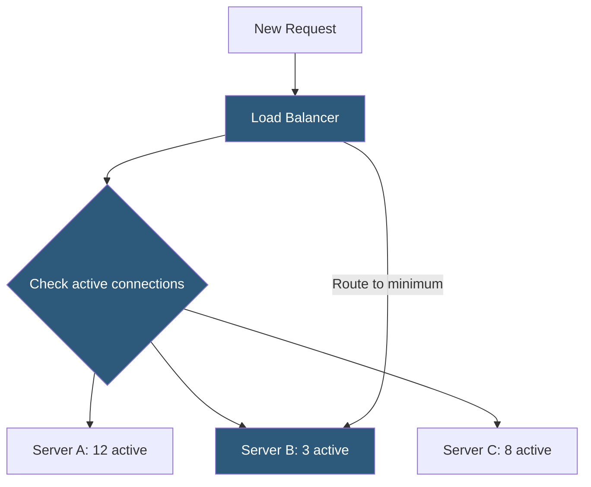

**Category:** Load Balancing
**Difficulty:** Beginner
**Reading time:** 5 min read

---

The least connections algorithm routes each new request to the backend server currently handling the fewest active connections, adapting load distribution to actual server utilization rather than simply rotating requests in sequence.

- **Active connections** — the count of currently open connections being processed by each backend server
- **Least connections (leastconn)** — selects the server with the minimum active connection count
- **Weighted least connections** — factors in server weight when comparing connection counts
- **Connection counter** — maintained by the load balancer for each backend; incremented on new connection, decremented on close
- **Long-lived connections** — scenarios where requests have highly variable duration and where least-connections significantly outperforms round-robin
- **Tie-breaking** — when multiple servers have the same count, typically broken by round-robin or lowest index
- **IPVS LC** — Linux kernel's built-in least-connections mode in the IPVS subsystem

The load balancer maintains a connection counter for each backend server. When a new client connection or request arrives, the load balancer inspects the current counter values and selects the server with the lowest count. The counter is atomically incremented when a connection is forwarded and decremented when the connection closes.

This dynamic adaptation is the algorithm's key advantage. Consider two servers where Server A is processing a slow database query holding 15 connections open, while Server B has just finished serving its requests with 2 open connections. Round-robin would blindly alternate between them, sending the next request to the already-stressed Server A. Least connections would send it to Server B.

**Weighted least connections** divides each server's active connection count by its weight before comparison. A server with weight 2 is treated as if it has half as many connections, proportionally increasing its share of new connections. This is appropriate when servers have different hardware capacities and long-lived connections are the workload pattern.

The algorithm requires constant tracking of connection state, which adds a small overhead versus the purely counter-based round-robin. In practice, the tracking overhead is negligible compared to the latency savings from avoiding overloaded backends.

For **request-based (not connection-based)** proxies — where the load balancer uses HTTP keep-alive connections to backends and multiplexes multiple client requests over each — the equivalent algorithm counts pending requests per backend connection rather than TCP connections.

- WebSocket or long-lived HTTP connections where round-robin creates significant imbalance
- Mixed workload servers where some requests are expensive (generating reports) and some cheap (serving pings)
- Database connection load balancing where query duration varies widely
- Any environment where request processing time is unpredictable and variable

| Advantage | Disadvantage |
|-----------|--------------|
| Dynamically adapts to actual server utilization | Requires maintaining per-server connection counters; not truly stateless |
| Prevents overloading busy servers with long-running requests | Does not account for CPU or memory utilization; just connection count |
| Weighted variant handles heterogeneous server pools naturally | Counter-based tracking can be inaccurate if connections are not properly closed |
| Better than round-robin when request cost variance is high | For short-lived HTTP requests, difference from round-robin is negligible |

- [Round-robin algorithm](round-robin-algorithm.md)
- [Weighted load balancing](weighted-load-balancing.md)
- [IP hash load balancing](ip-hash-load-balancing.md)

---
*Part of the [Load Balancing](index.md) category · [Back to Master Index](../../index.md)*
