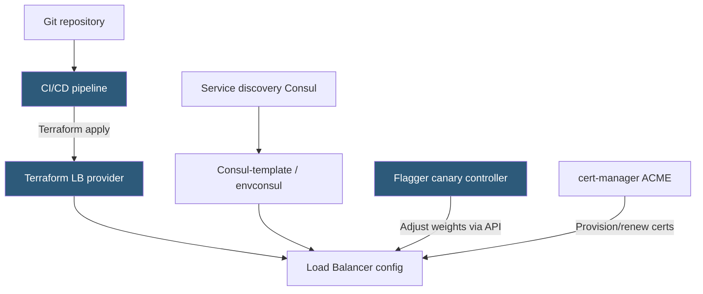

**Category:** Load Balancing
**Difficulty:** Intermediate
**Reading time:** 6 min read

---

Load balancer automation manages backend server registration, weight adjustments, certificate renewals, and configuration changes programmatically through APIs and Infrastructure as Code tools, eliminating manual changes and enabling self-healing and progressive delivery workflows.

- **HAProxy Runtime API** — Unix socket interface allowing dynamic server state changes without reload
- **NGINX Plus API** — REST API for dynamic upstream management (add/remove servers without config reload)
- **Terraform** — infrastructure-as-code tool with providers for AWS ALB, GCP LB, HAProxy, and NGINX
- **Ansible** — configuration management tool for templating and applying LB configuration
- **cert-manager** — Kubernetes controller that automates TLS certificate lifecycle via ACME
- **Service discovery** — Consul, etcd, or Kubernetes EndpointSlice as dynamic backend registry
- **Progressive delivery** — automated weight-based canary promotion driven by metrics (Flagger, Argo Rollouts)

**HAProxy Runtime API** is the foundation for dynamic automation. By connecting to HAProxy's stats socket (`echo "show stat" | socat stdio /var/run/haproxy/admin.sock`), scripts can: add new servers (`add server backend/server1 10.0.0.5:80 check`), change server weights (`set server backend/server1 weight 50`), drain servers before maintenance (`set server backend/server1 state drain`), and force health check results. Automated deployment systems use this to register new application instances as they boot.

**consul-template** dynamically rerenders HAProxy or NGINX configuration files whenever the Consul service registry changes. When a new pod starts and registers with Consul, consul-template detects the change, renders a new `haproxy.cfg` with the added server, and signals HAProxy to reload. This eliminates manual configuration for ephemeral cloud infrastructure.

**Terraform providers** for AWS (aws_lb_target_group, aws_lb_listener), GCP (google_compute_backend_service), and HAProxy (haproxy_backend) manage load balancer configuration as code. Changes are version-controlled, peer-reviewed, and applied atomically via `terraform apply`. This replaces hand-edited configuration files with reproducible, auditable infrastructure definitions.

**Flagger** is a Kubernetes operator for automated progressive delivery. It takes a Deployment and manages a canary rollout by adjusting NGINX Ingress annotations or Istio VirtualService weights based on Prometheus metrics. If error rate or latency on the canary exceeds defined thresholds, Flagger automatically rolls back by setting the canary weight to 0 and alerting the team.

**cert-manager** solves TLS certificate automation. It watches Certificate resources, issues ACME challenges via HTTP-01 or DNS-01, and stores the resulting certificate in Kubernetes Secrets. The Ingress controller reads the Secret and serves the certificate. Renewal happens automatically before expiry, replacing the months-long manual certificate renewal process.

- Auto-registering Kubernetes pods as load balancer targets via Endpoints/EndpointSlice watches
- Progressive canary deployments with automated rollback based on Prometheus error rate
- GitOps-driven LB configuration where all changes are code-reviewed pull requests
- Automated certificate provisioning and renewal for dozens of hostnames

| Advantage | Disadvantage |
|-----------|--------------|
| API-driven changes are auditable and reversible; no undocumented manual changes | Automation complexity adds failure modes; bugs in automation scripts can misconfigure LBs |
| Progressive delivery automation reduces deployment risk without manual oversight | Automated rollbacks require accurate metrics; misconfigured thresholds cause false rollbacks |
| IaC enables environment parity and reproducible configurations | Terraform state drift can occur if manual changes are made outside of IaC workflows |
| cert-manager eliminates certificate expiry incidents | ACME challenges fail in restricted network environments; requires DNS or HTTP reachability |

- [Load balancer logging and metrics](load-balancer-logging-and-metrics.md)
- [Blue-green deployment with LB](blue-green-deployment-with-lb.md)
- [Weighted load balancing](weighted-load-balancing.md)

---
*Part of the [Load Balancing](index.md) category · [Back to Master Index](../../index.md)*
