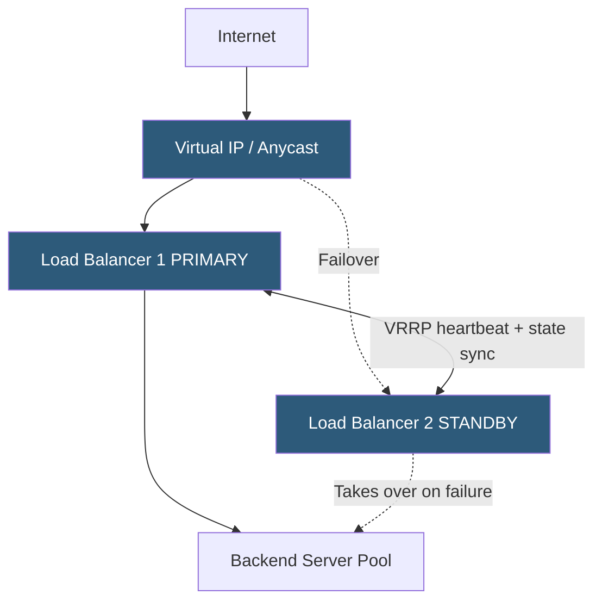

**Category:** Load Balancing
**Difficulty:** Intermediate
**Reading time:** 6 min read

---

A load balancer is itself a potential single point of failure for the applications it serves. Load balancer high availability uses redundant LB instances with failover mechanisms — VRRP, anycast, or cloud-native constructs — to ensure continuous availability even when individual LB instances fail.

- **VRRP (Virtual Router Redundancy Protocol)** — protocol that allows multiple routers/LBs to share a virtual IP, with one active master and standby backups
- **Keepalived** — Linux daemon implementing VRRP for software load balancer HA
- **Active-passive** — one LB processes all traffic; the other waits in standby and takes over on failure
- **Active-active** — both LBs process traffic simultaneously; ECMP or anycast distributes connections across them
- **State synchronization** — replicating connection tables, persistence mappings, and rate limit state between active and standby
- **Failover time** — the duration from primary failure until the standby assumes the VIP and begins accepting connections
- **Floating IP** — cloud equivalent of VIP; reassigned to standby instance via cloud API on failure detection

In a **VRRP-based HA pair**, both LB instances are configured with a shared virtual IP (VIP). The master announces the VIP via gratuitous ARP and processes all traffic. VRRP heartbeat packets (multicast) flow between master and backup on a configurable interval (typically 1 second). If the backup misses a configurable number of consecutive heartbeats (e.g., 3), it assumes the master has failed, promotes itself to master, and broadcasts a gratuitous ARP to update all devices' ARP caches to associate the VIP with its own MAC address. Failover completes within 3–5 seconds.

**State synchronization** improves failover quality. Without sync, all established connections are dropped when the primary fails because the standby has no knowledge of existing sessions, persistence mappings, or SSL session IDs. HAProxy supports `peers` synchronization for stick tables. Keepalived's `conntrackd` synchronizes the Linux netfilter connection tracking table. Commercial ADCs synchronize full session state, allowing established connections to survive failover transparently.

**Active-active HA** runs both LB instances simultaneously. ECMP routing sends packets for the same VIP to multiple instances. This doubles throughput capacity and provides failover — when one instance fails, ECMP automatically stops routing to it. The challenge is stateful features: session persistence, SSL session IDs, and rate limiters must be synchronized in real time between instances, or clients must accept losing state on redistribution.

In **cloud environments**, VRRP is often replaced by cloud-specific mechanisms. On AWS, Elastic IPs are reassigned via API calls from a monitoring script or health checker. On GCP, internal TCP load balancers provide built-in HA. On Azure, Standard Load Balancer is a managed HA service. These abstract away the VRRP complexity at the cost of vendor-specific configuration.

- Production web applications where LB failure would cause complete outage
- Database proxy layers where LB HA prevents connection pool exhaustion on failover
- On-premises clusters using Keepalived for software LB redundancy
- Multi-region deployments combining GSLB (geographic failover) with per-region LB HA

| Advantage | Disadvantage |
|-----------|--------------|
| VRRP failover restores service within seconds without manual intervention | Active-passive wastes 50% of LB capacity on the standby instance |
| State synchronization enables connection-transparent failover | State sync adds replication overhead and potential synchronization lag |
| Active-active doubles throughput and eliminates standby waste | Active-active requires stateless backends or real-time state synchronization |
| Cloud managed LB services abstract HA complexity entirely | Managed cloud LBs have less configuration flexibility than self-managed instances |

- [Active-passive clustering](active-passive-clustering.md)
- [Active-active clustering](active-active-clustering.md)
- [Global server load balancing (GSLB)](global-server-load-balancing-gslb.md)

---
*Part of the [Load Balancing](index.md) category · [Back to Master Index](../../index.md)*
