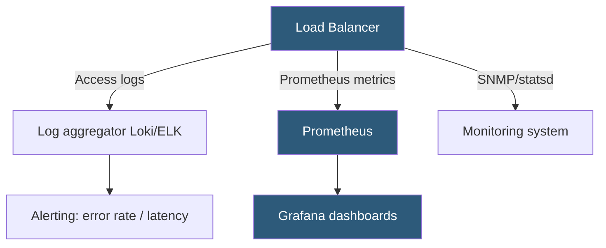

**Category:** Load Balancing
**Difficulty:** Intermediate
**Reading time:** 6 min read

---

Load balancer logs and metrics provide visibility into traffic patterns, error rates, latency distributions, backend health, and security events. They are essential for capacity planning, debugging, and SLA monitoring in production environments.

- **Access log** — per-request log entry recording client IP, URL, status code, response time, and bytes transferred
- **Error log** — records connection errors, backend failures, and load balancer internal warnings
- **Backend health metrics** — per-server up/down status, health check pass/fail counters, and connection counts
- **Request rate (RPS)** — requests per second; key capacity and traffic spike indicator
- **P99 latency** — the 99th percentile response time; reveals worst-case user experience
- **Error rate** — percentage of 5xx responses; primary SLA signal
- **HAProxy stats page** — built-in HTML/CSV statistics dashboard exposed on a configurable port

**Access logging** captures a structured record for each completed request. NGINX's log format is customizable; a production format typically includes `$remote_addr $request $status $body_bytes_sent $request_time $upstream_addr $upstream_response_time`. The `$upstream_response_time` is particularly valuable — it separates the backend processing time from total request time, isolating whether latency is from the LB or the backend.

HAProxy logs are sent via syslog to a log aggregator. HAProxy's log format captures the frontend and backend name, server selected, connection timers (Tq/Tw/Tc/Tr/Tt representing time in each phase of the connection), HTTP status, bytes, and session flags (termination codes indicating why the connection closed). The termination codes — `--` for normal, `cD` for client-side timeout, `sH` for server HTTP error — are essential for diagnosing connection issues.

**Prometheus metrics** expose real-time quantitative data for monitoring. NGINX Prometheus exporter (`nginx-prometheus-exporter`) scrapes `/status` or `/nginx_status` and exposes `nginx_connections_active`, `nginx_http_requests_total`, and other counters. HAProxy exports a full metrics endpoint at `/<statsuri>;csv` or via the built-in Prometheus exporter (`haproxy_process_*`, `haproxy_backend_*`, `haproxy_server_*`).

Key **alerting thresholds** to define:
- Error rate >0.1% of requests — backend instability
- P99 latency >500ms — degraded user experience
- Backend server DOWN — health check failure requiring investigation
- Connection rate spike 3x baseline — potential attack or traffic anomaly
- Active connection count approaching maxconn limit — capacity risk

**Distributed tracing** integration allows propagating a `X-Request-ID` or OpenTelemetry `traceparent` header from client through the load balancer to backends. The LB logs include the trace ID, linking access log entries to backend traces in Jaeger or Zipkin.

- SLA reporting: compute 99th percentile latency and error rate from access logs
- Capacity planning: trend analysis on RPS and concurrent connections over time
- Incident investigation: correlate access log timestamps with backend error spikes
- Security monitoring: detect unusual access patterns (high error rates from specific IPs)

| Advantage | Disadvantage |
|-----------|--------------|
| Access logs provide per-request visibility for debugging individual failures | High-traffic LBs generate GBs of logs per hour; requires significant log storage and processing |
| Prometheus metrics enable real-time alerting on SLA violations | Sampling high-frequency metrics adds CPU overhead; must balance granularity vs performance |
| Built-in stats pages (HAProxy) provide instant health overview without external tools | Log aggregation pipelines (Fluentd, Logstash) add infrastructure components to operate |
| Request timing fields isolate backend latency from LB overhead | Distributed tracing header propagation requires cooperation from all services in the chain |

- [Load balancer automation](load-balancer-automation.md)
- [Load balancer performance tuning](load-balancer-performance-tuning.md)
- [Active vs passive health checks](active-vs-passive-health-checks.md)

---
*Part of the [Load Balancing](index.md) category · [Back to Master Index](../../index.md)*
