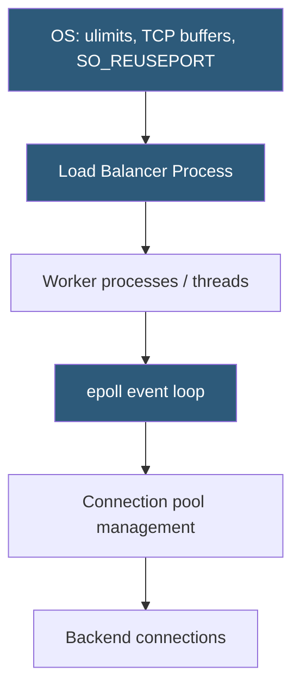

**Category:** Load Balancing
**Difficulty:** Advanced
**Reading time:** 7 min read

---

Load balancer performance tuning addresses OS-level, network-level, and application-level bottlenecks to maximize throughput, minimize latency, and handle large numbers of concurrent connections efficiently under production traffic loads.

- **Max open files (ulimit)** — the OS limit on file descriptors; must be raised to support many concurrent connections
- **TCP backlog** — the kernel queue of incoming connections waiting to be accepted; small backlog drops connections under SYN flood
- **SO_REUSEPORT** — socket option allowing multiple processes to bind the same port, distributing accept load across workers
- **TCP_NODELAY** — disables Nagle's algorithm, reducing latency for small HTTP responses
- **Sendfile** — zero-copy syscall for serving static files; bypasses userspace buffer copy
- **TCP receive/send buffers** — kernel buffers affecting throughput on high-bandwidth connections; tunable via sysctl
- **Worker process count** — should match CPU core count to maximize CPU utilization without context-switch overhead

**OS-level tuning** is the foundation. The default `nofile` limit (1024 on many Linux distros) must be raised to match the maximum expected connections. Setting `LimitNOFILE=1048576` in the systemd service file and corresponding system-level limits in `/etc/security/limits.conf` is required for high-connection-count scenarios. HAProxy and NGINX will refuse to start if the limit is too low for their configured maxconn value.

**TCP kernel parameters** via sysctl significantly affect performance:
- `net.core.somaxconn` and `net.ipv4.tcp_max_syn_backlog` — increase to prevent connection drops under burst traffic
- `net.ipv4.tcp_tw_reuse` — enables reuse of TIME_WAIT sockets for new connections, reducing port exhaustion
- `net.ipv4.tcp_rmem` and `tcp_wmem` — per-socket receive/send buffer sizes affecting bulk transfer throughput
- `net.core.netdev_max_backlog` — NIC receive queue size; increase for high-packet-rate interfaces

**Worker process configuration** in NGINX (`worker_processes auto`) and HAProxy (`nbthread N`) should reflect the available CPU cores. `SO_REUSEPORT` allows all workers to accept on the same port in parallel without a single accept bottleneck. This was a major throughput improvement, reducing lock contention on the accept queue.

**Connection pool sizing** for backend connections: each worker maintains its own keepalive pool. For NGINX, `keepalive N` sets idle connections per upstream. For HAProxy, `maxconn` on the backend sets the maximum queued+active connections, triggering queuing when exceeded.

**NIC and kernel bypass**: for extreme throughput requirements, DPDK (Data Plane Development Kit) bypasses the kernel network stack entirely, processing packets in userspace. Katran (Facebook's load balancer built on XDP/eBPF) achieves similar results within the kernel. These approaches are used at hyperscaler scale.

- High-traffic public APIs handling millions of requests per minute
- Video streaming load balancers handling large numbers of concurrent long-lived connections
- Financial trading platforms requiring sub-millisecond routing latency
- Diagnosing connection errors (EMFILE, ENFILE) on production load balancers

| Advantage | Disadvantage |
|-----------|--------------|
| Systematic OS tuning can double or triple connection handling capacity | Incorrect kernel parameters can cause instability; tuning requires testing in staging |
| SO_REUSEPORT eliminates accept bottleneck on multi-core machines | Aggressive TCP_TWREUSE can cause issues with badly-behaved clients |
| Connection pool sizing prevents backend overload under burst | Overly large connection pools can exhaust backend file descriptors |
| Profile-guided tuning targets actual bottlenecks | DPDK/XDP require specialized engineering and complicate debugging |

- [Software load balancers](software-load-balancers.md)
- [Connection rate limiting](connection-rate-limiting.md)
- [Load balancer logging and metrics](load-balancer-logging-and-metrics.md)

---
*Part of the [Load Balancing](index.md) category · [Back to Master Index](../../index.md)*
