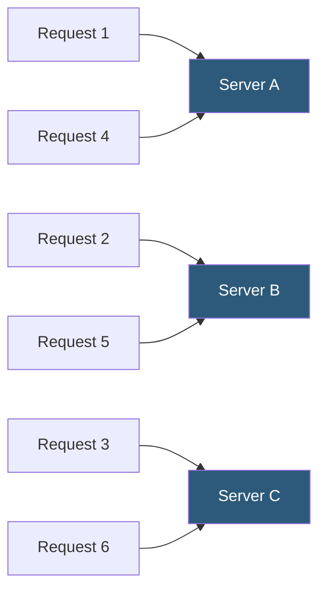

**Category:** Load Balancing
**Difficulty:** Beginner
**Reading time:** 5 min read

---

Round-robin is the most fundamental load balancing algorithm, distributing requests across backend servers in a sequential circular order. It is predictable, stateless, and effective when backend servers have equal capacity and requests have similar processing cost.

- **Round-robin** — sequentially sends each new request to the next server in the list, cycling back to the first after the last
- **Weighted round-robin** — extends the algorithm to send proportionally more requests to servers with higher weights
- **Server weight** — a numeric value representing relative capacity; a server with weight 3 receives 3x more requests than weight 1
- **Current index** — the load balancer's internal pointer tracking which server gets the next request
- **Equal distribution** — round-robin achieves statistical load equality only when requests have identical cost
- **Stateless distribution** — no connection or server state is stored; each request is independently routed
- **Virtual server list** — weighted round-robin may expand the server list proportionally to simulate weighting

Round-robin maintains a simple counter (current index) in the load balancer's state. When a new request arrives, the load balancer selects the server at the current index from its backend server list and increments (or wraps) the index to the next server. The algorithm requires only an atomic increment operation — it is one of the cheapest algorithms to compute.

**Weighted round-robin** allows operators to represent heterogeneous server capacities. If Server A has 4 CPUs and Server B has 8 CPUs, assigning weights 1 and 2 sends two requests to B for every one to A. One implementation expands the server array: `[A, B, B]` and rotates through it. HAProxy implements weighted round-robin using a scheduling algorithm (smooth weighted round-robin) that distributes requests more evenly without lumping all of one server's share consecutively.

**Interleaved weighted round-robin** (smooth WRR) was developed to avoid the problem of naive weighted round-robin sending consecutive bursts to the highest-weighted server. NGINX's implementation uses a running weight array where each server's effective weight increases by its configured weight each cycle, and the server with the highest effective weight is selected, then decremented by the total weight.

Round-robin is appropriate when:
- All backend servers have identical hardware and capacity
- Requests are stateless and independent
- Processing time per request is roughly uniform (e.g., serving static files)

It underperforms when requests vary significantly in processing time (some slow, some fast), because round-robin distributes requests evenly but not work evenly. In those cases, least-connections or least-response-time algorithms are more appropriate.

- Distributing HTTP requests across identical stateless API server replicas
- DNS round-robin for simple multi-server redundancy
- Distributing batch job submissions across a pool of identical workers
- Initial traffic distribution in environments without monitoring for more dynamic algorithms

| Advantage | Disadvantage |
|-----------|--------------|
| Extremely simple to implement; minimal CPU overhead | Does not account for current server load; can overload slower or occupied servers |
| Predictable distribution useful for capacity planning | Long-running requests accumulate on some servers; uneven effective load |
| Weighted variant handles heterogeneous server capacities | Weight configuration requires manual tuning; does not auto-adapt to server performance |
| Stateless; no connection tracking overhead | Provides no session persistence; same client may hit different servers each request |

- [Least connections algorithm](least-connections-algorithm.md)
- [Weighted load balancing](weighted-load-balancing.md)
- [Session persistence (sticky sessions)](session-persistence-sticky-sessions.md)

---
*Part of the [Load Balancing](index.md) category · [Back to Master Index](../../index.md)*
