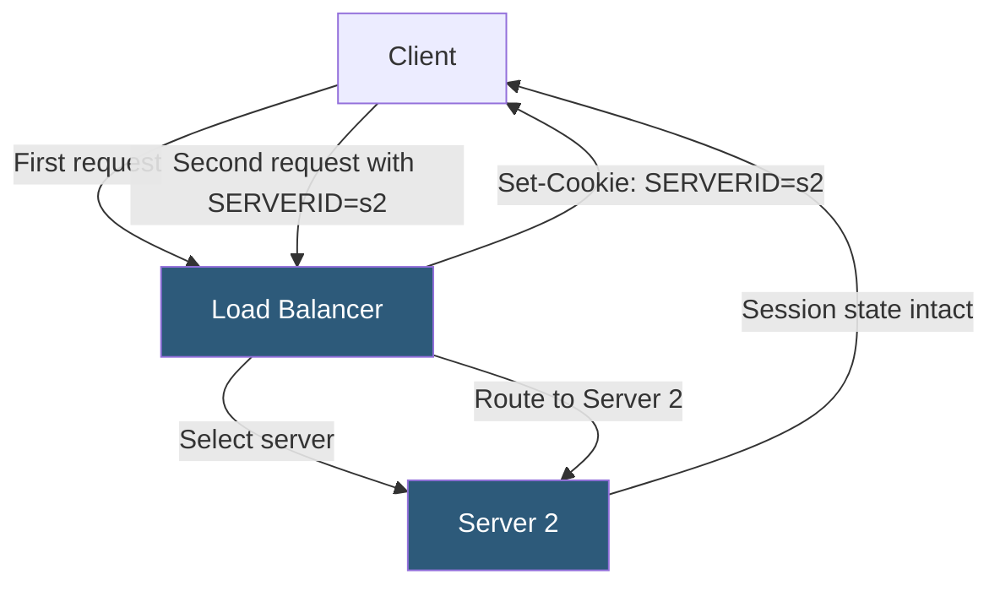

**Category:** Load Balancing
**Difficulty:** Intermediate
**Reading time:** 6 min read

---

Session persistence, or sticky sessions, ensures that a client's requests are consistently routed to the same backend server throughout a session. It is required for applications that store session state locally on the server rather than in a shared distributed store.

- **Stickiness** — the property of a load balancer that pins a client to a specific backend for the duration of a session
- **Cookie-based persistence** — the load balancer inserts a cookie identifying the selected server; subsequent requests use this cookie for routing
- **Source IP affinity** — routes clients to the same server based on source IP; simpler but less reliable
- **Server-side session** — session data stored in application server memory or local disk, requiring sticky routing
- **Persistence timeout** — the period of inactivity after which the stickiness binding expires
- **Failover behavior** — what happens when the pinned server fails; options are reset session or route to any healthy server
- **Session ticket** — alternative to server-side sessions; encrypted JWT-like token storing session state client-side

On the first request from a new client, the load balancer selects a backend server using its configured algorithm (round-robin, least-connections). It then inserts a persistence cookie into the HTTP response (`Set-Cookie: SERVERID=s2; Path=/; HttpOnly`). On all subsequent requests within the session lifetime, the client sends this cookie, and the load balancer reads it to bypass normal routing and send the request directly to Server 2.

The persistence cookie can be set by the **load balancer itself** (injected persistence, transparent to the application) or by the **application** (application-managed session cookie, where the load balancer reads the app's existing session cookie to extract server affinity). In application-managed mode, the load balancer must be configured with the cookie name, and it hashes the cookie value to select a server consistently.

**Failover behavior** is critical to define. When the pinned server fails health checks, the load balancer can: (a) return an error to the client, requiring them to start a new session; (b) route to any healthy server (losing the local session state but keeping the user connected); or (c) replicate session state across servers to allow transparent failover. Option (c) requires application-level session replication (e.g., Tomcat session clustering, Redis session store).

The best long-term architecture **eliminates the need for sticky sessions** by moving session state to a centralized store (Redis, Memcached, database). This allows truly stateless application pods that can be scaled up/down and replaced without session disruption, and removes the load balancing constraint.

- Legacy applications using servlet containers with in-memory sessions
- Shopping carts or checkout flows where session state is held server-side
- Applications during a migration phase before implementing distributed session storage
- WebSocket sessions that must remain on the same server for the connection lifetime

| Advantage | Disadvantage |
|-----------|--------------|
| No application changes required; persistence is transparent to the app | Server failure causes session loss for pinned clients unless session replication is configured |
| Cookie-based persistence is more reliable than IP-based for NAT environments | Stickiness can create load imbalance if some sessions are long-lived and expensive |
| Persistence timeout automatically cleans up expired bindings | Stateful backend servers are harder to scale and replace without session drain |
| Supports multiple persistence types (cookie, IP, SSL session ID) | Cookie-based persistence requires HTTPS or cookies visible to the load balancer |

- [Cookie-based affinity](cookie-based-affinity.md)
- [Source IP affinity](source-ip-affinity.md)
- [IP hash load balancing](ip-hash-load-balancing.md)

---
*Part of the [Load Balancing](index.md) category · [Back to Master Index](../../index.md)*
