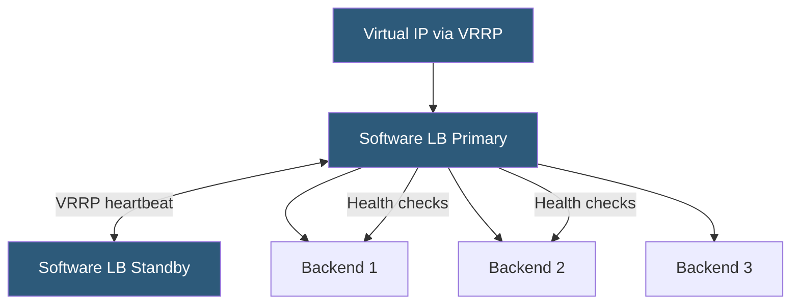

**Category:** Load Balancing
**Difficulty:** Beginner
**Reading time:** 5 min read

---

Software load balancers run on commodity server hardware or virtual machines and use the host CPU and OS networking stack to distribute traffic. They offer flexibility, cost efficiency, and cloud-native integration that hardware appliances cannot match.

- **HAProxy** — high-performance TCP/HTTP proxy and load balancer widely used in production environments
- **NGINX** — web server and reverse proxy with robust upstream load balancing capabilities
- **Envoy** — modern L7 proxy designed for cloud-native environments with xDS-based dynamic configuration
- **Linux Virtual Server (LVS/IPVS)** — kernel-level L4 load balancing built into the Linux kernel
- **epoll** — Linux kernel I/O event notification system that enables single-threaded handling of thousands of connections
- **Worker processes** — multiple OS processes that share a listening socket to parallelize connection handling
- **Software LB HA** — running two or more software LB instances with Keepalived (VRRP) for failover

Software load balancers use the operating system's networking capabilities — specifically non-blocking I/O via epoll (Linux) or kqueue (BSD) — to manage large numbers of concurrent connections with minimal CPU overhead. A single HAProxy worker process can handle hundreds of thousands of concurrent connections on a single CPU core.

**HAProxy** operates as a full proxy: it accepts client connections, selects a backend, establishes a new connection to that backend, and proxies data between the two. Its configuration defines frontends (listening sockets and ACL routing) and backends (server lists with health checks and load balancing algorithms). HAProxy's Runtime API allows server state changes (drain, up, down) without reloading the process.

**NGINX** is commonly used for L7 HTTP load balancing. Its `upstream` block defines a backend pool with weighting, keepalive connection pooling, and health checks. NGINX's event loop processes all connections in a single worker process per core, using sendfile() for efficient proxying.

**LVS/IPVS** operates entirely within the Linux kernel's netfilter framework, making routing decisions in the kernel fast path without context switching to userspace. It supports NAT, direct routing, and tunneling modes. Tools like Keepalived manage LVS rules and provide VRRP-based failover.

High availability is typically achieved with **Keepalived** using VRRP (Virtual Router Redundancy Protocol). Two software LB instances share a virtual IP; VRRP heartbeats between them detect failure and the standby takes over the VIP within 1–3 seconds.

- On-premises applications needing cost-effective L4/L7 load balancing without hardware appliance budget
- Container orchestration (Kubernetes ingress, service mesh data planes) using Envoy or HAProxy
- Edge caching and CDN origin load balancing using NGINX
- High-volume API gateways benefiting from HAProxy's precise connection handling

| Advantage | Disadvantage |
|-----------|--------------|
| Low cost; runs on commodity hardware or VMs | Performance bounded by host CPU and NIC; cannot match ASIC throughput |
| Easily scripted and automated via APIs and configuration management | OS scheduler jitter introduces latency variability absent from hardware appliances |
| Horizontally scalable by adding more instances behind DNS or L4 LB | HA requires external VRRP tooling and careful VIP management |
| Open-source; no vendor lock-in; fully customizable | Requires in-house expertise to configure, tune, and operate |

- [Hardware load balancer appliances](hardware-load-balancer-appliances.md)
- [Application delivery controllers (ADC)](application-delivery-controllers-adc.md)
- [Health check mechanisms](health-check-mechanisms.md)

---
*Part of the [Load Balancing](index.md) category · [Back to Master Index](../../index.md)*
