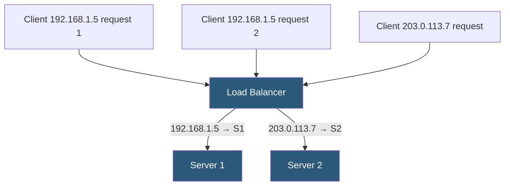

**Category:** Load Balancing
**Difficulty:** Beginner
**Reading time:** 5 min read

---

Source IP affinity routes all requests from the same client IP address to the same backend server, providing stateless session persistence without cookies. It is simple to configure but has known reliability issues for clients behind NAT or using mobile networks.

- **Source IP** — the IP address of the connecting client, used as the hash key for server selection
- **IP persistence table** — a load balancer's in-memory mapping from client IP to selected backend server
- **NAT problem** — multiple clients behind a corporate NAT share one IP, overloading a single backend
- **Mobile IP change** — mobile clients switching networks get a new IP, breaking their affinity binding
- **Persistence timeout** — the table entry expires after a configurable inactivity period
- **XFF (X-Forwarded-For)** — can substitute the real client IP when traffic passes through a proxy layer
- **ECMP (Equal-Cost Multi-Path)** — network-layer IP-based routing that achieves L4 affinity without a load balancer state table

On the first request from a client IP, the load balancer selects a backend server using its base algorithm and records the IP-to-server mapping in its persistence table. All subsequent requests from that IP within the persistence timeout are routed to the same backend, bypassing the selection algorithm.

The persistence table entries have a configurable timeout (e.g., 300 seconds). If the client is inactive for longer than this period, the entry is evicted. The next request from that IP starts fresh, potentially landing on a different server. This timeout must be tuned to be longer than the maximum expected session inactivity period.

The primary technical weakness is **NAT aggregation**. An organization with 5,000 employees all sharing a single NAT gateway IP will have all their requests routed to one backend server, creating a severe imbalance. Similarly, public cloud environments where multiple VMs share a NAT gateway IP can exhibit this problem.

For mobile users, IP address changes when switching from Wi-Fi to cellular (or between cell towers) break the affinity binding. The client gets a new IP and the load balancer treats it as a new session, potentially losing server-side session state.

Source IP affinity using **X-Forwarded-For** headers works when traffic passes through a reverse proxy layer that adds the real client IP. The load balancer reads the XFF header value instead of the TCP source IP for persistence decisions. This requires trusting the proxy layer and validating XFF headers to prevent spoofing.

**ECMP** at the network layer provides a form of IP affinity without load balancer state tables: multiple equal-cost routes to the same destination cause the router to hash 3-tuple or 5-tuple addresses to select paths. This is flow-consistent and scales to millions of flows.

- Non-HTTP protocols (TCP/UDP) where cookie-based affinity is not available
- Applications where clients are known to have unique IPs (not behind shared NAT)
- Simple persistence for internal microservice traffic where IP predictability is high
- Legacy applications that cannot be modified to use other persistence mechanisms

| Advantage | Disadvantage |
|-----------|--------------|
| No cookie or header inspection required; works for any TCP/UDP protocol | Unreliable for clients behind NAT; all NAT clients go to one server |
| Simple to configure; minimal computational overhead | Mobile clients lose session affinity when IP changes |
| No client-side support required; transparent to applications | Requires maintaining an in-memory IP-to-server table that can grow very large |
| Works for WebSocket and other persistent connections | Does not scale well with dynamic server pools where server count changes frequently |

- [Cookie-based affinity](cookie-based-affinity.md)
- [Session persistence (sticky sessions)](session-persistence-sticky-sessions.md)
- [IP hash load balancing](ip-hash-load-balancing.md)

---
*Part of the [Load Balancing](index.md) category · [Back to Master Index](../../index.md)*
