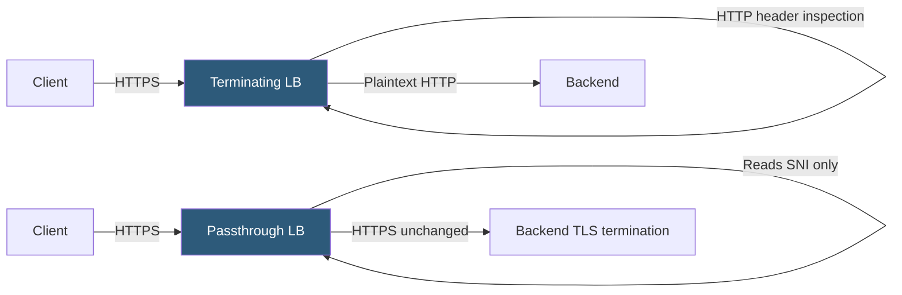

**Category:** Load Balancing
**Difficulty:** Intermediate
**Reading time:** 5 min read

---

SSL termination decrypts TLS at the load balancer before forwarding plain HTTP to backends, enabling full L7 inspection and routing. SSL passthrough forwards encrypted traffic directly to backends without decryption, preserving end-to-end encryption but limiting routing to SNI-based hostname matching only.

- **SSL termination** — TLS handshake and decryption happen at the LB; backend receives plain HTTP
- **SSL passthrough** — LB reads only the TLS ClientHello SNI extension; forwards encrypted TCP stream to backend
- **SNI (Server Name Indication)** — TLS extension that includes the target hostname in the ClientHello before encryption
- **End-to-end TLS** — client-to-LB encrypted, and LB-to-backend re-encrypted (SSL bridging)
- **mTLS passthrough** — client certificates are passed to the backend because the LB does not terminate the connection
- **Header insertion** — only possible with termination; passthrough cannot add X-Real-IP or X-Forwarded-For
- **Certificate authority** — backend servers in passthrough mode must hold their own certificates; LB holds none

In **SSL termination**, the load balancer performs the complete TLS handshake with the client, decrypts the application data, and then forwards plain HTTP (or re-encrypted HTTPS) to the backend. This gives the LB full visibility into HTTP headers, URL paths, cookies, and request body — enabling path-based routing, cookie persistence, header manipulation, WAF inspection, and content caching. The LB must hold the private key corresponding to the server certificate.

In **SSL passthrough**, the LB acts purely as a TCP proxy. It reads the TLS ClientHello to extract the SNI hostname for routing decisions, then forwards the raw TCP bytes — including all TLS records — to the appropriate backend server without modification. The backend server performs the actual TLS handshake and decryption. The LB never sees the decrypted content and never has access to the private key.

Passthrough is appropriate when:
- Client certificates (mTLS) must be validated by the application server itself
- End-to-end encryption is a compliance requirement that prohibits decryption at intermediate devices
- The backend application uses TLS for custom protocol tunneling that would break if decrypted
- Backend servers already have dedicated certificate management and HSMs

The limitation is severe: **no L7 routing** beyond SNI hostname. Path-based routing (`/api/*` to one service, `/web/*` to another) is impossible. Cookie persistence, header injection, WAF, and compression are all unavailable. All backends on the same hostname must be identical because the LB cannot differentiate requests.

**SSL bridging** (re-encryption) is a hybrid: the LB terminates the client's TLS, inspects and routes based on HTTP content, then establishes a new encrypted connection to the backend. This provides L7 inspection capability while maintaining encryption in transit to the backend. The LB must trust the backend's certificate.

- Passthrough: payment processors or HSM-backed applications where decryption at an intermediate device is prohibited
- Passthrough: mutual TLS authentication where client certificates must reach the application
- Termination: standard web application load balancing with path routing, compression, and WAF
- Bridging: regulatory environments requiring both L7 inspection and end-to-end encryption

| Advantage | Disadvantage |
|-----------|--------------|
| Termination enables full L7 routing, cookies, WAF, and caching | Termination requires private key at the LB; key compromise is catastrophic |
| Passthrough achieves true end-to-end encryption with no key at LB | Passthrough limits routing to SNI hostname only; no path, header, or cookie routing |
| Bridging combines inspection with backend encryption | Bridging doubles TLS overhead and requires LB to trust backend certificates |
| Passthrough allows backend-side mTLS client certificate validation | LB cannot add X-Real-IP header in passthrough mode; backend loses client IP visibility |

- [SSL/TLS offloading](ssl-tls-offloading.md)
- [Application delivery controllers (ADC)](application-delivery-controllers-adc.md)
- [HTTP/2 and HTTP/3 support](http2-and-http3-support.md)

---
*Part of the [Load Balancing](index.md) category · [Back to Master Index](../../index.md)*
