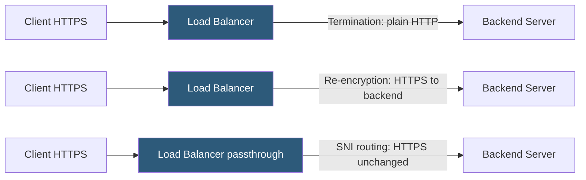

**Category:** Load Balancing
**Difficulty:** Intermediate
**Reading time:** 6 min read

---

SSL/TLS offloading moves the computationally expensive task of encrypting and decrypting HTTPS traffic from backend application servers to the load balancer or ADC, freeing backend CPU cycles for application logic and centralizing certificate management.

- **SSL termination** — the load balancer decrypts incoming TLS and forwards plain HTTP to backends
- **SSL passthrough** — the load balancer forwards encrypted traffic without decrypting it (SNI-based routing only)
- **SSL bridging / re-encryption** — the load balancer terminates TLS from the client, inspects traffic, and re-encrypts to the backend
- **TLS 1.3** — the current protocol version; mandatory forward secrecy, faster handshake, removed weak ciphers
- **OCSP stapling** — load balancer fetches and caches OCSP responses to speed up certificate validation for clients
- **Session ticket / session ID** — TLS session resumption mechanisms that reduce handshake overhead for returning clients
- **Certificate management** — centralizing certificates at the LB simplifies renewal using Let's Encrypt / ACME

In **SSL termination** mode, the load balancer holds the TLS private key and certificate. When a client connects, the load balancer performs the full TLS handshake — exchanging certificates, negotiating cipher suite and protocol version, deriving session keys. After termination, the connection to the backend is unencrypted HTTP on the internal network. This is the most common deployment because it reduces backend server CPU load significantly and enables L7 inspection of the decrypted traffic.

**TLS 1.3** reduces handshake latency. The client and server exchange hello messages with supported key share in one round trip (1-RTT), versus TLS 1.2's 2-RTT. TLS 1.3 also mandates perfect forward secrecy (only ECDHE key exchange) and removes weak cipher suites (RC4, 3DES, RSA key exchange). Load balancers that support TLS 1.3 improve connection setup time for all clients.

**OCSP stapling** has the load balancer periodically fetch the Certificate Authority's OCSP (Online Certificate Status Protocol) response and attach it to the TLS handshake. Without stapling, each client must independently query the CA's OCSP server, adding a network round trip and a dependency on the CA's infrastructure availability. Stapling pre-caches the response at the LB, reducing handshake latency and eliminating per-client CA queries.

**SSL re-encryption** is used when end-to-end encryption is required (e.g., compliance mandates) but the load balancer needs to inspect or modify HTTP traffic. The LB terminates the client TLS, performs inspection or routing decisions on the plaintext HTTP, then establishes a new TLS connection to the backend. This requires the LB to trust the backend's certificate (typically via internal CA).

Certificate management is simplified when all TLS terminates at the LB. Certbot or ACME clients on the load balancer renew Let's Encrypt certificates automatically. All backend servers receive plain HTTP, so they need no certificate configuration.

- High-traffic web applications offloading TLS handshake CPU from app servers
- Compliance environments requiring traffic inspection between client and server
- Centralized certificate lifecycle management for dozens of hostnames
- Improving TLS performance with hardware acceleration cards on ADCs

| Advantage | Disadvantage |
|-----------|--------------|
| Reduces backend CPU usage significantly on high-HTTPS-connection-rate sites | Internal network is unencrypted in termination mode; requires trusted internal network |
| Central certificate management simplifies renewal for all hosted services | Re-encryption adds latency and doubles the TLS handshake overhead |
| OCSP stapling reduces client-side latency and CA dependency | Passthrough mode limits L7 routing to SNI hostname only; no path or header routing |
| Hardware SSL acceleration on ADCs can handle millions of TLS sessions | Load balancer becomes a critical key management component; private key exposure is severe |

- [SSL termination vs passthrough](ssl-termination-vs-passthrough.md)
- [Application delivery controllers (ADC)](application-delivery-controllers-adc.md)
- [Layer 4 vs Layer 7 load balancing](layer-4-vs-layer-7-load-balancing.md)

---
*Part of the [Load Balancing](index.md) category · [Back to Master Index](../../index.md)*
