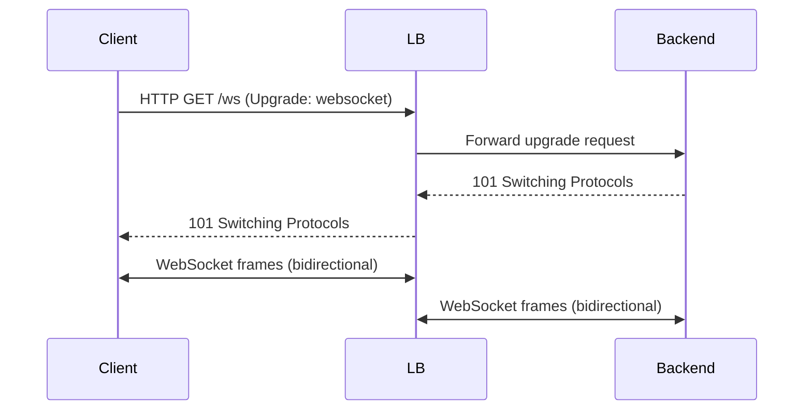

**Category:** Load Balancing
**Difficulty:** Intermediate
**Reading time:** 6 min read

---

WebSocket connections are long-lived, bidirectional TCP connections that start as HTTP and upgrade to the WebSocket protocol. Load balancers must handle the upgrade handshake, maintain persistent connections, and use sticky routing to ensure subsequent frames reach the correct backend server.

- **WebSocket upgrade** — an HTTP GET with `Upgrade: websocket` header that transitions from HTTP to the WS protocol
- **Long-lived connection** — WebSocket connections remain open for minutes to hours; LB timeout settings must accommodate this
- **Bidirectional frames** — both client and server can send frames at any time; LB must buffer and forward in both directions
- **Sticky routing** — WebSocket connections must stay on the same backend throughout their lifetime
- **Proxy timeout** — default HTTP timeouts (60s) terminate idle WebSockets; must be extended or disabled
- **WS over TLS (WSS)** — WebSocket over HTTPS; the TLS layer is terminated by the LB in termination mode
- **Heartbeat / ping-pong** — WebSocket protocol ping/pong frames keep the connection alive through load balancer idle timeouts

A WebSocket connection begins as a standard HTTP/1.1 GET request with specific headers: `Connection: Upgrade` and `Upgrade: websocket`, plus a `Sec-WebSocket-Key` that the server uses to generate an acceptance token. The load balancer sees this as a normal HTTP request and must forward the upgrade headers to the backend.

Once the backend returns `101 Switching Protocols`, the HTTP protocol ends and both sides enter WebSocket mode. The load balancer now acts as a TCP proxy for the connection, forwarding raw frames in both directions. It must **not** attempt to parse the WebSocket framing as HTTP or close the connection due to HTTP idle timeouts.

**Timeout configuration** is the most common WebSocket load balancing issue. NGINX's default `proxy_read_timeout` is 60 seconds — it closes any connection where no data is received for 60 seconds. WebSocket connections that are legitimately idle (no messages being exchanged) would be terminated. The fix is increasing `proxy_read_timeout` to match the expected session duration, or enabling WebSocket keepalive (ping/pong) on the application side so the connection is never fully idle.

**Sticky sessions are mandatory** for WebSocket connections that maintain server-side state. If a backend uses in-memory storage for connected client state (common in Node.js Socket.io applications), routing mid-session to a different backend loses that state. Cookie-based or IP-based affinity must be configured to ensure all frames from a given WebSocket client go to the same backend process.

**Load balancing strategy**: WebSocket connections are long-lived, so the initial connection distribution matters more than per-request balancing. Least-connections is often preferred to round-robin because it prevents one backend from accumulating disproportionately many long-lived connections.

- Real-time chat applications where clients maintain persistent WebSocket connections to message brokers
- Live dashboard/telemetry applications pushing server-side events to browsers
- Online gaming backends with low-latency bidirectional communication
- Financial market data feeds where server push latency must be minimized

| Advantage | Disadvantage |
|-----------|--------------|
| WebSocket over standard HTTP ports (80/443) traverses most corporate firewalls | Long-lived connections increase load balancer concurrency requirements significantly |
| SSL termination works the same as HTTP; LB handles TLS upgrade transparently | Sticky sessions complicate horizontal scaling; one backend failure affects all pinned clients |
| Most modern load balancers (NGINX, HAProxy, ALB) support WebSocket natively | Idle timeout misconfiguration is a frequent source of unexpected connection drops |
| Sticky routing prevents server-side session state loss | Very high concurrent WebSocket count per backend may exhaust server file descriptors |

- [Session persistence (sticky sessions)](session-persistence-sticky-sessions.md)
- [gRPC load balancing](grpc-load-balancing.md)
- [HTTP/2 and HTTP/3 support](http2-and-http3-support.md)

---
*Part of the [Load Balancing](index.md) category · [Back to Master Index](../../index.md)*
