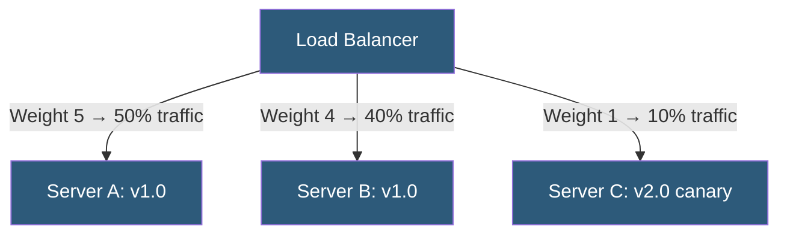

**Category:** Load Balancing
**Difficulty:** Beginner
**Reading time:** 5 min read

---

Weighted load balancing assigns numeric weights to backend servers to control the proportion of traffic each receives, enabling heterogeneous server pools, canary deployments, and gradual traffic migrations to coexist under a single load balancer.

- **Weight** — a numeric value assigned to each backend; higher weight = higher traffic share
- **Traffic ratio** — a server with weight 3 receives 3x more traffic than a server with weight 1
- **Canary deployment** — routing a small percentage (e.g., 5%) of traffic to a new version via low weight
- **Blue-green weights** — shifting weight from 100/0 to 0/100 migrates traffic from old to new deployment
- **Dynamic weight adjustment** — some load balancers allow weight changes via API without reload
- **Zero weight** — effectively removes a server from the pool without deleting the configuration
- **Smooth weighted round-robin** — distributes weighted requests without bursting all weight to one server consecutively

Weighted load balancing extends any base algorithm (round-robin, least-connections) by factoring server weights into selection. In weighted round-robin, the virtual server list is expanded proportionally: a weight-3 server appears 3 times in the rotation cycle. NGINX implements smooth weighted round-robin, where each server maintains a running weight score that increases by its configured weight each round; the server with the highest score is selected and penalized by the sum of all weights, preventing consecutive selection.

**Canary deployments** are one of the most practical uses. An operator adds the new version as a backend with weight 1 alongside existing servers with combined weight 99. Exactly 1% of production traffic goes to the canary. Monitoring dashboards track error rates and latency. If the canary is healthy, the operator incrementally increases its weight and decreases the stable servers, eventually completing the cutover.

**Dynamic weight changes** allow this without downtime. HAProxy's Runtime API supports `set server <backend>/<server> weight <n>` commands that take effect immediately on new connections without reloading the process. This enables automated canary controllers (like Flagger) to adjust weights in response to metric thresholds.

Setting a server's weight to **zero** is equivalent to graceful draining — no new connections are sent to it, but existing connections complete normally. This is used before taking a server out of service for maintenance.

Weighted algorithms compose with health checks: a server that fails health checks is removed from active rotation regardless of its weight configuration. Weight only applies to healthy servers in the pool.

- Canary deployments routing small traffic percentages to new versions
- Heterogeneous server pools where some servers have more CPU/RAM
- Blue-green deployments with gradual traffic migration
- A/B testing different application versions with controlled traffic splits

| Advantage | Disadvantage |
|-----------|--------------|
| Fine-grained control over traffic distribution without infrastructure changes | Requires manual or automated weight management; easy to misconfigure |
| Zero-weight draining allows graceful maintenance without dropping connections | Traffic distribution is approximate; actual percentages may deviate at low request rates |
| Dynamic weight API enables progressive delivery automation | Does not account for server saturation; a slow high-weight server will still receive traffic |
| Works with any base algorithm (round-robin, least-connections) | Multiple weight changes in rapid succession can cause brief traffic spikes |

- [Round-robin algorithm](round-robin-algorithm.md)
- [Least connections algorithm](least-connections-algorithm.md)
- [Blue-green deployment with LB](blue-green-deployment-with-lb.md)

---
*Part of the [Load Balancing](index.md) category · [Back to Master Index](../../index.md)*
